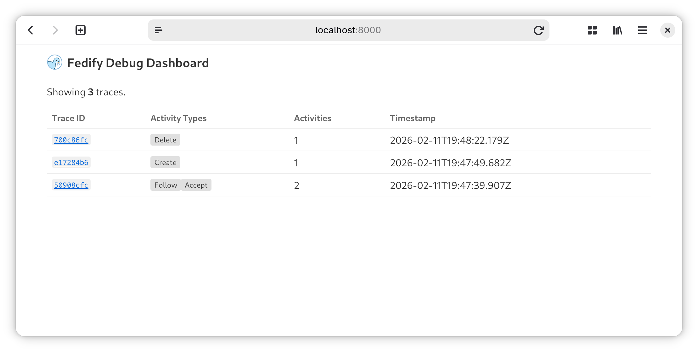
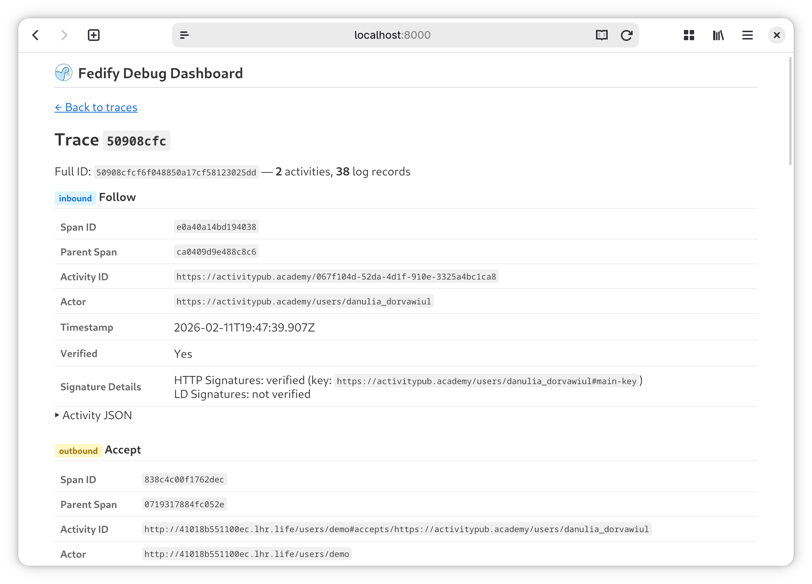

Debugging
=========

*This API is available since Fedify 2.0.0.*

When developing a federated server app, it can be difficult to understand what
activities are being sent and received, and whether signatures are being
verified correctly.  The `@fedify/debugger` package provides an embedded
real-time debug dashboard that you can add to your app to inspect ActivityPub
traces and activities without leaving your browser.

Installation
------------

::: code-group

~~~~ bash [Deno]
deno add jsr:@fedify/debugger
~~~~

~~~~ bash [npm]
npm install @fedify/debugger
~~~~

~~~~ bash [pnpm]
pnpm add @fedify/debugger
~~~~

~~~~ bash [Yarn]
yarn add @fedify/debugger
~~~~

~~~~ bash [Bun]
bun add @fedify/debugger
~~~~

:::

Setup
-----

The debugger works as a proxy that wraps your existing `Federation` object.
It intercepts HTTP requests matching a configurable path prefix and serves
the debug dashboard, while delegating everything else to the inner federation.

The simplest way to set it up is to call `createFederationDebugger()` with
your federation object:

~~~~ typescript twoslash
// @noErrors: 2345
import { createFederation, MemoryKvStore } from "@fedify/fedify";
import { createFederationDebugger } from "@fedify/debugger";

const innerFederation = createFederation<void>({
  kv: new MemoryKvStore(),
  // ... other federation options
});

const federation = createFederationDebugger(innerFederation);
~~~~

When called without an `exporter` option, `createFederationDebugger()`
automatically:

 -  Creates a `MemoryKvStore` and `FedifySpanExporter` for trace data storage
 -  Creates a `BasicTracerProvider` with a `SimpleSpanProcessor`
 -  Registers it as the global [OpenTelemetry] tracer provider
 -  Registers an `AsyncLocalStorageContextManager` as the global OpenTelemetry
    context manager (required for parent–child span propagation)
 -  Registers a `W3CTraceContextPropagator` as the global OpenTelemetry
    propagator (required for trace context to propagate across message queue
    boundaries)
 -  Configures [LogTape] to collect logs per trace (using `getConfig()` to
    merge with any existing configuration)

This means `createFederation()` will automatically use the tracer provider
without needing an explicit `tracerProvider` option, and logs emitted by
Fedify will be captured and displayed alongside traces in the dashboard.

The `federation` object returned by `createFederationDebugger()` is a drop-in
replacement for the original.  You can use it everywhere you would normally use
the inner federation object (e.g., passing it to framework integrations).

> [!WARNING]
> The debug dashboard is intended for development use only.  It is strongly
> recommended to enable [authentication](#auth) if the dashboard is accessible
> over a network, as it exposes internal trace data.

[OpenTelemetry]: ./opentelemetry.md
[LogTape]: https://logtape.org/

Configuration
-------------

The `createFederationDebugger()` function accepts the following options:

### `path`

The path prefix for the debug dashboard.  Defaults to `"/__debug__"`.
All dashboard routes are served under this prefix.

For example, if you set `path` to `"/_debug"`, the dashboard will be available
at `/_debug/` and traces at `/_debug/traces/:traceId`.

~~~~ typescript twoslash
// @noErrors: 2345
import { createFederation, MemoryKvStore } from "@fedify/fedify";
import { createFederationDebugger } from "@fedify/debugger";

const innerFederation = createFederation<void>({
  kv: new MemoryKvStore(),
});
// ---cut-before---
const federation = createFederationDebugger(innerFederation, {
  path: "/_debug",
});
~~~~

### `auth`

*Optional.*  Authentication configuration for the debug dashboard.  When
omitted, the dashboard is accessible without authentication.

The `auth` option accepts a discriminated union with three modes:

#### Password-only authentication

Shows a login form with a single password field.  You can provide a static
password string or an `authenticate()` callback:

~~~~ typescript twoslash
// @noErrors: 2345
import { createFederation, MemoryKvStore } from "@fedify/fedify";
import { createFederationDebugger } from "@fedify/debugger";

const innerFederation = createFederation<void>({
  kv: new MemoryKvStore(),
});
// ---cut-before---
// Static password:
const federation = createFederationDebugger(innerFederation, {
  auth: {
    type: "password",
    password: Deno.env.get("DEBUG_PASSWORD")!,
  },
});
~~~~

~~~~ typescript twoslash
// @noErrors: 2345
import { createFederation, MemoryKvStore } from "@fedify/fedify";
import { createFederationDebugger } from "@fedify/debugger";

const innerFederation = createFederation<void>({
  kv: new MemoryKvStore(),
});
// ---cut-before---
// Callback:
const federation = createFederationDebugger(innerFederation, {
  auth: {
    type: "password",
    authenticate: (password) => password === "my-secret",
  },
});
~~~~

#### Username + password authentication

Shows a login form with both username and password fields:

~~~~ typescript twoslash
// @noErrors: 2345
import { createFederation, MemoryKvStore } from "@fedify/fedify";
import { createFederationDebugger } from "@fedify/debugger";

const innerFederation = createFederation<void>({
  kv: new MemoryKvStore(),
});
// ---cut-before---
// Static credentials:
const federation = createFederationDebugger(innerFederation, {
  auth: {
    type: "usernamePassword",
    username: "admin",
    password: Deno.env.get("DEBUG_PASSWORD")!,
  },
});
~~~~

~~~~ typescript twoslash
// @noErrors: 2345
import { createFederation, MemoryKvStore } from "@fedify/fedify";
import { createFederationDebugger } from "@fedify/debugger";

const innerFederation = createFederation<void>({
  kv: new MemoryKvStore(),
});
// ---cut-before---
// Callback:
const federation = createFederationDebugger(innerFederation, {
  auth: {
    type: "usernamePassword",
    authenticate: (username, password) =>
      username === "admin" && password === "secret",
  },
});
~~~~

#### Request-based authentication

Authenticates based on the incoming `Request` object, without showing a login
form.  Useful for IP-based access control.  Rejected requests receive a 403
Forbidden response.

~~~~ typescript twoslash
// @noErrors: 2345
import { createFederation, MemoryKvStore } from "@fedify/fedify";
import { createFederationDebugger } from "@fedify/debugger";

const innerFederation = createFederation<void>({
  kv: new MemoryKvStore(),
});
// ---cut-before---
const federation = createFederationDebugger(innerFederation, {
  auth: {
    type: "request",
    authenticate: (request) => {
      // Only allow requests from localhost
      const url = new URL(request.url);
      return url.hostname === "127.0.0.1" || url.hostname === "::1";
    },
  },
});
~~~~

> [!NOTE]
> Authentication only applies to the debug dashboard routes.  All other
> requests (e.g., ActivityPub endpoints) are passed through to the inner
> federation without any authentication check.

### `exporter`

*Optional.*  A `FedifySpanExporter` instance that the dashboard queries for
trace data.

When omitted (the recommended approach), the debugger automatically creates
an exporter and sets up OpenTelemetry tracing for you.

When provided, you are responsible for setting up the `BasicTracerProvider`
and passing it to `createFederation()`.  See the
[Advanced setup](#advanced-setup) section below.

### `kv`

*Required when `exporter` is provided.*  A `KvStore` instance used to persist
log records collected by the debug dashboard's LogTape sink.

When using the simplified overload (without `exporter`), the debugger
automatically creates a `MemoryKvStore` for log storage.

When using the advanced overload (with `exporter`), you must pass the same
`KvStore` instance so that log records written by worker processes are visible
in the web dashboard.

Dashboard pages
---------------

Once set up, the debug dashboard is accessible at the configured path prefix
(default: `/__debug__/`).

### Traces list

The root page (`/__debug__/`) shows a list of all captured traces.  For each
trace, it displays:

 -  **Trace ID** (first 8 characters, linked to the detail page)
 -  **Activity types** present in the trace (e.g., Create, Follow, Like)
 -  **Activity count**
 -  **Timestamp**

The page automatically polls the JSON API every 3 seconds and refreshes when
new traces are detected.

### Trace detail

The trace detail page (`/__debug__/traces/:traceId`) shows all activities
belonging to a specific trace.  For each activity, it displays:

 -  **Direction** (inbound or outbound)
 -  **Activity type** (e.g., Create, Accept, Follow)
 -  **Span ID** and optional parent span ID
 -  **Activity ID** (if present)
 -  **Actor ID**
 -  **Timestamp**
 -  **Inbox URL** (for outbound activities)
 -  **Signature verification** details (for inbound activities):
     -  Whether HTTP Signatures were verified
     -  The key ID used for verification
     -  Whether Linked Data Signatures were verified
 -  **Activity JSON** (expandable, pretty-printed)

Below the activities section, a **Logs** section shows all [LogTape] log
records captured during the trace.  Each log entry displays:

 -  **Timestamp** (time portion only)
 -  **Log level** (color-coded: debug, info, warning, error, fatal)
 -  **Logger category** (e.g., `fedify.federation.http`)
 -  **Message** with expandable properties

### JSON API

A JSON API endpoint is available at `/__debug__/api/traces` which returns
the list of recent traces in JSON format.  This is used by the auto-polling
mechanism on the traces list page, but you can also query it directly for
programmatic access.

A separate endpoint at `/__debug__/api/logs/:traceId` returns the log records
for a specific trace in JSON format.

Using with framework integrations
---------------------------------

The debugger works with any framework integration that accepts a `Federation`
object.  Simply wrap the federation before passing it to your integration:

### Hono

~~~~ typescript twoslash
// @noErrors: 2345
import { createFederation, MemoryKvStore } from "@fedify/fedify";
import { createFederationDebugger } from "@fedify/debugger";
import { federation as honoFederation } from "@fedify/hono";
import { Hono } from "hono";

const innerFederation = createFederation<void>({
  kv: new MemoryKvStore(),
});
const federation = createFederationDebugger(innerFederation);

const app = new Hono();
app.use(honoFederation(federation, (_) => undefined));
~~~~

### Express

~~~~ typescript twoslash
// @noErrors: 2345
import { createFederation, MemoryKvStore } from "@fedify/fedify";
import { createFederationDebugger } from "@fedify/debugger";
import { integrateFederation } from "@fedify/express";
import express from "express";

const innerFederation = createFederation<void>({
  kv: new MemoryKvStore(),
});
const federation = createFederationDebugger(innerFederation);

const app = express();
app.use(integrateFederation(federation, (req) => undefined));
~~~~

Advanced setup
--------------

If you need full control over the OpenTelemetry setup (for example, to use
a custom `KvStore` or to add additional span processors), you can pass an
explicit `exporter` option:

~~~~ typescript twoslash
// @noErrors: 2345
import { createFederation, MemoryKvStore } from "@fedify/fedify";
import { FedifySpanExporter } from "@fedify/fedify/otel";
import { createFederationDebugger } from "@fedify/debugger";
import { context, propagation } from "@opentelemetry/api";
import { AsyncLocalStorageContextManager } from "@opentelemetry/context-async-hooks";
import { W3CTraceContextPropagator } from "@opentelemetry/core";
import {
  BasicTracerProvider,
  SimpleSpanProcessor,
} from "@opentelemetry/sdk-trace-base";

// Register context manager and propagator (required for trace
// propagation across async boundaries and message queues):
context.setGlobalContextManager(new AsyncLocalStorageContextManager());
propagation.setGlobalPropagator(new W3CTraceContextPropagator());

// Create a KV store and a span exporter that captures trace data:
const kv = new MemoryKvStore();
const exporter = new FedifySpanExporter(kv);
const tracerProvider = new BasicTracerProvider({
  spanProcessors: [new SimpleSpanProcessor(exporter)],
});

const innerFederation = createFederation({
  kv,
  tracerProvider,
  // ... other federation options
});

// Wrap the federation with the debugger:
const federation = createFederationDebugger(innerFederation, {
  exporter,
  kv,
});
~~~~

In this mode, the returned `federation` object has a `sink` property that is
a [LogTape] `Sink` function.  You should include it in your LogTape
configuration to enable per-trace log collection:

~~~~ typescript twoslash
// @noErrors: 2345
import { configure } from "@logtape/logtape";
declare const federation: { sink: (record: any) => void };
// ---cut-before---
await configure({
  sinks: {
    debugger: federation.sink,
    // ... other sinks
  },
  loggers: [
    { category: "fedify", sinks: ["debugger"] },
    // ... other loggers
  ],
});
~~~~

In this mode, you are responsible for:

 -  Registering an `AsyncLocalStorageContextManager` as the global context
    manager
 -  Registering a `W3CTraceContextPropagator` as the global propagator
 -  Creating and configuring the `BasicTracerProvider`
 -  Passing `tracerProvider` to `createFederation()`
 -  Passing the same `exporter` and `kv` to `createFederationDebugger()`
 -  Configuring LogTape with `federation.sink` to collect logs per trace
