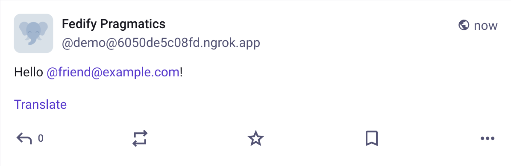
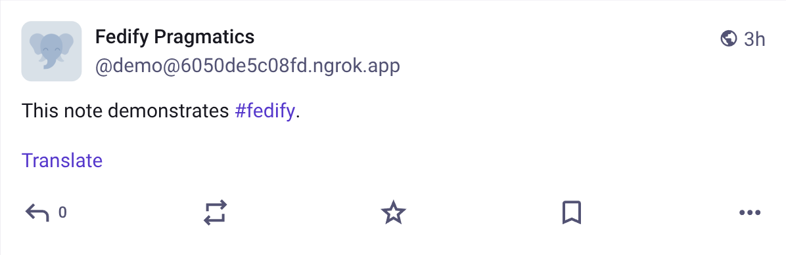
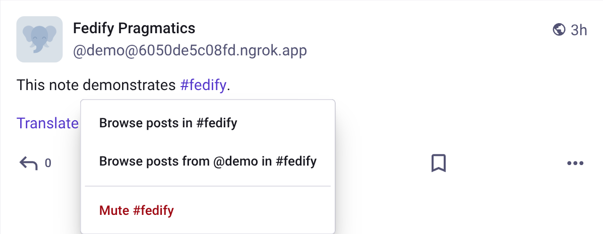

Pragmatics
==========

> [!NOTE]
> This section is a work in progress.  Contributions are welcome.

While Fedify provides [vocabulary API](./vocab.md), it does not inherently
define how to utilize those vocabularies.  ActivityPub implementations like
[Mastodon] and [Misskey] already have de facto norms for how to use them,
which you should follow to get the desired results.

For example, you need to know which properties on a `Person` object should be
populated with which values to display an avatar or header image, which property
represents a date joined, and so on.

In this section, we will explain the pragmatic aspects of using Fedify, such as
how to utilize the vocabulary API and the de facto norms of ActivityPub
implementations.

[Mastodon]: https://joinmastodon.org/
[Misskey]: https://misskey-hub.net/

Actors
------

The following five types of actors represent entities that can perform
activities in ActivityPub:

 -  `Application` describes a software application.
 -  `Group` represents a formal or informal collective of actors.
 -  `Organization` represents an organization.
 -  `Person` represents an individual person.
 -  `Service` represents a service of any kind.

The most common type of actor is `Person`, which represents an individual user.
When you register an [actor dispatcher], you should return an actor object of
an appropriate type of the account.

Those five types of actors have the same set of properties, e.g., `name`,
`preferredUsername`, `summary`, and `published`.

[actor dispatcher]: ./actor.md

### `Application`/`Service`: Automated/bot actors

If an actor is represented as an `Application` or `Service` object, it is
considered an automated actor by Mastodon and a bot actor by Misskey.

~~~~ typescript twoslash
import { Application } from "@fedify/vocab";
// ---cut-before---
new Application({  // [!code highlight]
  name: "Fedify Demo",
  preferredUsername: "demo",
  summary: "This is a Fedify Demo account",
  // Other properties...
})
~~~~

For example, the above actor object is displayed as an automated actor in
Mastodon like the following:

### `Group`

If an actor is represented as a `Group` object, it is considered a group actor
by Mastodon.

~~~~ typescript twoslash
import { Group } from "@fedify/vocab";
// ---cut-before---
new Group({  // [!code highlight]
  name: "Fedify Demo",
  preferredUsername: "demo",
  summary: "This is a Fedify Demo account",
  // Other properties...
})
~~~~

For example, the above actor object is displayed as a group actor in Mastodon
like the following:

> [!TIP]
> [Lemmy] communities and [Guppe] groups are also represented as `Group`
> objects.

[Lemmy]: https://join-lemmy.org/
[Guppe]: https://a.gup.pe/

### `name`: Display name

The `name` property is used as a display name in Mastodon and the most
ActivityPub implementations.  The display name is usually a full name or
a nickname of a person, or a title of a group or an organization.
It is displayed in the profile page of an actor and the timeline.

~~~~ typescript twoslash
import { Person } from "@fedify/vocab";
// ---cut-before---
new Person({
  name: "Fedify Demo",  // [!code highlight]
  preferredUsername: "demo",
  summary: "This is a Fedify Demo account",
  // Other properties...
})
~~~~

For example, the above actor object is displayed like the following in Mastodon:

### `summary`: Bio

The `summary` property is used as a bio in Mastodon and the most ActivityPub
implementations.  The bio is displayed in the profile page of the actor.

> [!NOTE]
> The `summary` property expects an HTML string, so you should escape HTML
> entities if it contains characters like `<`, `>`, and `&`.

~~~~ typescript twoslash
import { Person } from "@fedify/vocab";
// ---cut-before---
new Person({
  name: "Fedify Demo",
  preferredUsername: "demo",
  summary: "This is a Fedify Demo account",  // [!code highlight]
  // Other properties...
})
~~~~

For example, the above actor object is displayed like the following in Mastodon:

### `published`: Date joined

The `published` property is used as a date joined in Mastodon and Misskey.
The date joined is displayed in the profile page of the actor.

> [!NOTE]
> Although the `published` property contains a date and time, it is displayed
> as a date only in Mastodon and Misskey.  However, there may be ActivityPub
> implementations that display the date and time.

~~~~ typescript twoslash
import { Person } from "@fedify/vocab";
// ---cut-before---
new Person({
  name: "Fedify Demo",
  preferredUsername: "demo",
  summary: "This is a Fedify Demo account",
  published: Temporal.Instant.from("2024-03-31T00:00:00Z"), // [!code highlight]
  // Other properties...
})
~~~~

For example, the above actor object is displayed like the following in Mastodon:

### `icon`: Avatar image

The `icon` property is used as an avatar image in Mastodon and the most
ActivityPub implementations.  The avatar image is displayed next to the name
of the actor in the profile page and the timeline.

~~~~ typescript{5-8} twoslash
import { Image, Person } from "@fedify/vocab";
// ---cut-before---
new Person({
  name: "Fedify Demo",
  preferredUsername: "demo",
  summary: "This is a Fedify Demo account",
  icon: new Image({
    url: new URL("https://i.imgur.com/CUBXuVX.jpeg"),
    mediaType: "image/jpeg",
  }),
  // Other properties...
})
~~~~

For example, the above actor object is displayed like the following in Mastodon:

### `image`: Header image

The `image` property is used as a header image in Mastodon and Misskey.
The header image is displayed on the top of the profile page.

~~~~ typescript{5-8} twoslash
import { Image, Person } from "@fedify/vocab";
// ---cut-before---
new Person({
  name: "Fedify Demo",
  preferredUsername: "demo",
  summary: "This is a Fedify Demo account",
  image: new Image({
    url: new URL("https://i.imgur.com/yEZ0EEw.jpeg"),
    mediaType: "image/jpeg",
  }),
  // Other properties...
})
~~~~

For example, the above actor object is displayed like the following in Mastodon:

### `attachments`: Custom fields

The `attachments` property is used as custom fields in Mastodon and Misskey.
The custom fields are displayed as a table in the profile page.

~~~~ typescript{5-18} twoslash
import { Person, PropertyValue } from "@fedify/vocab";
// ---cut-before---
new Person({
  name: "Fedify Demo",
  preferredUsername: "demo",
  summary: "This is a Fedify Demo account",
  attachments: [
    new PropertyValue({
      name: "Location",
      value: "Seoul, South Korea",
    }),
    new PropertyValue({
      name: "Pronoun",
      value: "they/them",
    }),
    new PropertyValue({
      name: "Website",
      value: '<a href="https://fedify.dev/">fedify.dev</a>'
    }),
  ],
  // Other properties...
})
~~~~

> [!NOTE]
> The `PropertyValue.value` property expects an HTML string, so you should
> escape HTML entities if it contains characters like `<`, `>`, and `&`.

For example, the above actor object is displayed like the following in Mastodon:

### `manuallyApprovesFollowers`: Lock account

The `manuallyApprovesFollowers` property is used to *indicate* that the actor
manually approves followers.  In Mastodon and Misskey, the actor is displayed as
a locked account if the `manuallyApprovesFollowers` property is `true`.

> [!WARNING]
> The `manuallyApprovesFollowers` property only *indicates* that the actor
> manually approves followers.  The actual behavior of the actor is determined
> by the [inbox listener](./inbox.md) for `Follow` activities.
> If it automatically sends `Accept` activities right after receiving `Follow`,
> the actor behaves as an unlocked account.  If it sends `Accept` when the
> owner explicitly clicks the *Accept* button, the actor behaves as a locked
> account.

~~~~ typescript twoslash
import { Person } from "@fedify/vocab";
// ---cut-before---
new Person({
  name: "Fedify Demo",
  preferredUsername: "demo",
  summary: "This is a Fedify Demo account",
  manuallyApprovesFollowers: true,  // [!code highlight]
  // Other properties...
})
~~~~

For example, the above actor object is displayed like the following in Mastodon:

### `suspended`

The `suspended` property is used to suspend an actor in Mastodon.
If the `suspended` property is `true`, the profile page of the actor is
displayed as suspended.

~~~~ typescript twoslash
import { Person } from "@fedify/vocab";
// ---cut-before---
new Person({
  name: "Fedify Demo",
  preferredUsername: "demo",
  summary: "This is a Fedify Demo account",
  suspended: true,  // [!code highlight]
  // Other properties...
})
~~~~

For example, the above actor object is displayed like the following in Mastodon:

### `memorial`

The `memorial` property is used to memorialize an actor in Mastodon.
If the `memorial` property is `true`, the profile page of the actor is
displayed as memorialized.

~~~~ typescript twoslash
import { Person } from "@fedify/vocab";
// ---cut-before---
new Person({
  name: "Fedify Demo",
  preferredUsername: "demo",
  summary: "This is a Fedify Demo account",
  memorial: true,  // [!code highlight]
  // Other properties...
})
~~~~

For example, the above actor object is displayed like the following in Mastodon:

### `~Federatable.setFollowingDispatcher()`: Following collection

The `~Federatable.setFollowingDispatcher()` method registers a dispatcher for
the collection of actors that the actor follows.  The number of the collection
is displayed in the profile page of the actor.  Each item in the collection is
a URI of the actor that the actor follows, or an actor object itself.

~~~~ typescript twoslash
import type { Federation } from "@fedify/fedify";
const federation = null as unknown as Federation<void>;
// ---cut-before---
federation
  .setFollowingDispatcher(
    "/users/{identifier}/following", async (ctx, identifier, cursor) => {
      // Loads the list of actors that the actor follows...
      return {
        items: [
          new URL("..."),
          new URL("..."),
          // ...
        ]
      };
    }
  )
  .setCounter((ctx, identifier) => 123);
~~~~

For example, the above following collection is displayed like the below
in Mastodon:

> [!NOTE]
> Mastodon does not display the following collection of a remote actor,
> but other ActivityPub implementations may display it.

### `~Federatable.setFollowersDispatcher()`: Followers collection

The `~Federatable.setFollowersDispatcher()` method registers a dispatcher for
the collection of actors that follow the actor.  The number of the collection
is displayed in the profile page of the actor.  Each item in the collection is
a `Recipient` or an `Actor` that follows the actor.

~~~~ typescript twoslash
import type { Federation } from "@fedify/fedify";
import type { Recipient } from "@fedify/vocab";
const federation = null as unknown as Federation<void>;
// ---cut-before---
federation
  .setFollowersDispatcher(
    "/users/{identifier}/followers", async (ctx, identifier, cursor) => {
      // Loads the list of actors that follow the actor...
      return {
        items: [
          {
            id: new URL("..."),
            inboxId: new URL("..."),
          } satisfies Recipient,
          // ...
        ]
      };
    }
  )
  .setCounter((ctx, identifier) => 456);
~~~~

For example, the above followers collection is displayed like the below
in Mastodon:

> [!NOTE]
> Mastodon does not display the followers collection of a remote actor,
> but other ActivityPub implementations may display it.

Objects
-------

The following types of objects are commonly used to represent posts and other
public-facing content in the fediverse:

 -  `Article` represents a multi-paragraph written work.
 -  `Note` is a short post.
 -  `Question` is a poll.

Link-like objects such as `Mention`, `Hashtag`, and `Emoji` are usually attached
to these objects through their `tags` property.  The exact way ActivityPub
implementations render these objects differs, but Mastodon and Misskey already
share a number of de facto conventions.

### `to`, `cc`

> [!NOTE]
> You can find more information in the [Specifying an activity] document.

The objects described above can have `to` and `cc` properties that address
their intended audience.  These properties can also be used on other
ActivityStreams objects, including activities.
The `to` property identifies primary recipients, while `cc` identifies
secondary recipients.  To address multiple recipients, use the `tos` and `ccs`
properties.

~~~~ typescript twoslash
import { Note, PUBLIC_COLLECTION } from "@fedify/vocab";
import { type Context } from "@fedify/fedify";
const ctx = null as unknown as Context<void>;
const identifier: string = "";
// ---cut-before---
new Note({
  to: PUBLIC_COLLECTION,
  cc: ctx.getFollowersUri(identifier),
  // additional things...
});
~~~~

This combination addresses the public collection as the primary audience and
the actor's followers as the secondary audience.  Mastodon uses this convention
for public posts.

[Specifying an activity]: ./send.md#specifying-an-activity

### `Note`: Short posts

The `Note` type is the most common object type for short posts.  In Mastodon,
the `content` property becomes the post body, and `attachments` are rendered
below the body.

~~~~ typescript twoslash
import { Hashtag, Image, Mention, Note } from "@fedify/vocab";
// ---cut-before---
new Note({
  content:  // [!code highlight]
    '
Hello <a class="mention u-url" href="https://example.com/users/friend">' +
    '@friend@example.com</a>! This note demonstrates ' +
    '<a class="mention hashtag" rel="tag" ' +
    'href="https://example.com/tags/fedify">#fedify</a>.
',
  attachments: [  // [!code highlight]
    new Image({
      url: new URL("https://picsum.photos/id/237/1200/800"),
      mediaType: "image/jpeg",
      name: "A placeholder dog photo",
    }),
  ],
  tags: [
    new Mention({
      href: new URL("https://example.com/users/friend"),
      name: "@friend@example.com",
    }),
    new Hashtag({
      href: new URL("https://example.com/tags/fedify"),
      name: "#fedify",
    }),
  ],
})
~~~~

> [!NOTE]
> The `content` property expects an HTML string.  If it contains characters
> like `<`, `>`, and `&`, you should escape HTML entities.

For example, the above `Note` object is displayed like the following in
Mastodon:

### `summary`: Content warnings

On `Note` objects, the `summary` property is commonly used as a content
warning.  In Mastodon, it becomes the warning text shown above the collapsed
post body.

~~~~ typescript twoslash
import { Note } from "@fedify/vocab";
// ---cut-before---
new Note({
  summary: "CW: Rendering pragmatics demo",  // [!code highlight]
  content: "
Hello @friend@example.com! This note demonstrates #fedify.
",
})
~~~~

> [!NOTE]
> The `summary` property also expects an HTML string.

For example, the above `summary` is displayed like the following in Mastodon:

### `Article`: Long-form posts

The `Article` type is commonly used for long-form posts such as blog entries.
In Mastodon, the `name` property is displayed as the title, the `url` property
is shown as the canonical link, and `tags` can still surface hashtags below the
post body.

~~~~ typescript twoslash
import { Article, Hashtag } from "@fedify/vocab";
// ---cut-before---
new Article({
  name: "Pragmatics of `Article` objects",  // [!code highlight]
  url: new URL("https://example.com/blog/pragmatics-article"),  // [!code highlight]
  content:  // [!code highlight]
    "
This article demonstrates how a long-form object can expose a title " +
    "and a canonical permalink.
",
  tags: [  // [!code highlight]
    new Hashtag({
      href: new URL("https://example.com/tags/activitypub"),
      name: "#activitypub",
    }),
  ],
})
~~~~

> [!NOTE]
> Many ActivityPub implementations render `Article` objects more compactly than
> `Note` objects.  If you want a title-like presentation, populate the `name`
> property instead of relying on the body alone.

For example, the above `Article` object is displayed like the following in
Mastodon:

### `Question`: Polls

The `Question` type is used for polls.  In Mastodon, the question body comes
from `content`, the poll choices come from `exclusiveOptions` or
`inclusiveOptions`, and metadata such as `voters` and `closed` are displayed
below the choices.

### `exclusiveOptions`: Single-choice polls

~~~~ typescript twoslash
import { Collection, Note, Question } from "@fedify/vocab";
// ---cut-before---
new Question({
  content: "
Which pragmatics example should the manual explain first?
",  // [!code highlight]
  exclusiveOptions: [  // [!code highlight]
    new Note({ name: "A short note", replies: new Collection({ totalItems: 4 }) }),
    new Note({ name: "A long article", replies: new Collection({ totalItems: 2 }) }),
    new Note({
      name: "A poll question",
      replies: new Collection({ totalItems: 7 }),
    }),
  ],
  voters: 13,  // [!code highlight]
  closed: Temporal.Instant.from("2026-04-28T12:00:00Z"),  // [!code highlight]
})
~~~~

> [!NOTE]
> Use `exclusiveOptions` for single-choice polls.  A `Question` object should
> not contain both `exclusiveOptions` and `inclusiveOptions`.

When Mastodon shows poll results, each option's `replies.totalItems` value is
used as that option's vote count.  In the above example, the values 4, 2, and 7
add up to 13, which matches `voters` and yields the percentages shown in the
results view.

For example, the above `Question` object is displayed like the following in
Mastodon after opening the results view:

### `inclusiveOptions`: Multiple-choice polls

Use `inclusiveOptions` for polls where a voter may choose more than one option.

~~~~ typescript twoslash
import { Collection, Note, Question } from "@fedify/vocab";
// ---cut-before---
new Question({
  content: "
Which pragmatics details should the manual cover next?
",  // [!code highlight]
  inclusiveOptions: [  // [!code highlight]
    new Note({
      name: "Content warnings",
      replies: new Collection({ totalItems: 6 }),
    }),
    new Note({
      name: "Custom emoji",
      replies: new Collection({ totalItems: 8 }),
    }),
    new Note({
      name: "Poll results",
      replies: new Collection({ totalItems: 3 }),
    }),
  ],
  voters: 13,  // [!code highlight]
  closed: Temporal.Instant.from("2026-04-20T12:00:00Z"),  // [!code highlight]
})
~~~~

In Mastodon, the `replies.totalItems` values on `inclusiveOptions` still become
the per-option counts in the results view, but unlike a single-choice poll they
do not need to add up to `voters`, because each voter may select more than one
option.

For example, the above multiple-choice `Question` object is initially displayed
like the following in Mastodon:

After opening the results view, Mastodon shows the per-option counts derived
from `replies.totalItems`:

### `Mention`: Mentioned accounts

The `Mention` type is usually placed in an object's `tags` property to indicate
that a link in `content` points to another actor.  In Mastodon, this makes the
linked handle render as a mention of the remote account.

~~~~ typescript twoslash
import { Mention, Note } from "@fedify/vocab";
// ---cut-before---
new Note({
  content:  // [!code highlight]
    '
Hello <a class="mention u-url" href="https://example.com/users/friend">' +
    '@friend@example.com</a>!
',
  tags: [  // [!code highlight]
    new Mention({
      href: new URL("https://example.com/users/friend"),  // [!code highlight]
      name: "@friend@example.com",  // [!code highlight]
    }),
  ],
})
~~~~

> [!NOTE]
> In practice, you should keep the anchor in `content` and the `Mention` object
> in `tags` aligned with each other.  If they point to different actors,
> ActivityPub implementations may render or notify inconsistently.
> For Mastodon-compatible mention rendering, the anchor in `content` should use
> `class="mention u-url"` so the link is treated as a mention instead of a
> generic profile URL.

For example, the above `Mention` object is displayed like the following in
Mastodon:

### `Hashtag`: Clickable hashtags

The `Hashtag` type is also commonly placed in `tags`.  In Mastodon, it turns a
matching hashtag in `content` into a clickable tag link.

~~~~ typescript twoslash
import { Hashtag, Note } from "@fedify/vocab";
// ---cut-before---
new Note({
  content:  // [!code highlight]
    '
This note demonstrates <a class="mention hashtag" rel="tag" ' +  // [!code highlight]
    'href="https://example.com/tags/fedify">' +
    '#fedify</a>.
',
  tags: [  // [!code highlight]
    new Hashtag({
      href: new URL("https://example.com/tags/fedify"),  // [!code highlight]
      name: "#fedify",  // [!code highlight]
    }),
  ],
})
~~~~

> [!NOTE]
> For Mastodon-compatible hashtag rendering, the anchor in `content` should use
> `class="mention hashtag"` and `rel="tag"`.  Without those attributes,
> Mastodon is more likely to treat it as a plain link instead of a hashtag.

For example, the above `Hashtag` object is displayed like the following in
Mastodon:

If you click the hashtag in Mastodon, it opens a hashtag-specific menu instead
of behaving like a plain external link:

### `Emoji`: Custom emoji

The `Emoji` type represents a custom emoji.  In Mastodon, the shortcode in
`content` is replaced with the image from `icon` when a matching `Emoji`
object is present in `tags`.

~~~~ typescript twoslash
import { Emoji, Image, Note } from "@fedify/vocab";
// ---cut-before---
new Note({
  content: "
Let us celebrate with :fedify_party:.
",  // [!code highlight]
  tags: [  // [!code highlight]
    new Emoji({
      name: ":fedify_party:",  // [!code highlight]
      icon: new Image({
        url: new URL("https://example.com/emojis/fedify-party.png"),  // [!code highlight]
        mediaType: "image/png",  // [!code highlight]
      }),
    }),
  ],
})
~~~~

> [!NOTE]
> The shortcode in `content` should match `Emoji.name` exactly, usually in the
> `:shortcode:` form.  If there is no matching `Emoji` object in `tags`, the
> shortcode is displayed as plain text.

For example, the above `Emoji` object is displayed like the following in
Mastodon:

### Replies

To reply to an object, create a `Note` whose `replyTarget` is the object being
replied to, a `Link` to it, or its canonical URL.  Fedify serializes
`replyTarget` as the standard ActivityStreams `inReplyTo` property in JSON-LD.

For a public reply, address the public collection in `to`, and add the replying
actor's followers and the parent object's author to `cc`.  Also add a `Mention`
tag for the parent author, with a matching mention link in `content`:

~~~~ typescript twoslash
import type { Context } from "@fedify/fedify";
import { Mention, Note, PUBLIC_COLLECTION } from "@fedify/vocab";
const ctx = null as unknown as Context<void>;
const identifier = "alice";
const parentNote = new URL("https://example.net/notes/123");
const parentAuthor = new URL("https://example.net/users/bob");
// ---cut-before---
new Note({
  content:  // [!code highlight]
    '
<a class="mention u-url" href="https://example.net/users/bob">' +
    "@bob@example.net</a> Thanks for sharing this!
",
  replyTarget: parentNote,  // [!code highlight]
  to: PUBLIC_COLLECTION,  // [!code highlight]
  ccs: [  // [!code highlight]
    ctx.getFollowersUri(identifier),
    parentAuthor,
  ],
  tags: [  // [!code highlight]
    new Mention({
      href: parentAuthor,
      name: "@bob@example.net",
    }),
  ],
})
~~~~

The `to` and `cc` values are audience addresses, not inbox URLs.  In particular,
use the parent author's actor URL in `cc`, then deliver the `Create` activity to
that actor through `Context.sendActivity()`.  Give the enclosing `Create`
activity the same `to` and `cc` values as its `Note` object.

Mastodon uses the `inReplyTo` property to attach a reply to its parent thread.
Addressing the parent author in `cc` delivers the reply to them, while a
matching `Mention` tag creates a notification; neither establishes the thread
relationship.  Ensure the `Mention.href`, `Mention.name`, and the mention link
in `content` all identify the same actor.  For a non-public or direct reply, do
not use `PUBLIC_COLLECTION` or the followers collection; address only the
actors who should be able to see the conversation instead.

### Allowing quotes

[FEP-044f] defines consent-respecting quote posts.  To allow anyone to quote a
`Note` automatically, set its `interactionPolicy.canQuote.automaticApproval`
property to `PUBLIC_COLLECTION`:

~~~~ typescript twoslash
import { InteractionPolicy, InteractionRule, Note, PUBLIC_COLLECTION } from "@fedify/vocab";
// ---cut-before---
new Note({
  content: "
Anyone may quote this note.
",
  interactionPolicy: new InteractionPolicy({  // [!code highlight]
    canQuote: new InteractionRule({  // [!code highlight]
      automaticApproval: PUBLIC_COLLECTION,  // [!code highlight]
    }),
  }),
})
~~~~

Advertising this policy improves interoperability with quote-aware
implementations.  Mastodon 4.4 verifies and displays remote FEP-044f quotes,
and Mastodon 4.5 can author quotes and set automatic quote policies.
[Hackers' Pub] and [Hollo] also support FEP-044f quote policies and the
authorization flow.

> [!NOTE]
> Misskey's `_misskey_quote` property is a non-standard extension that only
> identifies the quoted object's URL.  FEP-044f's `quote` property represents
> the same relationship, but its `interactionPolicy.canQuote`, `QuoteRequest`,
> and `QuoteAuthorization` terms also let implementations obtain, verify, and
> revoke the original author's consent.  Fedify's `Note.quoteUrl` supports the
> legacy `_misskey_quote`, `quoteUrl`, and `quoteUri` properties for
> compatibility, while `Note.getQuote()` and `Note.quoteId` represent FEP-044f's
> `quote` property.

To require the author's approval instead, use `manualApproval` with the actors
or collections that may request a quote.  The policy advertises whether a quote
is expected to be allowed, but it does not authorize a quote by itself.  Under
FEP-044f, the quoting actor sends a `QuoteRequest`; after accepting it, the
original author returns an `Accept` activity whose `result` is a
`QuoteAuthorization`.  The quote post then references that authorization.

See the [interaction controls] documentation for the helpers that evaluate
`canQuote` policies and create or verify quote authorizations.

[FEP-044f]: https://helge.codeberg.page/fep/fep/044f/
[Hackers' Pub]: https://hackers.pub/
[Hollo]: https://hollo.social/
[interaction controls]: ./interaction-controls.md

### Microformats

[Microformats 2] is a convention for embedding machine-readable metadata in
HTML with CSS class names.  In federated posts, `Note.content` is HTML, so a
receiving implementation cannot reliably infer whether an arbitrary link is an
account mention, a hashtag, or an ordinary external link from its visible text
alone.  The classes provide that missing semantic information.

> [!TIP]
> Microformats are not required by ActivityPub, so a post remains valid without
> them.  Nevertheless, adding them is recommended for interoperability with
> Mastodon and other implementations that recognize these conventions.
> See Mastodon's [Microformats specification] for the classes it supports.

For example, write a mention as an `h-card` containing a `u-url` link.  The
`h-card` identifies the linked text as a person or organization, and `u-url`
identifies the link as that account's profile permalink.  Mastodon also uses
its `mention` class to open the link as an in-app account mention instead of a
generic URL:

~~~~ html

Hello
  
    <a class="u-url mention" href="https://example.com/users/friend">
      @friend@example.com
    </a>
  !

~~~~

The `mention` class is a Mastodon-specific extension, not a Microformats class.
Likewise, use `class="hashtag"` and `rel="tag"` on hashtag links so Mastodon
can treat them as hashtags rather than ordinary links.  These classes describe
the HTML representation only; they do not replace ActivityPub metadata.  Keep
the corresponding `Mention` or `Hashtag` object in `Note.tags`, with the same
URL and displayed name, so implementations can correctly process the post,
including notifications and thread handling.

When generating `content`, preserve these classes through HTML sanitization.
Removing them may leave the link clickable, but Mastodon-compatible clients can
lose its mention or hashtag behavior.

[Microformats 2]: https://microformats.io/
[Microformats specification]: https://docs.joinmastodon.org/spec/microformats/
