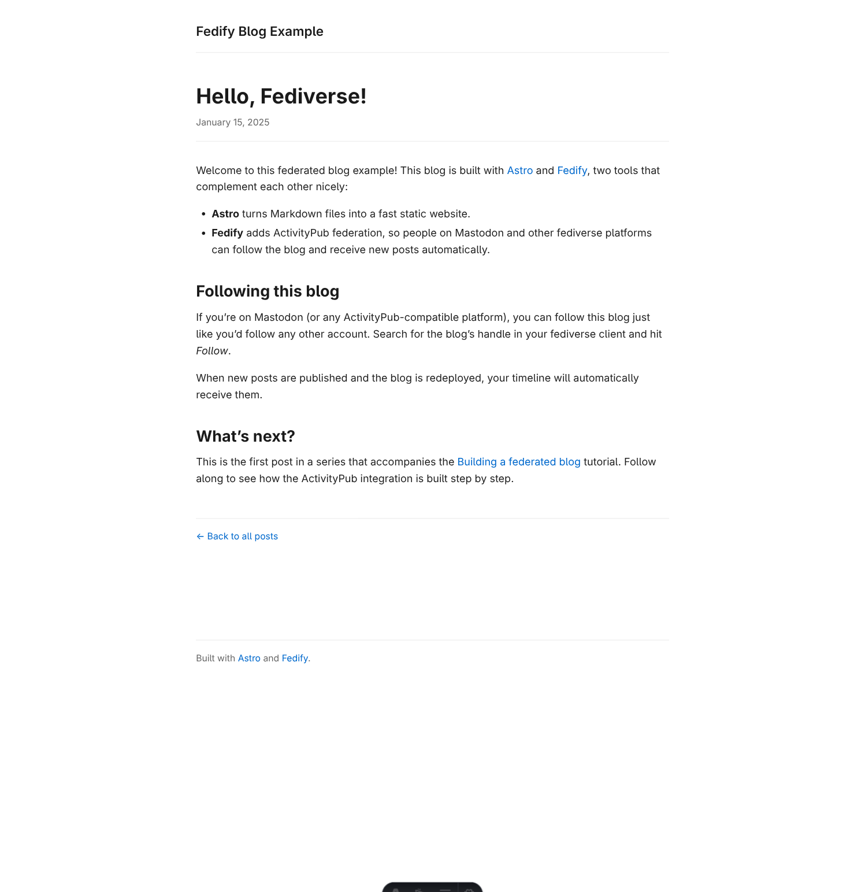
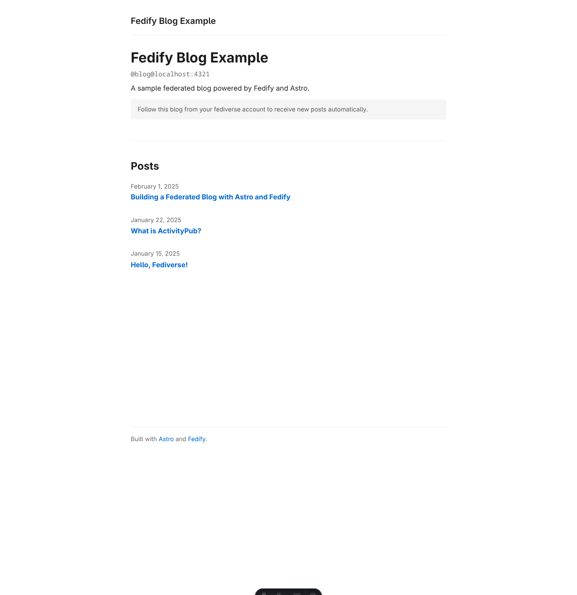
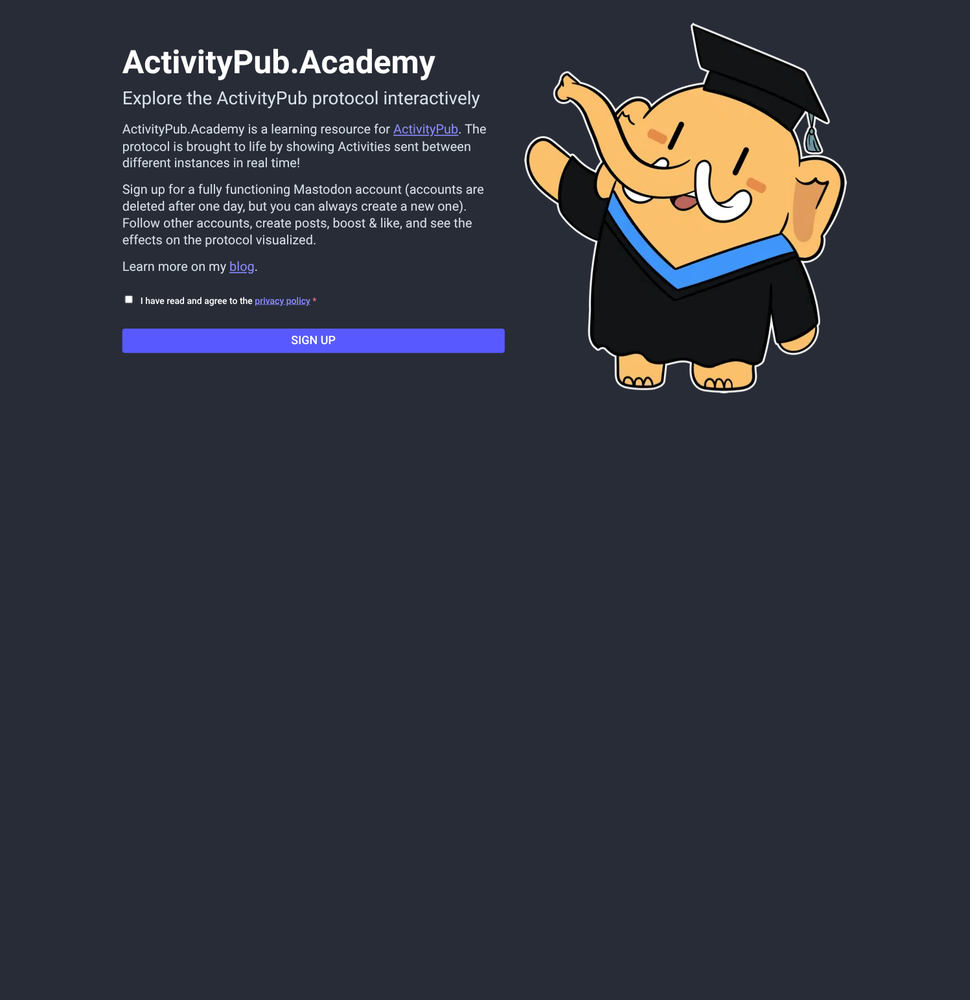
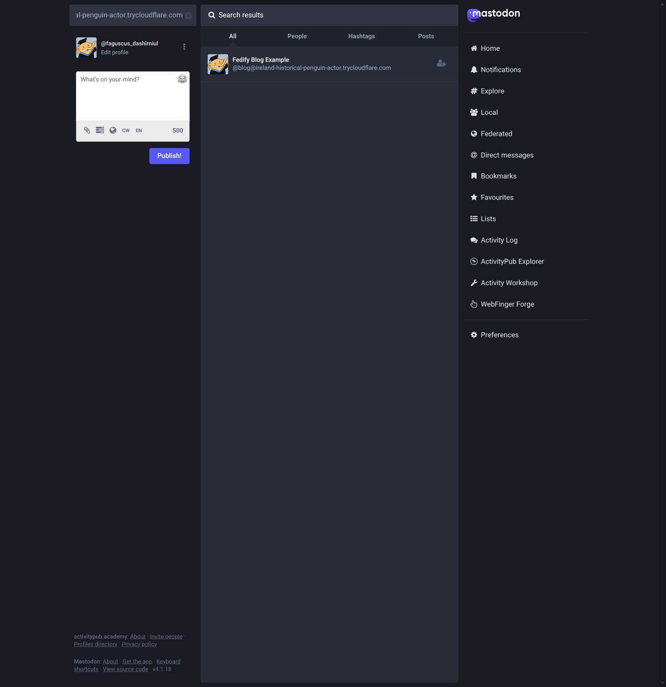
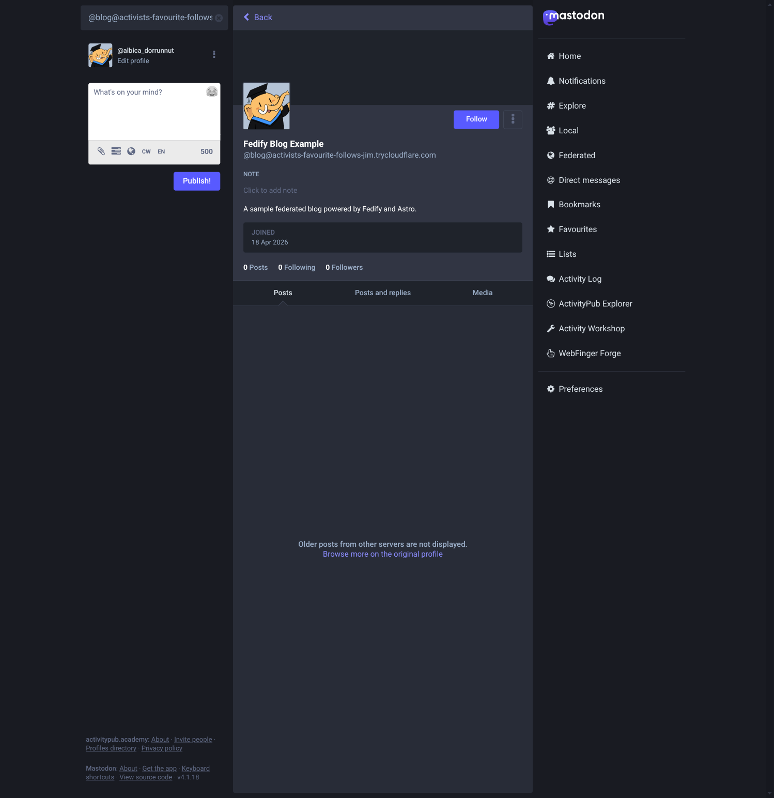
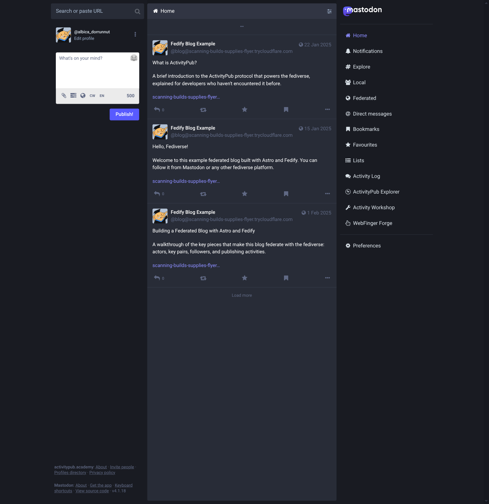
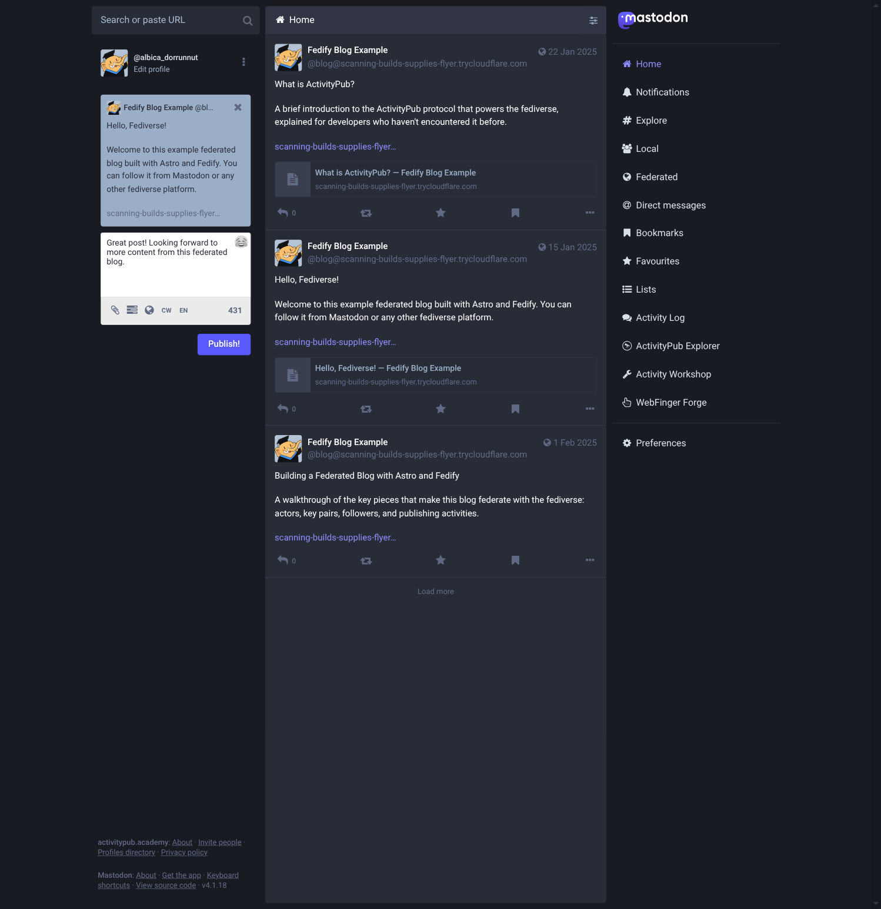
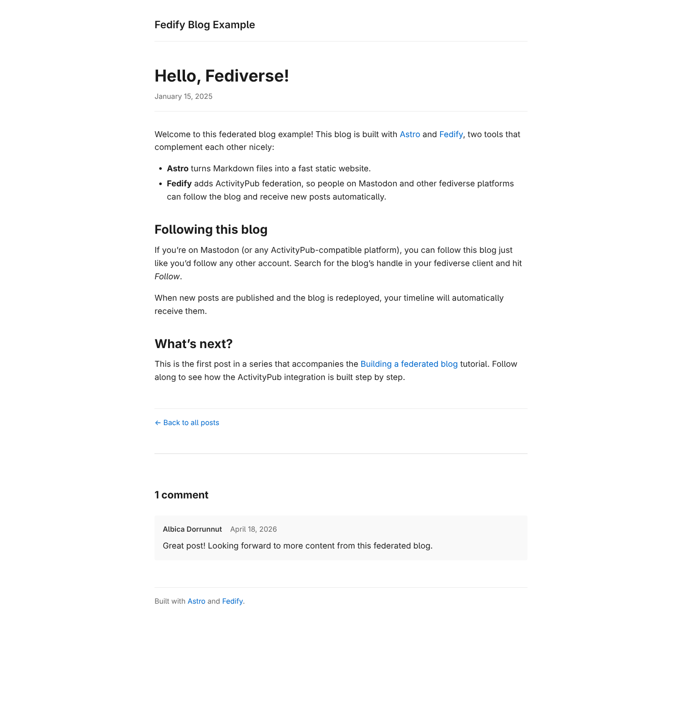

Building a federated blog
=========================

In this tutorial, we will build a [federated blog] using [Fedify] and [Astro].
Blog posts are authored as [Markdown] files in Astro content collections and
rendered on the server on request, while [ActivityPub] federation is handled
by dynamic server routes.
When you publish a new post (by deploying a new version of the site), your
followers in the fediverse automatically receive it—no extra steps needed.
Remote users can also reply to your posts from their own fediverse accounts,
and those replies appear as comments on your blog.

This tutorial focuses more on how to use Fedify than on understanding the
underlying ActivityPub protocol.  You'll see how Fedify handles the complex
parts of federation for you.

If you have any questions, suggestions, or feedback, please feel free to join
our [Matrix chat space] or [GitHub Discussions].

[federated blog]: https://en.wikipedia.org/wiki/Blog
[Fedify]: https://fedify.dev/
[Astro]: https://astro.build/
[Markdown]: https://en.wikipedia.org/wiki/Markdown
[ActivityPub]: https://www.w3.org/TR/activitypub/
[Matrix chat space]: https://matrix.to/#/#fedify:matrix.org
[GitHub Discussions]: https://github.com/fedify-dev/fedify/discussions

Target audience
---------------

This tutorial is aimed at those who want to learn Fedify and build their own
federated blog software.

We assume that you have some experience creating web pages using HTML and
basic JavaScript, and that you're comfortable using the command line.
However, you don't need to know TypeScript, ActivityPub, or Fedify—we'll
teach you what you need to know as we go along.

You don't need experience building ActivityPub software, but we do assume
that you've used at least one fediverse application such as Mastodon or
Misskey.  This way you'll have a feel for what we're trying to build.

*[HTML]: HyperText Markup Language

Goals
-----

In this tutorial, we'll use Fedify and [Astro] to create a single-author
federated blog that communicates with other fediverse software via ActivityPub.
The blog will include the following features:

 -  Blog posts are authored as Markdown files in *src/content/posts/*.
 -  The blog can be followed by other actors in the fediverse.
 -  A follower can unfollow the blog.
 -  When the blog is deployed with new posts, those posts are delivered to
    all followers as ActivityPub activities.
 -  Remote users can reply to blog posts from their fediverse account.
 -  Replies appear as comments on the blog post page.

To keep things focused, we'll impose the following limitations:

 -  The author's profile (bio, avatar, etc.) can only be changed by editing
    source files.
 -  Post changes only propagate to followers on the next server restart;
    there is no mechanism to push immediate edits or deletions.
 -  There are no likes or reposts.
 -  There is no search feature.
 -  There are no authentication or authorization features.

The complete source code is available in the [GitHub repository], with commits
corresponding to each step of this tutorial for your reference.

[GitHub repository]: https://github.com/fedify-dev/astro-blog

Setting up the development environment
--------------------------------------

### Installing Bun

Fedify supports three JavaScript runtimes: [Deno], [Node.js], and [Bun].
In this tutorial we'll use [Bun] because it includes a built-in SQLite driver
(`bun:sqlite`) that we'll use later to store followers and comments.

> [!TIP]
> A JavaScript *runtime* is a platform that executes JavaScript code outside
> of a web browser—on a server or in a terminal.  Node.js was the original
> server-side JavaScript runtime; Bun is a newer, faster alternative that also
> comes with a built-in package manager and test runner.

To install Bun, follow the instructions on the [Bun installation page].
Once installed, verify it works:

~~~~ sh
bun --version
~~~~

You should see a version number such as `1.2.0` or later.

[Deno]: https://deno.com/
[Node.js]: https://nodejs.org/
[Bun]: https://bun.sh/
[Bun installation page]: https://bun.sh/docs/installation

### Installing the `fedify` command

To initialize a Fedify project you need the [`fedify`](../cli.md) command.
Install it globally with:

~~~~ sh
bun install -g @fedify/cli
~~~~

Verify the installation:

~~~~ sh
fedify --version
~~~~

Make sure the version is 2.2.0 or higher.

### `fedify init` to initialize the project

Let's create a new directory for our blog and initialize the project.
In this tutorial we'll call it *astro-blog*:

~~~~ sh
fedify init astro-blog
~~~~

When `fedify init` runs, it asks a series of questions.
Select *Astro*, *bun*, *in-process*, and *in-memory* in order:

~~~~ console
             ___      _____        _ _  __
            /'_')    |  ___|__  __| (_)/ _|_   _
     .-^^^-/  /      | |_ / _ \/ _` | | |_| | | |
   __/       /       |  _|  __/ (_| | |  _| |_| |
  <__.|_|-|_|        |_|  \___|\__,_|_|_|  \__, |
                                           |___/

? Choose the web framework to use
  Bare-bones
  Hono
  Nitro
  Next.js
  ElysiaJS
❯ Astro
  Express

? Choose the package manager to use
  deno
  pnpm
❯ bun
  yarn
  npm

? Choose the message queue to use
❯ in-process
  redis
  postgres
  mysql
  amqp

? Choose the key-value store to use
❯ in-memory
  redis
  postgres
  mysql
~~~~

> [!NOTE]
> Fedify is not a full-stack web framework—it's a library specialized for
> implementing [ActivityPub] servers.  You always use it alongside another
> web framework.  In this tutorial we use [Astro] with server-side rendering,
> which lets us work with Markdown content collections and handle ActivityPub
> endpoints all in the same application.

After a moment, you'll have a working project with the following structure:

 -  *src/*
     -  *assets/* — Images and other static assets used in pages
     -  *components/* — Reusable Astro components
     -  *layouts/* — Page layout templates
     -  *pages/* — Routes (each *.astro* file becomes a URL)
         -  *index.astro* — The home page (`/`)
     -  *federation.ts* — ActivityPub server definition (the Fedify part)
     -  *logging.ts* — Logging configuration
     -  *middleware.ts* — Connects Fedify to Astro's request pipeline
 -  *public/* — Files served as-is (favicon, etc.)
 -  *astro.config.ts* — Astro configuration
 -  *biome.json* — Code formatter and linter settings
 -  *package.json* — Package metadata and scripts
 -  *tsconfig.json* — TypeScript settings

Because we're using TypeScript instead of plain JavaScript, source files have
*.ts* or *.astro* extensions.  We'll cover the TypeScript-specific syntax you
need as we go along.

### Visual Studio Code

We recommend using [Visual Studio Code] while following this tutorial.
TypeScript tooling works best in VS Code, and the generated project already
includes settings for it.

After [installing VS Code], open the project folder: *File* → *Open Folder…*.

If a popup asks you to install the recommended extensions, click *Install
All*.  This installs the [Biome extension] (formats and lints your code on
save) and the [Astro extension] (syntax highlighting and IntelliSense for
*.astro* files).

Let's verify the project works.  First, install the dependencies:

~~~~ sh
cd astro-blog
bun install
~~~~

Then start the development server:

~~~~ sh
bun run dev
~~~~

You should see output like this:

~~~~ console
 astro  v6.x.x ready in xxx ms
┃ Local    http://localhost:4321/
┃ Network  use --host to expose
~~~~

Leave the server running and open a second terminal.  Run this command to look
up the demo actor that `fedify init` created:

~~~~ sh
fedify lookup http://localhost:4321/users/john
~~~~

If you see output like this, everything is working:

~~~~ console
✔ Looking up the object...
Person {
  id: URL "http://localhost:4321/users/john",
  name: "john",
  preferredUsername: "john"
}
~~~~

This tells us there's an ActivityPub [*actor*][actor] at */users/john* on our
server.  An actor represents an account that can interact with other servers in
the fediverse.

> [!TIP]
> [`fedify lookup`](../cli.md#fedify-lookup-looking-up-an-activitypub-object)
> fetches and displays any ActivityPub object.  It's like doing a fediverse
> search from the command line.
>
> You can also use `curl` directly if you prefer:
>
> ~~~~ sh
> curl -H "Accept: application/activity+json" \
>   http://localhost:4321/users/john | jq .
> ~~~~
>
> The `-H "Accept: application/activity+json"` option sets the
> <code>Accept</code> header and tells Astro to return the ActivityPub JSON
> representation of the page rather than the HTML version.  This is called
> *content negotiation*, and we'll cover it in detail when we implement our
> actor.

Stop the dev server with <kbd>Ctrl</kbd>+<kbd>C</kbd> for now.

[Visual Studio Code]: https://code.visualstudio.com/
[installing VS Code]: https://code.visualstudio.com/docs/setup/setup-overview
[Biome extension]: https://marketplace.visualstudio.com/items?itemName=biomejs.biome
[Astro extension]: https://marketplace.visualstudio.com/items?itemName=astro-build.astro-vscode
[actor]: https://www.w3.org/TR/activitypub/#actors

Prerequisites
-------------

### TypeScript

Before we start writing code, let's briefly go over TypeScript.
If you're already familiar with TypeScript, feel free to skip this section.

TypeScript is a superset of JavaScript that adds optional static type
annotations.  The syntax is almost identical to JavaScript; you just add type
information after a colon (`:`).

For example, this declares a variable `name` that must hold a string:

~~~~ typescript twoslash
let name: string = "Alice";
~~~~

If you try to assign a value of the wrong type, your editor will show a red
underline *before you even run the code*:

~~~~ typescript twoslash
// @errors: 2322
let name: string;
// ---cut-before---
name = 42; // ← red underline: Type 'number' is not assignable to type 'string'
~~~~

You can also annotate function parameters and return types:

~~~~ typescript twoslash
function greet(name: string): string {
  return `Hello, ${name}!`;
}
~~~~

Throughout this tutorial we'll encounter a few more TypeScript features and
explain them as they appear.  TypeScript knowledge isn't required—just pay
attention to the red underlines in your editor and read the error messages.
They're usually very helpful.

Building the blog
-----------------

Now that the project is scaffolded, let's turn it into an actual blog.
We'll use [Astro's content collections][content-collections] to manage blog
posts as Markdown files, create a listing page, and add individual post pages.
At the end of this chapter you'll have a working blog—no ActivityPub yet, just
a clean static site.

[content-collections]: https://docs.astro.build/en/guides/content-collections/

### Defining the content collection

Astro uses *content collections* to type-check and manage structured content
like blog posts.  Create the file *src/content.config.ts*:

~~~~ typescript
import { defineCollection } from "astro:content";
import { glob } from "astro/loaders";
import { z } from "astro/zod";

const posts = defineCollection({
  loader: glob({ pattern: "**/*.md", base: "./src/content/posts" }),
  schema: z.object({
    title: z.string(),
    pubDate: z.coerce.date(),
    description: z.string(),
    draft: z.boolean().optional(),
  }),
});

export const collections = { posts };
~~~~

Let's walk through this:

 -  `defineCollection()` declares a named collection of content files.
 -  `glob(...)` tells Astro to find all _\*.md_ files in *src/content/posts/*.
 -  `z.object(...)` is a [Zod] schema that validates and types the frontmatter
    in each Markdown file.

> [!NOTE]
> *Frontmatter* is the YAML block at the top of a Markdown file, enclosed
> in `---`.  It holds metadata like the title and publication date.

The `z` object is a schema validation library called [Zod].  Each field in the
schema corresponds to a frontmatter field in our Markdown posts.  TypeScript
will enforce that all posts have a `title`, `pubDate`, and `description`.

[Zod]: https://zod.dev/

### Writing blog posts

Create three sample posts.  First, *src/content/posts/hello-fediverse.md*:

~~~~ markdown
---
title: "Hello, Fediverse!"
pubDate: 2025-01-15
description: >-
  Welcome to this example federated blog built with Astro and Fedify.
  You can follow it from Mastodon or any other fediverse platform.
---

Welcome to this federated blog example! ...
~~~~

Create two more posts—their exact content isn't important for the tutorial;
what matters is that each post has valid frontmatter matching the schema.

> [!TIP]
> The `>-` syntax in YAML is a *block scalar*—it lets you write a long string
> across multiple lines.  Trailing newlines are stripped.  This is handy for
> `description` fields that would otherwise make the frontmatter too wide.

### The layout component

Replace *src/layouts/Layout.astro* with a minimal layout.  The key parts are
the `Props` interface (which TypeScript uses to type-check component usage) and
a `<slot />` where page content is injected:

~~~~ astro
---
interface Props {
  title?: string;
  description?: string;
}

const { title, description } = Astro.props;
const siteTitle = "Fedify Blog Example";
const pageTitle = title ? `${title} — ${siteTitle}` : siteTitle;
---

<!doctype html>
<html lang="en">
  <head>
    <meta charset="UTF-8" />
    <meta name="viewport" content="width=device-width, initial-scale=1.0" />
    <link rel="icon" href="/favicon.ico" />
    <title>{pageTitle}</title>
    {description && <meta name="description" content={description} />}
  </head>
  <body>
    <header>
      <nav>
        <a href="/" class="site-title">{siteTitle}</a>
      </nav>
    </header>
    <main>
      <slot />
    </main>
    <footer>
      

        Built with <a href="https://astro.build/">Astro</a> and
        <a href="https://fedify.dev/">Fedify</a>.
      

    </footer>
  </body>
</html>

~~~~

Notice that the layout uses `
~~~~

This page imports the constants from *federation.ts* so the blog name and
description stay in sync between the HTML and JSON-LD views.

> [!TIP]
> The URL `/users/blog` is served by both Fedify and Astro—they share the
> route.  Which one responds depends on the <code>Accept</code> header of the
> request.  ActivityPub clients send `Accept: application/activity+json`, so
> Fedify handles those and returns JSON-LD.  Browsers send
> `Accept: text/html`, so Astro handles those and renders the HTML profile
> page.
>
> This HTTP [content negotiation] trick is what makes Fedify and Astro work
> together on the same path.  Fedify's `@fedify/astro` middleware inspects the
> <code>Accept</code> header and hands off non-ActivityPub requests to the
> Astro router.

[content negotiation]: https://developer.mozilla.org/en-US/docs/Web/HTTP/Content_negotiation

### Testing the actor

Start the development server if it isn't running:

~~~~ sh
bun run dev
~~~~

Open <http://localhost:4321/users/blog> in your browser.  You should see the
actor profile page with the blog name, handle, and post list:

Now test the ActivityPub response.  Open a new terminal and run:

~~~~ sh
fedify lookup http://localhost:4321/users/blog
~~~~

You should see output like this:

~~~~ console
✔ Looking up the object...
Person {
  id: URL "http://localhost:4321/users/blog",
  name: "Fedify Blog Example",
  summary: "A sample federated blog powered by Fedify and Astro.",
  url: URL "http://localhost:4321/",
  preferredUsername: "blog",
  publicKey: CryptographicKey {
    id: URL "http://localhost:4321/users/blog#main-key",
    owner: URL "http://localhost:4321/users/blog",
    publicKey: CryptoKey { ... },
  },
  ...
}
~~~~

> [!NOTE]
> If `fedify lookup` returns an error about a private or localhost address,
> add the `-p`/`--allow-private-address` flag:
>
> ~~~~ sh
> fedify lookup -p http://localhost:4321/users/blog
> ~~~~

The blog now has a valid ActivityPub identity.  However, it can't receive
follows or deliver posts to the fediverse yet—those features require a public
URL, which we'll set up next.

Interoperating with Mastodon
----------------------------

So far we've verified the actor endpoint works locally.  Now let's confirm
it's recognizable to other ActivityPub software—in this case, Mastodon.  To
do that, we need a publicly reachable HTTPS URL.

In this chapter you'll first expose your local server through a tunnel,
then update the middleware and Astro configuration so the server works
correctly behind that public URL.

### Exposing the server with `fedify tunnel`

The `fedify` CLI includes a built-in tunneling command that creates a secure
public URL pointing at your local server:

~~~~ sh
fedify tunnel 4321
~~~~

You'll see output like this after a few seconds:

~~~~ console
✔ Tunnel is ready!
  Public URL: https://3f8a2b1c4d5e6f.lhr.life/
~~~~

> [!NOTE]
> The tunnel uses one of several free tunneling services
> (localhost.run, serveo.net, or pinggy.io).  The URL changes each
> time you run the command.  Once you've introduced SQLite persistence
> (in a later chapter), delete *blog.db* whenever the tunnel URL
> changes—otherwise the ActivityPub IDs stored in the database (actor
> URL, post URLs) will reference the old origin and remote servers may
> reject or deduplicate activities incorrectly.

Keep the tunnel running in a separate terminal while you continue
testing.

However, there's one more thing to do.  The tunnel terminates HTTPS
and forwards plain HTTP to your local server.  Without extra
configuration, Fedify would generate `http://` actor IDs rather than
`https://`, which other servers will reject.

To fix this, update *src/middleware.ts* to rewrite the request URL based on
the `X-Forwarded-Proto` and `X-Forwarded-Host` headers that the tunnel sets:

~~~~ typescript twoslash [src/middleware.ts]
// @noErrors
import { fedifyMiddleware } from "@fedify/astro";
import type { MiddlewareHandler } from "astro";
import federation from "./federation.ts";
import "./logging.ts";

export const onRequest: MiddlewareHandler = (context, next) => {
  // Rewrite the request URL based on X-Forwarded-Proto / X-Forwarded-Host
  // when running behind a reverse proxy or tunnel (e.g. `fedify tunnel`).
  const proto = context.request.headers.get("x-forwarded-proto");
  const host = context.request.headers.get("x-forwarded-host");
  const url = new URL(context.request.url);
  if (proto != null && url.protocol !== `${proto}:`) url.protocol = proto;
  if (host != null && url.host !== host) url.host = host;
  if (proto != null || host != null) {
    context.request = new Request(url.toString(), context.request);
  }
  return fedifyMiddleware(federation, (_ctx) => undefined)(context, next);
};
~~~~

The `X-Forwarded-Proto` header carries the original scheme (`https`), and
`X-Forwarded-Host` carries the original hostname (your tunnel domain).
Together they ensure Fedify generates fully correct actor and object URLs.

Also update *astro.config.ts* to allow requests from external hostnames
(the tunnel assigns a different hostname than `localhost`):

~~~~ typescript{9-18} [astro.config.ts]
import { fedifyIntegration } from "@fedify/astro";
import bun from "@nurodev/astro-bun";
import { defineConfig } from "astro/config";

export default defineConfig({
  integrations: [fedifyIntegration()],
  output: "server",
  adapter: bun(),
  security: {
    // Trust any forwarded host so the server works correctly behind a
    // reverse proxy or tunnel (e.g. `fedify tunnel`, Cloudflare Tunnel).
    allowedDomains: [{}],
  },
  vite: {
    server: {
      allowedHosts: true,
    },
  },
});
~~~~

`security.allowedDomains` tells Astro to trust
`X-Forwarded-Host`.  Setting it to `[{}]` (an object with no properties)
matches any domain.  Without this, the server ignores `X-Forwarded-Host`
and Fedify falls back to `localhost` in all generated URLs, which other
fediverse servers can't reach.

> [!WARNING]
> Trusting all forwarded headers (`allowedDomains: [{}]`) is only safe when
> the server is exclusively reachable through a trusted reverse proxy or
> tunnel that sets `X-Forwarded-Host` correctly.  If the server were directly
> accessible from the internet, a malicious client could forge
> `X-Forwarded-Host` and cause Fedify to generate incorrect ActivityPub IDs.
> For a production deployment behind a known proxy (e.g. Fly.io), you can
> restrict `allowedDomains` to the exact hostname(s) your proxy uses.

> [!WARNING]
> `allowedHosts: true` disables Vite's host checking.  This is fine for
> local development where only you control the server.  Do **not** use
> this setting in production—Astro uses a different server configuration
> when built for deployment.

Restart the dev server after these changes.  Now run `fedify lookup`
with the tunnel URL to confirm the actor ID uses `https://`:

~~~~ sh
fedify lookup https://3f8a2b1c4d5e6f.lhr.life/users/blog
~~~~

You should see:

~~~~ console
✔ Looking up the object...
Person {
  id: URL "https://3f8a2b1c4d5e6f.lhr.life/users/blog",
  name: "Fedify Blog Example",
  ...
}
~~~~

### Searching for the blog on ActivityPub.Academy

With the server publicly accessible, head to [ActivityPub.Academy]—a
sandbox Mastodon instance designed for ActivityPub testing.  Unlike a
regular Mastodon server, ActivityPub.Academy issues a temporary anonymous
account on the spot: there is no email or password.  Accounts are
automatically deleted after 24 hours, but you can always create a fresh
one.

To get an account, check *I have read and agree to the privacy policy*
and click *Sign up*:

Once signed in, type the blog's handle into the search box and press
<kbd>Enter</kbd>:

~~~~ console
@blog@3f8a2b1c4d5e6f.lhr.life
~~~~

ActivityPub.Academy sends a [WebFinger] lookup to your server to resolve
the handle.  You should see the blog appear in the search results:

> [!NOTE]
> You must be *signed in* for remote actor resolution to work.
> Unauthenticated searches only show locally cached results, so the
> blog won't appear if you search without logging in first.

Click the blog's profile to confirm all the metadata looks correct:

The blog is now discoverable across the fediverse.  In the next chapter
we'll implement inbox listeners so it can actually receive and respond
to `Follow` activities.

[ActivityPub.Academy]: https://activitypub.academy
[WebFinger]: https://webfinger.net/

Implementing followers
----------------------

Our blog actor is now discoverable, but if a remote user tries to follow it,
nothing happens—we haven't implemented the inbox yet.  In this chapter we'll
handle `Follow` activities (auto-accepting them and storing followers) and
`Undo(Follow)` activities (removing followers).  We'll also display the
follower count on the home page.

### Updating the federation module

Replace *src/federation.ts* with the following:

~~~~ typescript twoslash [src/federation.ts]
// @noErrors
import {
  createFederation,
  generateCryptoKeyPair,
  InProcessMessageQueue,
  MemoryKvStore,
} from "@fedify/fedify";
import { Accept, Endpoints, Follow, Person, Undo } from "@fedify/vocab";
import { getLogger } from "@logtape/logtape";
import { followers, keyPairs } from "./lib/store.ts";

const logger = getLogger("astro-blog");

export const BLOG_IDENTIFIER = "blog";
export const BLOG_NAME = "Fedify Blog Example";
export const BLOG_SUMMARY =
  "A sample federated blog powered by Fedify and Astro.";

const federation = createFederation({
  kv: new MemoryKvStore(),
  queue: new InProcessMessageQueue(),
});

federation
  .setActorDispatcher("/users/{identifier}", async (ctx, identifier) => {
    if (identifier !== BLOG_IDENTIFIER) {
      logger.debug("Unknown actor identifier: {identifier}", { identifier });
      return null;
    }
    const kp = await ctx.getActorKeyPairs(identifier);
    return new Person({
      id: ctx.getActorUri(identifier),
      preferredUsername: identifier,
      name: BLOG_NAME,
      summary: BLOG_SUMMARY,
      url: new URL("/", ctx.url),
      inbox: ctx.getInboxUri(identifier),
      endpoints: new Endpoints({
        sharedInbox: ctx.getInboxUri(),
      }),
      followers: ctx.getFollowersUri(identifier),
      publicKey: kp[0].cryptographicKey,
      assertionMethods: kp.map((k) => k.multikey),
    });
  })
  .setKeyPairsDispatcher(async (_ctx, identifier) => {
    if (identifier !== BLOG_IDENTIFIER) return [];
    const stored = keyPairs.get(identifier);
    if (stored) return stored;
    const [rsaKey, ed25519Key] = await Promise.all([
      generateCryptoKeyPair("RSASSA-PKCS1-v1_5"),
      generateCryptoKeyPair("Ed25519"),
    ]);
    const kp = [rsaKey, ed25519Key];
    keyPairs.set(identifier, kp);
    return kp;
  });

federation
  .setInboxListeners("/users/{identifier}/inbox", "/inbox")
  .on(Follow, async (ctx, follow) => {
    if (follow.id == null || follow.actorId == null) return;
    const parsed = ctx.parseUri(follow.objectId);
    if (parsed?.type !== "actor" || parsed.identifier !== BLOG_IDENTIFIER) {
      return;
    }
    const follower = await follow.getActor(ctx);
    if (follower == null || follower.id == null || follower.inboxId == null) {
      return;
    }
    followers.set(follower.id.href, follower.inboxId.href);
    logger.info("New follower: {follower}", { follower: follower.id.href });
    await ctx.sendActivity(
      { identifier: BLOG_IDENTIFIER },
      follower,
      new Accept({
        id: new URL(
          `#accepts/${follower.id.href}`,
          ctx.getActorUri(BLOG_IDENTIFIER),
        ),
        actor: ctx.getActorUri(BLOG_IDENTIFIER),
        object: follow,
      }),
    );
  })
  .on(Undo, async (ctx, undo) => {
    const object = await undo.getObject(ctx);
    if (!(object instanceof Follow)) return;
    if (object.objectId?.href !== ctx.getActorUri(BLOG_IDENTIFIER).href) return;
    if (undo.actorId == null) return;
    followers.delete(undo.actorId.href);
    logger.info("Unfollowed: {actor}", { actor: undo.actorId.href });
  });

federation.setFollowersDispatcher(
  "/users/{identifier}/followers",
  (_ctx, identifier) => {
    if (identifier !== BLOG_IDENTIFIER) return null;
    const items = Array.from(followers.entries()).map(([id, inboxId]) => ({
      id: new URL(id),
      inboxId: new URL(inboxId),
    }));
    return { items };
  },
);

export default federation;
~~~~

Let's walk through the new pieces:

**Importing `Accept`, `Follow`, and `Undo`** from `@fedify/vocab` gives us the
activity types we need to handle.  We also import `followers` from the store.

**`.on(Follow, ...)`** registers a handler for incoming `Follow` activities.
When someone follows the blog:

1.  We use `ctx.parseUri(follow.objectId)` to confirm they're following our
    blog actor (not some other actor).
2.  We call `follow.getActor(ctx)` to fetch the follower's actor document—this
    gives us their `id` and `inboxId`.
3.  We store the follower in the `followers` map.
4.  We send back an `Accept(Follow)` activity to confirm the follow.  Without
    this, the follow request stays pending on the remote server.

**`.on(Undo, ...)`** handles `Undo(Follow)` activities, which are sent when
someone unfollows.  We use `undo.getObject(ctx)` to retrieve the original
`Follow` activity.  If it's a `Follow`, we remove the actor from the
`followers` map.

**`setFollowersDispatcher`** now returns the real follower list instead of an
empty array.  Each item needs both an `id` (the actor's URL) and an `inboxId`
(where to deliver activities)—Fedify uses these when sending activities to all
followers.

> [!WARNING]
> After saving *src/federation.ts*, stop the dev server
> (<kbd>Ctrl</kbd>+<kbd>C</kbd>) and start it again with `bun run dev`.
> Astro's hot-module reload does not always re-register Fedify's inbox
> listeners, and an incoming `Follow` against a stale federation object
> may be rejected with `Unsupported activity type: Follow`.  Every time
> you edit *src/federation.ts* (now or in later chapters), do a clean
> restart before sending activities to the inbox.

### Showing follower count on the home page

Update *src/pages/index.astro* to display the follower count and a link to
the actor profile:

~~~~ astro{2-4,11-14} [src/pages/index.astro]
---
import { getCollection } from "astro:content";
import { BLOG_IDENTIFIER, BLOG_NAME } from "../federation.ts";
import { followers } from "../lib/store.ts";
import Layout from "../layouts/Layout.astro";

const allPosts = await getCollection("posts");
const posts = allPosts
  .filter((post) => !post.data.draft)
  .sort((a, b) => b.data.pubDate.getTime() - a.data.pubDate.getTime());

const followerCount = followers.size;
const handle = `@${BLOG_IDENTIFIER}@${Astro.url.host}`;
---

<Layout>
  <h1>{BLOG_NAME}</h1>
  

    <a href={`/users/${BLOG_IDENTIFIER}`}>{handle}</a>
    · {followerCount} {followerCount === 1 ? "follower" : "followers"}
  

  ...
</Layout>
~~~~

### Testing with ActivityPub.Academy

To test the follow flow, we need a real ActivityPub server to send `Follow`
activities to our blog.  [ActivityPub.Academy] is a sandbox Mastodon instance
designed specifically for this purpose.

> [!IMPORTANT]
> If you haven't already, stop the dev server
> (<kbd>Ctrl</kbd>+<kbd>C</kbd>) and start it again before running this
> test—see the warning above about HMR and inbox listeners.

Restart the dev server and open the tunnel in a separate terminal:

~~~~ sh
bun run dev
# In a separate terminal:
fedify tunnel 4321
~~~~

On ActivityPub.Academy, sign in (or create a test account) and search for
your blog's handle:

~~~~ console
@blog@3f8a2b1c4d5e6f.lhr.life
~~~~

Click *Follow*.  Within a second or two, you should see a log message in
your dev server terminal:

~~~~ console
18:42:01.123 INF astro-blog New follower: https://activitypub.academy/users/testuser
~~~~

Refresh the home page—the follower count should now read `1 follower`:

To test unfollowing, click *Unfollow* on ActivityPub.Academy.  The follower
count should drop back to 0.

> [!NOTE]
> Followers are stored in memory and are lost when you restart the
> server.  We'll fix this in the next chapter when we migrate to SQLite.

Persisting data with SQLite
---------------------------

Our blog now handles followers—but there is a catch.  Every time you restart
the dev server, both the key pairs and the follower list vanish.  This means
the blog appears under a *different* public key after each restart, which
causes all remote servers to reject its HTTP signatures.  Followers accumulated
during a previous run are also gone, so the blog can no longer notify them of
new posts.

The fix is straightforward: persist everything in a SQLite database that
survives restarts.  Bun ships with `bun:sqlite`, a zero-dependency, high-speed
SQLite driver, so we don't need to install anything new.

### Adding bun-types

`bun:sqlite` is a Bun built-in module.  Its TypeScript declarations are
shipped in the `bun-types` package.  Install it as a dev dependency:

~~~~ sh
bun add -d bun-types
~~~~

Then tell TypeScript to include those declarations by adding a
`compilerOptions` block to *tsconfig.json*:

~~~~ json [tsconfig.json]
{
  "extends": "astro/tsconfigs/strict",
  "compilerOptions": {
    "types": ["bun-types"]
  },
  "include": [".astro/types.d.ts", "**/*"],
  "exclude": ["dist"]
}
~~~~

### Creating the database module

Create a new file *src/lib/db.ts* that opens the database and defines the
schema:

~~~~ typescript twoslash [src/lib/db.ts]
// @noErrors
import { Database } from "bun:sqlite";

const db = new Database("blog.db");

db.run(`
  CREATE TABLE IF NOT EXISTS key_pairs (
    identifier TEXT NOT NULL,
    algorithm  TEXT NOT NULL,
    private_key BLOB NOT NULL,
    public_key  BLOB NOT NULL,
    PRIMARY KEY (identifier, algorithm)
  )
`);

db.run(`
  CREATE TABLE IF NOT EXISTS followers (
    actor_id  TEXT PRIMARY KEY,
    inbox_url TEXT NOT NULL
  )
`);

export default db;
~~~~

`new Database("blog.db")` creates *blog.db* in the project root on the first
run and reopens it on subsequent runs.  The `CREATE TABLE IF NOT EXISTS`
statements are idempotent, so they run safely every time the server starts.

The schema has two tables:

 -  **`key_pairs`** stores one row per cryptographic key.  The composite primary
    key `(identifier, algorithm)` lets us store both the RSA-PKCS1-v1\_5 and
    Ed25519 keys for the same actor.  Private and public key material are kept
    as raw binary (`BLOB`) using the standard PKCS#8 and SPKI formats.

 -  **`followers`** maps each follower's actor URL (`actor_id`) to their inbox
    URL (`inbox_url`).  The actor URL is the primary key so that a second
    `Follow` from the same actor simply overwrites the row.

### Migrating the store

Replace the entire contents of *src/lib/store.ts* with SQLite-backed
functions:

~~~~ typescript twoslash [src/lib/store.ts]
// @noErrors
import db from "./db.ts";

export async function getKeyPairs(
  identifier: string,
): Promise<CryptoKeyPair[] | null> {
  const rows = db
    .query<
      { algorithm: string; private_key: Uint8Array; public_key: Uint8Array },
      [string]
    >(
      `SELECT algorithm, private_key, public_key
       FROM key_pairs WHERE identifier = ? ORDER BY rowid`,
    )
    .all(identifier);
  if (rows.length === 0) return null;
  return Promise.all(
    rows.map(async ({ algorithm, private_key, public_key }) => {
      const alg: AlgorithmIdentifier | RsaHashedImportParams =
        algorithm === "RSASSA-PKCS1-v1_5"
          ? { name: "RSASSA-PKCS1-v1_5", hash: "SHA-256" }
          : algorithm;
      const [privateKey, publicKey] = await Promise.all([
        crypto.subtle.importKey(
          "pkcs8",
          private_key as unknown as Uint8Array<ArrayBuffer>,
          alg,
          true,
          ["sign"],
        ),
        crypto.subtle.importKey(
          "spki",
          public_key as unknown as Uint8Array<ArrayBuffer>,
          alg,
          true,
          ["verify"],
        ),
      ]);
      return { privateKey, publicKey };
    }),
  );
}

export async function saveKeyPairs(
  identifier: string,
  kp: CryptoKeyPair[],
): Promise<void> {
  const insert = db.prepare(
    `INSERT OR REPLACE INTO key_pairs
     (identifier, algorithm, private_key, public_key) VALUES (?, ?, ?, ?)`,
  );
  for (const { privateKey, publicKey } of kp) {
    const [privateKeyData, publicKeyData] = await Promise.all([
      crypto.subtle.exportKey("pkcs8", privateKey),
      crypto.subtle.exportKey("spki", publicKey),
    ]);
    insert.run(
      identifier,
      privateKey.algorithm.name,
      new Uint8Array(privateKeyData),
      new Uint8Array(publicKeyData),
    );
  }
}

export function addFollower(actorId: string, inboxUrl: string): void {
  db.run(
    `INSERT OR REPLACE INTO followers (actor_id, inbox_url) VALUES (?, ?)`,
    [actorId, inboxUrl],
  );
}

export function removeFollower(actorId: string): void {
  db.run(`DELETE FROM followers WHERE actor_id = ?`, [actorId]);
}

export function countFollowers(): number {
  return (
    db
      .query<{ count: number }, []>(
        `SELECT COUNT(*) AS count FROM followers`,
      )
      .get()?.count ?? 0
  );
}

export function getFollowers(): { id: URL; inboxId: URL }[] {
  return db
    .query<{ actor_id: string; inbox_url: string }, []>(
      `SELECT actor_id, inbox_url FROM followers`,
    )
    .all()
    .map(({ actor_id, inbox_url }) => ({
      id: new URL(actor_id),
      inboxId: new URL(inbox_url),
    }));
}
~~~~

A few things worth noting here:

 -  *Key serialization:* `CryptoKey` objects exist only in memory—they cannot
    be stored directly.  We export private keys with [`crypto.subtle.exportKey`]
    using the PKCS#8 format and public keys using the SPKI format, both of
    which produce `ArrayBuffer` values that SQLite stores as BLOBs.  On the
    way back we call [`crypto.subtle.importKey`] with the reverse formats.
    RSA keys also need the hash algorithm (SHA-256) specified at import time,
    so we branch on the algorithm name stored in the row.

 -  *BLOB return type:* Bun's SQLite driver returns BLOB columns as
    `Uint8Array<ArrayBufferLike>`, but the [Web Crypto API]'s `importKey`
    expects `Uint8Array<ArrayBuffer>`.  The difference is purely a TypeScript
    typing issue—the underlying bytes are identical—so we silence it with
    `as unknown as Uint8Array<ArrayBuffer>`.

 -  *Synchronous followers:* Unlike key pairs, follower operations don't
    involve any cryptography, so the four follower functions (`addFollower`,
    `removeFollower`, `countFollowers`, `getFollowers`) are plain synchronous
    functions.

[`crypto.subtle.exportKey`]: https://developer.mozilla.org/en-US/docs/Web/API/SubtleCrypto/exportKey
[`crypto.subtle.importKey`]: https://developer.mozilla.org/en-US/docs/Web/API/SubtleCrypto/importKey
[Web Crypto API]: https://developer.mozilla.org/en-US/docs/Web/API/Web_Crypto_API

### Updating the federation module

*src/federation.ts* now imports functions from the new store instead of
`Map` objects.  Replace the import line and update the two dispatcher bodies:

~~~~ typescript twoslash [src/federation.ts]
// @noErrors
import {
  createFederation,
  generateCryptoKeyPair,
  InProcessMessageQueue,
  MemoryKvStore,
} from "@fedify/fedify";
import { Accept, Endpoints, Follow, Person, Undo } from "@fedify/vocab";
import { getLogger } from "@logtape/logtape";
import {
  addFollower,
  getFollowers,
  getKeyPairs,
  removeFollower,
  saveKeyPairs,
} from "./lib/store.ts";

const logger = getLogger("astro-blog");

export const BLOG_IDENTIFIER = "blog";
export const BLOG_NAME = "Fedify Blog Example";
export const BLOG_SUMMARY =
  "A sample federated blog powered by Fedify and Astro.";

const federation = createFederation({
  kv: new MemoryKvStore(),
  queue: new InProcessMessageQueue(),
});

federation
  .setActorDispatcher("/users/{identifier}", async (ctx, identifier) => {
    if (identifier !== BLOG_IDENTIFIER) {
      logger.debug("Unknown actor identifier: {identifier}", { identifier });
      return null;
    }
    const kp = await ctx.getActorKeyPairs(identifier);
    return new Person({
      id: ctx.getActorUri(identifier),
      preferredUsername: identifier,
      name: BLOG_NAME,
      summary: BLOG_SUMMARY,
      url: new URL("/", ctx.url),
      inbox: ctx.getInboxUri(identifier),
      endpoints: new Endpoints({
        sharedInbox: ctx.getInboxUri(),
      }),
      followers: ctx.getFollowersUri(identifier),
      publicKey: kp[0].cryptographicKey,
      assertionMethods: kp.map((k) => k.multikey),
    });
  })
  .setKeyPairsDispatcher(async (_ctx, identifier) => {
    if (identifier !== BLOG_IDENTIFIER) return [];
    const stored = await getKeyPairs(identifier);
    if (stored) return stored;
    const [rsaKey, ed25519Key] = await Promise.all([
      generateCryptoKeyPair("RSASSA-PKCS1-v1_5"),
      generateCryptoKeyPair("Ed25519"),
    ]);
    const kp = [rsaKey, ed25519Key];
    await saveKeyPairs(identifier, kp);
    return kp;
  });

federation
  .setInboxListeners("/users/{identifier}/inbox", "/inbox")
  .on(Follow, async (ctx, follow) => {
    if (follow.id == null || follow.actorId == null) return;
    const parsed = ctx.parseUri(follow.objectId);
    if (parsed?.type !== "actor" || parsed.identifier !== BLOG_IDENTIFIER) {
      return;
    }
    const follower = await follow.getActor(ctx);
    if (follower == null || follower.id == null || follower.inboxId == null) {
      return;
    }
    addFollower(follower.id.href, follower.inboxId.href);
    logger.info("New follower: {follower}", { follower: follower.id.href });
    await ctx.sendActivity(
      { identifier: BLOG_IDENTIFIER },
      follower,
      new Accept({
        id: new URL(
          `#accepts/${follower.id.href}`,
          ctx.getActorUri(BLOG_IDENTIFIER),
        ),
        actor: ctx.getActorUri(BLOG_IDENTIFIER),
        object: follow,
      }),
    );
  })
  .on(Undo, async (ctx, undo) => {
    const object = await undo.getObject(ctx);
    if (!(object instanceof Follow)) return;
    if (object.objectId?.href !== ctx.getActorUri(BLOG_IDENTIFIER).href) return;
    if (undo.actorId == null) return;
    removeFollower(undo.actorId.href);
    logger.info("Unfollowed: {actor}", { actor: undo.actorId.href });
  });

federation.setFollowersDispatcher(
  "/users/{identifier}/followers",
  (_ctx, identifier) => {
    if (identifier !== BLOG_IDENTIFIER) return null;
    return { items: getFollowers() };
  },
);

export default federation;
~~~~

The key changes are:

 -  `keyPairs.get(identifier)` → `await getKeyPairs(identifier)`
 -  `keyPairs.set(identifier, kp)` → `await saveKeyPairs(identifier, kp)`
 -  `followers.set(...)` → `addFollower(...)`
 -  `followers.delete(...)` → `removeFollower(...)`
 -  `Array.from(followers.entries()).map(...)` → `getFollowers()`

### Updating the home page

*src/pages/index.astro* used to read `followers.size` directly from the
in-memory `Map`.  Now it calls `countFollowers()`:

~~~~ astro [src/pages/index.astro]
---
import { getCollection } from "astro:content";
import { BLOG_IDENTIFIER, BLOG_NAME } from "../federation.ts";
import Layout from "../layouts/Layout.astro";
import { countFollowers } from "../lib/store.ts";

const allPosts = await getCollection("posts");
const posts = allPosts
  .filter((post) => !post.data.draft)
  .sort((a, b) => b.data.pubDate.getTime() - a.data.pubDate.getTime());

const followerCount = countFollowers();
const handle = `@${BLOG_IDENTIFIER}@${Astro.url.host}`;
---
~~~~

### Trying it out

Restart the dev server and follow the blog from ActivityPub.Academy (using a
tunnel as described in the previous chapters).  Stop the server, restart it,
and verify that:

1.  The follower count on the home page still shows the correct number.
2.  `fedify lookup http://localhost:4321/users/blog` returns the same actor
    with the same key fingerprints as before the restart.

You should see a *blog.db* file appear in the project root after the first
run.  This file contains both your persistent key material and the follower
list.

> [!TIP]
> Add *blog.db* to *.gitignore* to avoid committing your private keys to
> version control:
>
> ~~~~ sh
> echo "blog.db" >> .gitignore
> ~~~~

Publishing posts
----------------

The blog now survives restarts—but followers still don't see its posts.  In
this chapter we'll add a *startup sync* that compares the current Astro content
collection against the SQLite `posts` table and sends the appropriate
ActivityPub activities to all followers.

The mechanism works like this:

 -  A post that exists in the collection but **not** in the database is *new*:
    send `Create(Article)`.
 -  A post that exists in both but whose content has changed is *updated*:
    send `Update(Article)`.
 -  A post that exists in the database but **not** in the collection has been
    *deleted*: send `Delete(Article)`.

After sending, the database is brought in sync.  On the next restart, unchanged
posts produce no activity.

### What is an article?

In ActivityPub, a blog post is represented as an `Article` object.  The
vocabulary defines several standard properties for it:

 -  **`id`** — the ActivityPub object ID (also the URL that content-negotiates
    between HTML and JSON-LD)
 -  **`attribution`** — the actor who wrote the post
 -  **`name`** — the post title
 -  **`summary`** — a short description
 -  **`content`** — an HTML representation of the post (in this tutorial,
    just the description wrapped in `
` tags rather than the full body)
 -  **`url`** — the canonical URL of the HTML page (same as `id` in our case)
 -  **`published`** — the publication date as a `Temporal.Instant`

### Adding the posts table

Open *src/lib/db.ts* and add the `posts` table at the end:

~~~~ typescript twoslash [src/lib/db.ts]
// @noErrors
import { Database } from "bun:sqlite";

const db = new Database("blog.db");

db.run(`
  CREATE TABLE IF NOT EXISTS key_pairs (
    identifier TEXT NOT NULL,
    algorithm  TEXT NOT NULL,
    private_key BLOB NOT NULL,
    public_key  BLOB NOT NULL,
    PRIMARY KEY (identifier, algorithm)
  )
`);

db.run(`
  CREATE TABLE IF NOT EXISTS followers (
    actor_id  TEXT PRIMARY KEY,
    inbox_url TEXT NOT NULL
  )
`);
// ---cut-before---
db.run(`
  CREATE TABLE IF NOT EXISTS posts (
    id           TEXT PRIMARY KEY,
    title        TEXT NOT NULL,
    url          TEXT NOT NULL,
    content_hash TEXT NOT NULL,
    published_at TEXT NOT NULL
  )
`);

export default db;
~~~~

The `id` column stores the Astro content collection slug (e.g.,
`hello-fediverse`).  `url` is the ActivityPub ID of the `Article`—it doubles
as the HTML page URL since we'll share the path `/posts/{slug}` between Astro
and Fedify via content negotiation.  `content_hash` is a SHA-256 digest of the
title and body, used to detect edits.

### Adding `@js-temporal/polyfill`

The `Article` object uses `Temporal.Instant` from the [TC39 Temporal proposal]
polyfill.  Although `@fedify/vocab` already depends on this package, you should
list it directly in your project so the version stays under your control:

~~~~ sh
bun add @js-temporal/polyfill
~~~~

[TC39 Temporal proposal]: https://tc39.es/proposal-temporal/

### Adding an article object dispatcher

When a remote server receives a `Create(Article)` activity, it will
dereference the `Article.id` URL to fetch the full object.  Without an object
dispatcher, Fedify would return 404.

First, add two new imports to the top of *src/federation.ts*:

 -  `getCollection` from `astro:content` (to read the post collection)
 -  `Article` added to the existing `@fedify/vocab` import

~~~~ typescript twoslash
// @noErrors
import { getCollection } from "astro:content";
import {
  Accept,
  Article,
  Endpoints,
  Follow,
  Person,
  Undo,
} from "@fedify/vocab";
~~~~

Then add the following dispatcher to *src/federation.ts* (just before
`export default federation`):

~~~~ typescript twoslash [src/federation.ts]
// @noErrors
import { getCollection } from "astro:content";
import {
  createFederation,
  generateCryptoKeyPair,
  InProcessMessageQueue,
  MemoryKvStore,
} from "@fedify/fedify";
import {
  Accept,
  Article,
  Endpoints,
  Follow,
  Person,
  Undo,
} from "@fedify/vocab";
import { Temporal } from "@js-temporal/polyfill";
import { getLogger } from "@logtape/logtape";
import {
  addFollower,
  getFollowers,
  getKeyPairs,
  removeFollower,
  saveKeyPairs,
} from "./lib/store.ts";

const logger = getLogger("astro-blog");

export const BLOG_IDENTIFIER = "blog";
export const BLOG_NAME = "Fedify Blog Example";
export const BLOG_SUMMARY =
  "A sample federated blog powered by Fedify and Astro.";

const federation = createFederation({
  kv: new MemoryKvStore(),
  queue: new InProcessMessageQueue(),
});

federation
  .setActorDispatcher("/users/{identifier}", async (ctx, identifier) => {
    if (identifier !== BLOG_IDENTIFIER) {
      logger.debug("Unknown actor identifier: {identifier}", { identifier });
      return null;
    }
    const kp = await ctx.getActorKeyPairs(identifier);
    return new Person({
      id: ctx.getActorUri(identifier),
      preferredUsername: identifier,
      name: BLOG_NAME,
      summary: BLOG_SUMMARY,
      url: new URL("/", ctx.url),
      inbox: ctx.getInboxUri(identifier),
      endpoints: new Endpoints({
        sharedInbox: ctx.getInboxUri(),
      }),
      followers: ctx.getFollowersUri(identifier),
      publicKey: kp[0].cryptographicKey,
      assertionMethods: kp.map((k) => k.multikey),
    });
  })
  .setKeyPairsDispatcher(async (_ctx, identifier) => {
    if (identifier !== BLOG_IDENTIFIER) return [];
    const stored = await getKeyPairs(identifier);
    if (stored) return stored;
    const [rsaKey, ed25519Key] = await Promise.all([
      generateCryptoKeyPair("RSASSA-PKCS1-v1_5"),
      generateCryptoKeyPair("Ed25519"),
    ]);
    const kp = [rsaKey, ed25519Key];
    await saveKeyPairs(identifier, kp);
    return kp;
  });

federation
  .setInboxListeners("/users/{identifier}/inbox", "/inbox")
  .on(Follow, async (ctx, follow) => {
    if (follow.id == null || follow.actorId == null) return;
    const parsed = ctx.parseUri(follow.objectId);
    if (parsed?.type !== "actor" || parsed.identifier !== BLOG_IDENTIFIER) {
      return;
    }
    const follower = await follow.getActor(ctx);
    if (follower == null || follower.id == null || follower.inboxId == null) {
      return;
    }
    addFollower(follower.id.href, follower.inboxId.href);
    logger.info("New follower: {follower}", { follower: follower.id.href });
    await ctx.sendActivity(
      { identifier: BLOG_IDENTIFIER },
      follower,
      new Accept({
        id: new URL(
          `#accepts/${follower.id.href}`,
          ctx.getActorUri(BLOG_IDENTIFIER),
        ),
        actor: ctx.getActorUri(BLOG_IDENTIFIER),
        object: follow,
      }),
    );
  })
  .on(Undo, async (ctx, undo) => {
    const object = await undo.getObject(ctx);
    if (!(object instanceof Follow)) return;
    if (object.objectId?.href !== ctx.getActorUri(BLOG_IDENTIFIER).href) return;
    if (undo.actorId == null) return;
    removeFollower(undo.actorId.href);
    logger.info("Unfollowed: {actor}", { actor: undo.actorId.href });
  });

federation.setFollowersDispatcher(
  "/users/{identifier}/followers",
  (_ctx, identifier) => {
    if (identifier !== BLOG_IDENTIFIER) return null;
    return { items: getFollowers() };
  },
);
// ---cut-before---
federation.setObjectDispatcher(
  Article,
  "/posts/{slug}",
  async (ctx, { slug }) => {
    const allPosts = await getCollection("posts");
    const post = allPosts.find((p) => p.id === slug && !p.data.draft);
    if (!post) return null;
    return new Article({
      id: ctx.getObjectUri(Article, { slug }),
      attribution: ctx.getActorUri(BLOG_IDENTIFIER),
      name: post.data.title,
      summary: post.data.description,
      content: `
${post.data.description}
`,
      url: new URL(`/posts/${slug}`, ctx.url),
      published: Temporal.Instant.from(post.data.pubDate.toISOString()),
    });
  },
);

export default federation;
~~~~

`setObjectDispatcher` registers a path pattern (`/posts/{slug}`) and a
callback that returns the ActivityPub object for that path.  The `{ slug }`
destructuring extracts the path parameter.

`ctx.getObjectUri(Article, { slug })` generates the canonical ActivityPub
ID for the `Article`, e.g. `https://example.com/posts/hello-fediverse`.  This
is the same URL as the HTML page—content negotiation (via the
<code>Accept</code> header)
determines which representation is served:

 -  Browser sends `Accept: text/html, */*` → Astro renders the HTML page
 -  ActivityPub client sends `Accept: application/activity+json` → Fedify
    returns JSON-LD

The `@fedify/astro` middleware handles this negotiation automatically.

### Creating the publish module

Create *src/lib/publish.ts*:

~~~~ typescript twoslash [src/lib/publish.ts]
// @noErrors
import type { RequestContext } from "@fedify/fedify";
import { Article, Create, Delete, Update } from "@fedify/vocab";
import { Temporal } from "@js-temporal/polyfill";
import { getCollection } from "astro:content";
import { BLOG_IDENTIFIER } from "../federation.ts";
import db from "./db.ts";

async function hashPost(
  title: string,
  description: string,
  body: string,
): Promise<string> {
  const data = new TextEncoder().encode(`${title}\n${description}\n${body}`);
  const buf = await crypto.subtle.digest("SHA-256", data);
  return [...new Uint8Array(buf)]
    .map((b) => b.toString(16).padStart(2, "0"))
    .join("");
}

const AS_PUBLIC = new URL("https://www.w3.org/ns/activitystreams#Public");

export async function syncPosts(
  ctx: RequestContext<unknown>,
): Promise<void> {
  const allPosts = await getCollection("posts");
  const current = allPosts.filter((p) => !p.data.draft);

  type DbPost = { id: string; content_hash: string; url: string };
  const storedRows = db
    .query<DbPost, []>("SELECT id, content_hash, url FROM posts")
    .all();
  const stored = new Map(storedRows.map((r) => [r.id, r]));

  const actorUri = ctx.getActorUri(BLOG_IDENTIFIER);
  const currentIds = new Set<string>();

  for (const post of current) {
    const slug = post.id;
    currentIds.add(slug);

    const articleId = ctx.getObjectUri(Article, { slug });
    const contentHash = await hashPost(
      post.data.title,
      post.data.description,
      post.body ?? "",
    );

    const article = new Article({
      id: articleId,
      attribution: actorUri,
      name: post.data.title,
      summary: post.data.description,
      content: `
${post.data.description}
`,
      url: new URL(`/posts/${slug}`, ctx.url),
      published: Temporal.Instant.from(post.data.pubDate.toISOString()),
    });

    if (!stored.has(slug)) {
      await ctx.sendActivity(
        { identifier: BLOG_IDENTIFIER },
        "followers",
        new Create({
          id: new URL(`#create-${Date.now()}`, articleId),
          actor: actorUri,
          to: AS_PUBLIC,
          object: article,
        }),
      );
      db.run(
        `INSERT INTO posts (id, title, url, content_hash, published_at)
         VALUES (?, ?, ?, ?, ?)`,
        [
          slug,
          post.data.title,
          articleId.href,
          contentHash,
          post.data.pubDate.toISOString(),
        ],
      );
    } else if (stored.get(slug)?.content_hash !== contentHash) {
      await ctx.sendActivity(
        { identifier: BLOG_IDENTIFIER },
        "followers",
        new Update({
          id: new URL(`#update-${Date.now()}`, articleId),
          actor: actorUri,
          to: AS_PUBLIC,
          object: article,
        }),
      );
      db.run(
        `UPDATE posts SET title = ?, content_hash = ?, published_at = ?
         WHERE id = ?`,
        [post.data.title, contentHash, post.data.pubDate.toISOString(), slug],
      );
    }
  }

  for (const [slug, row] of stored) {
    if (!currentIds.has(slug)) {
      await ctx.sendActivity(
        { identifier: BLOG_IDENTIFIER },
        "followers",
        new Delete({
          id: new URL(`#delete-${slug}-${Date.now()}`, actorUri),
          actor: actorUri,
          to: AS_PUBLIC,
          object: new URL(row.url),
        }),
      );
      db.run("DELETE FROM posts WHERE id = ?", [slug]);
    }
  }
}
~~~~

A few things to unpack here:

**`hashPost`** computes a SHA-256 digest of the title, description, and body
concatenated together.  Any change to those fields will produce a different
hash, triggering an `Update(Article)` activity.

**`AS_PUBLIC`** is the ActivityPub [public addressing] URL.  Activities
addressed `to` this URL are publicly visible on fediverse clients.

**`"followers"`** passed as the recipients argument tells Fedify to look up
the blog's followers collection and fan the activity out to all of them.
Fedify calls the followers dispatcher you registered earlier, so you no
longer need to call `getFollowers()` manually here.  When the followers list
is empty, Fedify simply sends nothing.

**The loop** iterates over current non-draft posts and checks the SQLite
table:

 -  `!stored.has(slug)` → new post → `Create(Article)`
 -  `stored.get(slug)?.content_hash !== contentHash` → changed post →
    `Update(Article)`
 -  Remaining slugs in `stored` that are not in `current` → deleted post →
    `Delete(Article)`

[public addressing]: https://www.w3.org/TR/activitypub/#public-addressing

### Triggering the sync on startup

Modify *src/middleware.ts* to call `syncPosts` once, on the first HTTP
request, right after the `X-Forwarded-Proto`/`X-Forwarded-Host` rewrite:

~~~~ typescript twoslash [src/middleware.ts]
// @noErrors
import { fedifyMiddleware } from "@fedify/astro";
import type { MiddlewareHandler } from "astro";
import federation from "./federation.ts";
import { syncPosts } from "./lib/publish.ts";
import "./logging.ts";

let synced = false;

export const onRequest: MiddlewareHandler = (context, next) => {
  // Rewrite the request URL based on X-Forwarded-Proto / X-Forwarded-Host
  // when running behind a reverse proxy or tunnel (e.g. `fedify tunnel`).
  const proto = context.request.headers.get("x-forwarded-proto");
  const host = context.request.headers.get("x-forwarded-host");
  const url = new URL(context.request.url);
  if (proto != null && url.protocol !== `${proto}:`) url.protocol = proto;
  if (host != null && url.host !== host) url.host = host;
  if (proto != null || host != null) {
    context.request = new Request(url.toString(), context.request);
  }
  if (!synced && context.request.headers.get("x-forwarded-host") != null) {
    synced = true;
    const ctx = federation.createContext(context.request, undefined);
    syncPosts(ctx).catch((err) => {
      console.error("Failed to sync posts:", err);
      synced = false;
    });
  }
  return fedifyMiddleware(federation, (_ctx) => undefined)(context, next);
};
~~~~

`federation.createContext(request, contextData)` creates a Fedify
[`RequestContext`] from the current HTTP request.  The context knows the
server's public URL (including scheme and host), which it uses to generate
correct ActivityPub IDs for the activities it sends.  Because the
`X-Forwarded-Proto`/`X-Forwarded-Host` rewrite already runs before this
point, `context.request` always carries the correct public URL when the
request arrives through the tunnel.

`syncPosts(ctx)` is fired and *not* awaited, so it runs in the background
while the response is served immediately.  The `synced` flag guards against
double-firing: it is set on the first request that arrives with an
`X-Forwarded-Host` header (i.e., the first tunnel request), and reset to
`false` if `syncPosts` throws so that a transient failure does not
permanently suppress activity delivery.

> [!TIP]
> In production you could also trigger `syncPosts` from a startup script or a
> deploy hook.  The fire-and-forget pattern shown here is simplest for a
> development tutorial.

[`RequestContext`]: https://jsr.io/@fedify/fedify/doc/~/RequestContext

### Testing

Follow the blog from ActivityPub.Academy (tunnel still required).
Then add a new post file to *src/content/posts/*:

~~~~ markdown [src/content/posts/new-post.md]
---
title: "A new post"
pubDate: 2025-04-01
description: "This post appears in followers' timelines."
---

Hello, followers!  This is a new post sent via ActivityPub.
~~~~

Restart the dev server:

~~~~ sh
bun run dev
~~~~

Then open your tunnel URL in a browser (e.g.
`https://your-tunnel-url.trycloudflare.com/`) so that the first request
arrives with the correct `X-Forwarded-Host` header and Fedify generates
the right public URLs for the activities it sends.

Within seconds you should see a log line like:

~~~~ console
18:42:02.456 INF @fedify/fedify Sent activity Create to ...
~~~~

Check your ActivityPub.Academy timeline—the new post should appear there.
The blog title and description are shown (we include the description as
`content`).

To test updates, change the title or description of the new post and
restart.  To test deletion, remove the file and restart.

Receiving and displaying comments
---------------------------------

Followers can now read our posts in their fediverse timelines.  In this chapter
we'll make the conversation two-way: when someone replies to one of our posts
from Mastodon or another fediverse server, we'll store the reply and display it
below the post.

### Adding the comments table

Open *src/lib/db.ts* and append a `comments` table:

~~~~ typescript twoslash [src/lib/db.ts]
// @noErrors
import { Database } from "bun:sqlite";

const db = new Database("blog.db");

db.run(`CREATE TABLE IF NOT EXISTS key_pairs (
  identifier TEXT NOT NULL, algorithm TEXT NOT NULL,
  private_key BLOB NOT NULL, public_key BLOB NOT NULL,
  PRIMARY KEY (identifier, algorithm))`);
db.run(`CREATE TABLE IF NOT EXISTS followers (
  actor_id TEXT PRIMARY KEY, inbox_url TEXT NOT NULL)`);
db.run(`CREATE TABLE IF NOT EXISTS posts (
  id TEXT PRIMARY KEY, title TEXT NOT NULL, url TEXT NOT NULL,
  content_hash TEXT NOT NULL, published_at TEXT NOT NULL)`);
// ---cut-before---
db.run(`
  CREATE TABLE IF NOT EXISTS comments (
    id           TEXT PRIMARY KEY,
    post_id      TEXT NOT NULL,
    author_url   TEXT NOT NULL,
    author_name  TEXT NOT NULL,
    content      TEXT NOT NULL,
    published_at TEXT NOT NULL
  )
`);

export default db;
~~~~

Each row represents one fediverse reply.  `id` is the ActivityPub object ID
of the remote `Note`, and `post_id` is the slug of the local post it replies
to.

### Adding comment helpers to the store

Extend *src/lib/store.ts* with the comment CRUD functions that the inbox
handlers will call:

~~~~ typescript twoslash [src/lib/store.ts]
// @noErrors
import db from "./db.ts";
// ---cut-before---
export interface Comment {
  id: string;
  postId: string;
  authorUrl: string;
  authorName: string;
  content: string;
  publishedAt: string;
}

export function addComment(comment: Comment): void {
  db.run(
    `INSERT OR REPLACE INTO comments
     (id, post_id, author_url, author_name, content, published_at)
     VALUES (?, ?, ?, ?, ?, ?)`,
    [
      comment.id,
      comment.postId,
      comment.authorUrl,
      comment.authorName,
      comment.content,
      comment.publishedAt,
    ],
  );
}

export function updateComment(
  id: string,
  authorName: string,
  content: string,
): void {
  db.run(
    `UPDATE comments SET author_name = ?, content = ? WHERE id = ?`,
    [authorName, content, id],
  );
}

export function getCommentAuthorUrl(id: string): string | null {
  return (
    db
      .query<{ author_url: string }, [string]>(
        `SELECT author_url FROM comments WHERE id = ?`,
      )
      .get(id)?.author_url ?? null
  );
}

export function deleteComment(id: string): void {
  db.run(`DELETE FROM comments WHERE id = ?`, [id]);
}

export function getCommentsByPost(postId: string): Comment[] {
  return db
    .query<
      {
        id: string;
        author_url: string;
        author_name: string;
        content: string;
        published_at: string;
      },
      [string]
    >(
      `SELECT id, author_url, author_name, content, published_at
       FROM comments WHERE post_id = ? ORDER BY published_at`,
    )
    .all(postId)
    .map((r) => ({
      id: r.id,
      postId,
      authorUrl: r.author_url,
      authorName: r.author_name,
      content: r.content,
      publishedAt: r.published_at,
    }));
}
~~~~

`addComment` uses `INSERT OR REPLACE` so that receiving the same activity
twice (e.g., retries) is idempotent.

`getCommentAuthorUrl` is a small helper used by the `Update` and `Delete`
handlers to verify that the actor performing the operation is the original
author.

### Handling inbox activities

Open *src/federation.ts* and update the imports and inbox listeners to handle
`Create(Note)`, `Update(Note)`, and `Delete(Note)`:

~~~~ typescript twoslash [src/federation.ts]
// @noErrors
import { getCollection } from "astro:content";
import {
  createFederation,
  generateCryptoKeyPair,
  InProcessMessageQueue,
  MemoryKvStore,
} from "@fedify/fedify";
import {
  Accept,
  Article,
  Create,
  Delete,
  Endpoints,
  Follow,
  Note,
  Person,
  Undo,
  Update,
} from "@fedify/vocab";
import { Temporal } from "@js-temporal/polyfill";
import { getLogger } from "@logtape/logtape";
import {
  addComment,
  addFollower,
  deleteComment,
  getCommentAuthorUrl,
  getFollowers,
  getKeyPairs,
  removeFollower,
  saveKeyPairs,
  updateComment,
} from "./lib/store.ts";

const logger = getLogger("astro-blog");

export const BLOG_IDENTIFIER = "blog";
export const BLOG_NAME = "Fedify Blog Example";
export const BLOG_SUMMARY =
  "A sample federated blog powered by Fedify and Astro.";

const federation = createFederation({
  kv: new MemoryKvStore(),
  queue: new InProcessMessageQueue(),
});

federation
  .setActorDispatcher("/users/{identifier}", async (ctx, identifier) => {
    if (identifier !== BLOG_IDENTIFIER) {
      logger.debug("Unknown actor identifier: {identifier}", { identifier });
      return null;
    }
    const kp = await ctx.getActorKeyPairs(identifier);
    return new Person({
      id: ctx.getActorUri(identifier),
      preferredUsername: identifier,
      name: BLOG_NAME,
      summary: BLOG_SUMMARY,
      url: new URL("/", ctx.url),
      inbox: ctx.getInboxUri(identifier),
      endpoints: new Endpoints({
        sharedInbox: ctx.getInboxUri(),
      }),
      followers: ctx.getFollowersUri(identifier),
      publicKey: kp[0].cryptographicKey,
      assertionMethods: kp.map((k) => k.multikey),
    });
  })
  .setKeyPairsDispatcher(async (_ctx, identifier) => {
    if (identifier !== BLOG_IDENTIFIER) return [];
    const stored = await getKeyPairs(identifier);
    if (stored) return stored;
    const [rsaKey, ed25519Key] = await Promise.all([
      generateCryptoKeyPair("RSASSA-PKCS1-v1_5"),
      generateCryptoKeyPair("Ed25519"),
    ]);
    const kp = [rsaKey, ed25519Key];
    await saveKeyPairs(identifier, kp);
    return kp;
  });

federation
  .setInboxListeners("/users/{identifier}/inbox", "/inbox")
  .on(Follow, async (ctx, follow) => {
    if (follow.id == null || follow.actorId == null) return;
    const parsed = ctx.parseUri(follow.objectId);
    if (parsed?.type !== "actor" || parsed.identifier !== BLOG_IDENTIFIER) {
      return;
    }
    const follower = await follow.getActor(ctx);
    if (follower == null || follower.id == null || follower.inboxId == null) {
      return;
    }
    addFollower(follower.id.href, follower.inboxId.href);
    logger.info("New follower: {follower}", { follower: follower.id.href });
    await ctx.sendActivity(
      { identifier: BLOG_IDENTIFIER },
      follower,
      new Accept({
        id: new URL(
          `#accepts/${follower.id.href}`,
          ctx.getActorUri(BLOG_IDENTIFIER),
        ),
        actor: ctx.getActorUri(BLOG_IDENTIFIER),
        object: follow,
      }),
    );
  })
  .on(Undo, async (ctx, undo) => {
    const object = await undo.getObject(ctx);
    if (!(object instanceof Follow)) return;
    if (object.objectId?.href !== ctx.getActorUri(BLOG_IDENTIFIER).href) return;
    if (undo.actorId == null) return;
    removeFollower(undo.actorId.href);
    logger.info("Unfollowed: {actor}", { actor: undo.actorId.href });
  })
  .on(Create, async (ctx, create) => {
    const object = await create.getObject(ctx);
    if (!(object instanceof Note)) return;
    if (object.id == null || create.actorId == null) return;
    const replyTargetId = object.replyTargetId;
    if (replyTargetId == null) return;
    const parsed = ctx.parseUri(replyTargetId);
    if (parsed?.type !== "object" || parsed.class !== Article) return;
    const { slug } = parsed.values;
    const allPosts = await getCollection("posts");
    if (!allPosts.some((p) => p.id === slug && !p.data.draft)) return;
    const author = await create.getActor(ctx);
    if (author == null || author.id == null) return;
    const authorName =
      author.name?.toString() ??
      author.preferredUsername?.toString() ??
      author.id.host;
    addComment({
      id: object.id.href,
      postId: slug,
      authorUrl: author.id.href,
      authorName,
      content: object.content?.toString() ?? "",
      publishedAt: (
        object.published ?? Temporal.Now.instant()
      ).toString(),
    });
    logger.info("New comment on /{slug} by {author}", {
      slug,
      author: author.id.href,
    });
  })
  .on(Update, async (ctx, update) => {
    const object = await update.getObject(ctx);
    if (!(object instanceof Note)) return;
    if (object.id == null || update.actorId == null) return;
    const existing = getCommentAuthorUrl(object.id.href);
    if (existing == null || existing !== update.actorId.href) return;
    const author = await update.getActor(ctx);
    const authorName =
      author?.name?.toString() ??
      author?.preferredUsername?.toString() ??
      update.actorId.host;
    updateComment(
      object.id.href,
      authorName,
      object.content?.toString() ?? "",
    );
  })
  .on(Delete, async (_ctx, delete_) => {
    if (delete_.actorId == null) return;
    const objectId = delete_.objectId;
    if (objectId == null) return;
    const existing = getCommentAuthorUrl(objectId.href);
    if (existing == null || existing !== delete_.actorId.href) return;
    deleteComment(objectId.href);
  });

federation.setFollowersDispatcher(
  "/users/{identifier}/followers",
  (_ctx, identifier) => {
    if (identifier !== BLOG_IDENTIFIER) return null;
    return { items: getFollowers() };
  },
);

federation.setObjectDispatcher(
  Article,
  "/posts/{slug}",
  async (ctx, { slug }) => {
    const allPosts = await getCollection("posts");
    const post = allPosts.find((p) => p.id === slug && !p.data.draft);
    if (!post) return null;
    return new Article({
      id: ctx.getObjectUri(Article, { slug }),
      attribution: ctx.getActorUri(BLOG_IDENTIFIER),
      name: post.data.title,
      summary: post.data.description,
      content: `
${post.data.description}
`,
      url: new URL(`/posts/${slug}`, ctx.url),
      published: Temporal.Instant.from(post.data.pubDate.toISOString()),
    });
  },
);

export default federation;
~~~~

Let's walk through the three new handlers:

`Create`
:   Called when someone sends a reply:

     1.  Fetch the activity's `object` and verify it's a `Note`.
     2.  Check `note.replyTargetId` (the `inReplyTo` URL) and parse it with
        `ctx.parseUri`.  If it matches our `Article` dispatcher pattern, we
        get back `{ type: "object", class: Article, values: { slug: "…" } }`.
     3.  Fetch the author actor to get their display name.
     4.  Store the comment with `addComment`.

`Update`
:   Called when the author edits their reply:

     1.  Verify the note exists in our database.
     2.  Verify the actor matches the stored `authorUrl` (no one else can
        edit someone else's comment).
     3.  Update the name and content.

`Delete`
:   Called when the author deletes their reply:

     1.  Check that the actor matches the stored author.
     2.  Delete the row.

The `Undo` handler ignores non-`Follow` objects, so it won't accidentally
remove comments when a follower unfollows.

> [!WARNING]
> The `content` field on `Note` is HTML sent by a remote server.  Storing
> and rendering it verbatim exposes your visitors to XSS attacks.  See
> [*Security: sanitizing comment HTML*](#security-sanitizing-comment-html) for
> guidance on sanitization.

### Displaying comments on the post page

Replace *src/pages/posts/\[slug].astro* with the following:

~~~~ astro
---
import { getCollection, render } from "astro:content";
import Layout from "../../layouts/Layout.astro";
import { getCommentsByPost } from "../../lib/store.ts";

const { slug } = Astro.params;
const posts = await getCollection("posts");
const post = posts.find((p) => p.id === slug);

if (!post || post.data.draft) {
  return new Response(null, { status: 404, statusText: "Not Found" });
}

const { Content } = await render(post);
const comments = getCommentsByPost(post.id);
---

<Layout title={post.data.title} description={post.data.description}>
  <article>
    <header class="post-header">
      <h1>{post.data.title}</h1>
      <time datetime={post.data.pubDate.toISOString()}>
        {
          post.data.pubDate.toLocaleDateString("en-US", {
            year: "numeric",
            month: "long",
            day: "numeric",
          })
        }
      </time>
    </header>
    

      <Content />
    

    <footer class="post-footer">
      <a href="/">&larr; Back to all posts</a>
    </footer>
  </article>

  <section class="comments">
    <h2>{comments.length} {comments.length === 1 ? "comment" : "comments"}</h2>
    {
      comments.length === 0 ? (
        
No comments yet.

      ) : (
        <ol class="comment-list">
          {comments.map((comment) => (
            <li class="comment">
              

                <a href={comment.authorUrl} rel="noopener noreferrer">
                  {comment.authorName}
                </a>
                <time datetime={comment.publishedAt}>
                  {new Date(comment.publishedAt).toLocaleDateString("en-US", {
                    year: "numeric",
                    month: "long",
                    day: "numeric",
                  })}
                </time>
              

              {/* Note: comment.content is HTML from remote servers.
                  Sanitize before rendering in production! */}
              

            </li>
          ))}
        </ol>
      )
    }
  </section>
</Layout>
~~~~

`getCommentsByPost(slug)` fetches all comments for the current post, ordered
by publication date.  Each comment is rendered with `set:html` so that
Mastodon's HTML formatting (bold, links, mentions) is preserved.

> [!CAUTION]
> `set:html` renders raw HTML without escaping.  An adversary could craft a
> `Note` containing `<script>` tags or event handlers that run in your
> visitors' browsers.  Before shipping to production, pipe `comment.content`
> through an HTML sanitizer that allows only safe tags (e.g., `
`, `<a>`,
> `<strong>`, `<em>`) and strips everything else.

### Testing with ActivityPub.Academy

Make sure the dev server is running and the tunnel is active, and that you
have followed the blog from ActivityPub.Academy (see
[*Interoperating with Mastodon*](#interoperating-with-mastodon)).  Open the
tunnel URL in a browser to trigger `syncPosts` with the correct public URL.
After a few seconds you should see log lines like:

~~~~ console
INF @fedify/fedify Sent activity Create to ...
~~~~

Switch to ActivityPub.Academy.  Your three blog posts should appear in
the home timeline:

Find the post you want to reply to and click the reply icon below it to
open the compose box:

Type a comment and click *Reply* to send it:

ActivityPub.Academy delivers a `Create(Note)` activity to your blog's
inbox.  Within a second or two you should see:

~~~~ console
INF astro-blog New comment on /hello-fediverse by https://...
~~~~

Now open http://localhost:4321/posts/hello-fediverse in your browser.
The comment from ActivityPub.Academy appears in the “Comments” section
below the post:

To test deletion: delete the reply on ActivityPub.Academy and reload the
post page.  The comment should disappear.

What's next
-----------

You've built a fully federated blog: static Markdown posts backed by Astro,
ActivityPub federation backed by Fedify, and a SQLite database that makes
everything survive restarts.  Here are some directions to take the project
further.

### Security: sanitizing comment HTML

The most important production concern is HTML sanitization.  Fediverse servers
send `Note.content` as HTML, and rendering it verbatim with `set:html` exposes
your readers to XSS.  Before shipping:

1.  Install a sanitization library such as [sanitize-html] or
    [DOMPurify] (the latter runs in a Web Worker or via [jsdom] on the server).

2.  Before calling `addComment` or `updateComment`, strip the HTML down to a
    safe subset:

    ~~~~ typescript
    import sanitizeHtml from "sanitize-html";

    const safeContent = sanitizeHtml(object.content?.toString() ?? "", {
      allowedTags: ["p", "br", "a", "strong", "em", "code", "pre"],
      allowedAttributes: { a: ["href", "rel"] },
    });
    ~~~~

3.  Consider stripping the `href` attribute on links too unless you validate
    the URL scheme (to prevent `javascript:` links).

[sanitize-html]: https://www.npmjs.com/package/sanitize-html
[DOMPurify]: https://www.npmjs.com/package/dompurify
[jsdom]: https://www.npmjs.com/package/jsdom

### Notifying followers when the actor profile changes

If you change `BLOG_NAME` or `BLOG_SUMMARY`, remote servers will still show
the old profile until they re-fetch the actor.  Send an
`Update(Person)` activity on startup whenever the actor metadata changes:

~~~~ typescript
await ctx.sendActivity(
  { identifier: BLOG_IDENTIFIER },
  "followers",
  new Update({
    id: new URL(`#update-actor-${Date.now()}`, ctx.getActorUri(BLOG_IDENTIFIER)),
    actor: ctx.getActorUri(BLOG_IDENTIFIER),
    object: await ctx.getActor(BLOG_IDENTIFIER),
  }),
);
~~~~

### Sending `Delete(Article)` when a post file is removed

Our current `syncPosts` implementation sends `Delete(Article)` when a post
slug disappears from the collection, but only if the server has been running
long enough to have stored the post in SQLite.  If you've never deployed a
version that ran `syncPosts`, the `posts` table may be empty and the deletion
won't be noticed.  One fix is to seed the `posts` table from a deployment
manifest.

### Image attachments

To include images in posts, set the `attachments` property on the `Article`
object to a list of `Document` or `Image` objects with the image URL,
media type, and optional alt text:

~~~~ typescript
import { Document } from "@fedify/vocab";

new Article({
  // ...
  attachments: [
    new Document({
      mediaType: "image/jpeg",
      url: new URL("/images/my-photo.jpg", ctx.url),
      name: "My photo alt text",
    }),
  ],
});
~~~~

### Deploying to Fly.io

[Fly.io] is a platform that runs your app in Docker containers close to
your users.  If you choose to deploy there, the main thing to handle is
SQLite persistence: containers are ephemeral, so *blog.db* would be wiped
on every deploy unless you store it on a durable volume.

[Fly Volumes] are persistent disks you attach to a Fly machine—similar to
a network-attached block device.  To use one, mount it in *fly.toml* and
point the database at the mounted path via an environment variable:

~~~~ typescript
const db = new Database(process.env.DB_PATH ?? "blog.db");
~~~~

Make sure your *Dockerfile* runs `bun run build` and starts the server
with `bun dist/server/entry.mjs` (the `@nurodev/astro-bun` adapter's
output).

For general guidance on running Fedify applications in production—key–value
store choices, message queue setup, and runtime-specific tips—see the
[*Deployment* manual].  For a full reference on the `@fedify/astro` package
options used throughout this tutorial, see [*Astro*] in the *Framework
integrations* manual.

[Fly.io]: https://fly.io/
[Fly Volumes]: https://fly.io/docs/volumes/
[*Deployment* manual]: ../manual/deploy.md
[*Astro*]: ../manual/integration.md#astro

### Congratulations

You've covered a lot of ground: WebFinger, HTTP Signatures, Object Integrity
Proofs, actor/inbox/followers dispatchers, `Create`/`Update`/`Delete`
activities, content negotiation, and SQLite persistence.  These are the
building blocks of everything federated on the web today.

The full source code for this tutorial is available in the
[astro-blog repository].

[astro-blog repository]: https://github.com/fedify-dev/astro-blog
