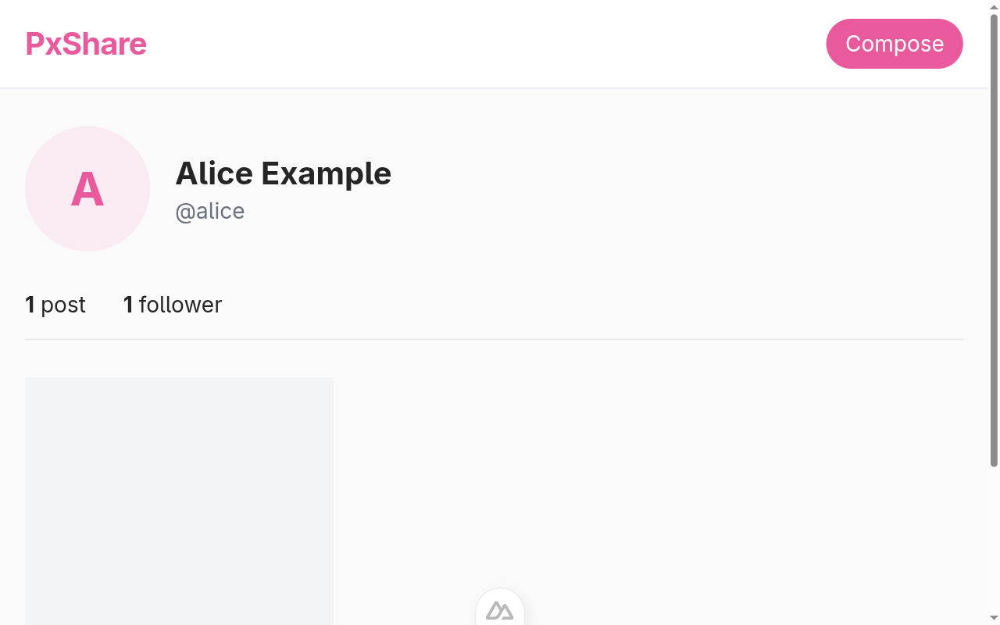

Creating a federated image sharing service
==========================================

In this tutorial we will build a small federated image sharing service,
similar to [Pixelfed] or, in a way, to [Instagram] with the locks blown off,
using [Nuxt] on the client and server side and [Fedify] for everything
ActivityPub.  The goal is to learn Fedify rather than Nuxt, but a brief tour
of Nuxt's building blocks is included so that a reader with only vanilla
JavaScript experience can follow along.

If you have any questions, suggestions, or feedback, please feel free to join
our [Matrix chat space] or [GitHub Discussions].

[Pixelfed]: https://pixelfed.org/
[Instagram]: https://instagram.com/
[Nuxt]: https://nuxt.com/
[Fedify]: https://fedify.dev/
[Matrix chat space]: https://matrix.to/#/#fedify:matrix.org
[GitHub Discussions]: https://github.com/fedify-dev/fedify/discussions

Target audience
---------------

This tutorial is aimed at web developers who want to learn Fedify and try
their hand at building federated software.

We assume you have some experience building small web applications with HTML
and JavaScript, and that you are comfortable with a terminal.  You do *not*
need to know TypeScript, Vue, Nuxt, SQL, ActivityPub, or Fedify.  We will teach
just enough of each along the way.

You don't need experience creating ActivityPub software, but we do assume
that you have used at least one fediverse service, like [Mastodon], [Pixelfed],
or [Misskey], so you have a feel for what we are trying to build.

If you have already worked through the [*Creating your own federated
microblog*](./microblog.md) tutorial, you will find many of the concepts
familiar.  This tutorial treads similar ground but swaps Hono and JSX for
Nuxt and Vue, and focuses on image posts instead of text posts.  The two
tutorials are designed to complement each other rather than stack on top,
so you can read them in either order.

[Mastodon]: https://joinmastodon.org/
[Misskey]: https://misskey-hub.net/

Goals
-----

We will end up with a single-user image sharing service that can talk to the
rest of the fediverse via ActivityPub.  Its features are:

 -  Only one account can be created on the instance.
 -  Other accounts in the fediverse can follow the local user.
 -  Followers can unfollow the local user.
 -  The user can view their list of followers.
 -  The user can upload image posts with captions.
 -  Posts published by the user fan out to their followers' timelines.
 -  The user can follow other accounts in the fediverse.
 -  The user can view the accounts they are following.
 -  The user sees a chronological home timeline of posts from accounts they
    follow.
 -  The user can like posts, and likes coming from remote actors are recorded.
 -  The user can leave comments on posts, and replies coming from remote
    actors are recorded.

To keep the tutorial focused, we impose these constraints:

 -  Each post has exactly one image; no carousels.
 -  Account profiles (bio, profile picture) cannot be edited.
 -  Posts cannot be edited or deleted once published.
 -  No boosts (reposts), no direct messages, no search.
 -  No pagination.
 -  No authentication: whoever opens the browser first owns the instance.

You are encouraged to add any of these features yourself after finishing the
tutorial.  The closing chapter lists a few natural extensions as a starting
point.

The full source code is available in the [GitHub repository], with one commit
per tutorial chapter so you can follow along by checking out the commit that
matches the chapter you are reading.

[GitHub repository]: https://github.com/fedify-dev/content-sharing

Setting up the development environment
--------------------------------------

### Installing Node.js

Fedify supports three JavaScript runtimes: [Deno], [Bun], and [Node.js].
Among the three, Node.js is the most widely used, and Nuxt targets Node.js
by default, so that is what we will use.

> [!TIP]
> A JavaScript runtime is a platform that executes JavaScript code outside
> a web browser.  Node.js is the most widely used one for server applications
> and command-line tools.  Nuxt runs on top of Node.js (it also runs on Bun
> and Deno, but Node.js gives the smoothest experience).

To use Fedify 2.2.0 and Nuxt 4, you need Node.js 22.0.0 or higher.  There
are [various installation methods]; pick the one that suits your system.

Once Node.js is installed, the `node` and `npm` commands become available:

~~~~ sh
node --version
npm --version
~~~~

[Deno]: https://deno.com/
[Bun]: https://bun.sh/
[Node.js]: https://nodejs.org/
[various installation methods]: https://nodejs.org/en/download/package-manager

### Installing the `fedify` command

To scaffold a Fedify project, install the [`fedify`](../cli.md) command on
your system.  There are [several installation methods](../cli.md#installation),
but using `npm` is the simplest:

~~~~ sh
npm install -g @fedify/cli
~~~~

After installation, check the version:

~~~~ sh
fedify --version
~~~~

Make sure the version is 2.2.0 or higher; older versions do not ship the
Nuxt integration we rely on.

### `fedify init` to scaffold the project

Pick a directory where you want to work.  We will call ours
*content-sharing*.  Then run
[`fedify init`](../cli.md#fedify-init-initializing-a-fedify-project) with four
non-interactive options so the command does not ask you any questions:

~~~~ sh
fedify init -w nuxt -p npm -k in-memory -m in-process content-sharing
~~~~

The flags tell `fedify init` to use:

`-w nuxt`
:   Nuxt as the web framework.

`-p npm`
:   npm as the package manager.

`-k in-memory`
:   An in-memory [key&ndash;value store](../manual/kv.md) for Fedify.  This is
    perfect for development; once you deploy, you would swap it for Redis or
    a relational database.

`-m in-process`
:   An in-process [message queue](../manual/mq.md) for Fedify.  The same
    reasoning applies: fine for development, swap for Redis or RabbitMQ in
    production.

After a short install you will see something like this printed at the end:

~~~~ console
✨ Nuxt project has been created with the minimal template.

╭── 👉 Next steps ───╮
│                    │
│   › npm run dev    │
│                    │
╰────────────────────╯

  To start the server, run the following command:

`npm run dev`

Then, try to look up an actor from your server:

`fedify lookup http://localhost:3000/users/john`

      Start by editing the server/federation.ts file to define your federation!
~~~~

Move into the directory and take a look at what got generated:

~~~~ sh
cd content-sharing
ls -a
~~~~

The most interesting files and directories are:

 -  *app/*: the Vue side of the app.
     -  *app.vue*: the root Vue component that Nuxt renders on every page.
        Right now it shows a `<NuxtWelcome />` component, which is the page
        you will see in a moment.
 -  *public/*: static assets served as-is (favicon, *robots.txt*, and any
    uploaded images we will add later).
 -  *server/*: code that runs on the server only.
     -  *federation.ts*: the Fedify federation object.  This is where actors,
        inbox listeners, and object dispatchers are registered.  Most of our
        work will land here.
     -  *logging.ts*: [LogTape] configuration used by Fedify.  The default
        export is the configuration promise; we never call into this file
        directly.
     -  *plugins/logging.ts*: a [Nitro server plugin] that awaits the
        configuration promise on startup so Fedify's logs are alive before
        any request lands.
 -  *nuxt.config.ts*: Nuxt's configuration file; already has `@fedify/nuxt`
    wired up as a module.
 -  *package.json*: npm metadata and dependencies.
 -  *biome.json*: [Biome] formatter and import-sorting configuration.
 -  *tsconfig.json*: TypeScript compiler references to the generated Nuxt
    type files.

We are using TypeScript, so most source files end in *.ts* (for pure
TypeScript) or *.vue* (for Vue single-file components that may contain
TypeScript in their `

<template>
  <button type="button" @click="count++">
    Clicked {{ count }} times
  </button>
</template>
~~~~

A few things are worth noting:

 -  `

<template>
  

    <header
      class="sticky top-0 z-10 bg-white border-b border-gray-200 px-4 py-3 flex items-center justify-between"
    >
      <NuxtLink to="/" class="text-xl font-bold text-brand tracking-tight">
        {{ siteName }}
      </NuxtLink>
      <nav class="flex items-center gap-4 text-sm">
        <NuxtLink
          to="/compose"
          class="px-3 py-1.5 bg-brand text-white rounded-full hover:bg-brand-dark"
        >
          Compose
        </NuxtLink>
      </nav>
    </header>
    <main class="flex-1 max-w-2xl w-full mx-auto px-4 py-6">
      <NuxtPage />
    </main>
    <footer class="py-6 text-center text-xs text-gray-400">
      Built with Fedify and Nuxt
    </footer>
  

</template>
~~~~

> [!TIP]
> Three Nuxt things to notice here:
>
>  -  `<NuxtLink to="/">` is Nuxt's client-side navigation link.  It
>     renders as an `<a>` element, but clicks update the URL without a
>     full page reload.
>  -  `<NuxtPage />` is the slot where the currently matched page
>     component renders.  If we did not include it, our pages would
>     never show.
>  -  `

<template>
  <section class="text-center py-16">
    <h1 class="text-3xl font-bold mb-2">Welcome to PxShare</h1>
    
A tiny federated image sharing service.

  </section>
</template>
~~~~

`useHead({ title: "PxShare" })` sets the browser tab title.  We will use
the same helper later to set per-page titles.

### Checking the result

Save every file.  If `npm run dev` is still running from the previous
chapter, Nuxt picks up the changes automatically, though it restarts once
because *nuxt.config.ts* changed.  Otherwise, run it again:

~~~~ sh
npm run dev
~~~~

Open <http://localhost:3000/> and you should see the new shell:

Nothing federated yet, but the skeleton is ready for us to fill in.  The
ActivityPub actor from the previous chapter still works:

~~~~ sh
fedify lookup http://localhost:3000/users/alice
~~~~

Content negotiation means the same URL serves the welcome layout to a
browser and a JSON-LD `Person` object to ActivityPub clients.  Chapter 6
covers this in detail.

Setting up the database
-----------------------

Fediverse software needs persistent state: who the local user is, who
follows them, what they have posted, what they have liked.  We will use
[SQLite] because it is a single file with no server to run, and we will
talk to it through [Drizzle ORM] so the schema is a TypeScript file and
the queries are typed.

> [!TIP]
> If you prefer raw SQL, Drizzle does not stand in the way: the same
> library exposes a `db.run(sql\`…\`)\` escape hatch.  We stick to the
> typed query builder in this tutorial so you can hover your cursor over
> any database call in your editor and see the columns involved.

[SQLite]: https://sqlite.org/
[Drizzle ORM]: https://orm.drizzle.team/

### Installing the packages

Install Drizzle, the better-sqlite3 driver, Drizzle's CLI (used only at
dev time to push schema changes), and the TypeScript type
declarations for better-sqlite3:

~~~~ sh
npm install better-sqlite3 drizzle-orm
npm install -D drizzle-kit @types/better-sqlite3
~~~~

### The schema

Create *server/db/schema.ts* with just an empty module marker.  Later
chapters will fill it in; keeping the file present lets us import it
from the client right away.

~~~~ typescript [server/db/schema.ts]
// Tables live here.  For now the file is empty; later chapters will fill
// in tables for the local user, followers, posts, comments, and likes.

export {};
~~~~

> [!NOTE]
> The `export {}` line makes TypeScript treat this file as a module
> rather than a plain script.  Without it, other files cannot
> `import * as schema from "./schema"`.

### The database connection

Create *server/db/client.ts*, which opens the SQLite file on disk and
wraps it with Drizzle:

~~~~ typescript [server/db/client.ts]
import Database from "better-sqlite3";
import { drizzle } from "drizzle-orm/better-sqlite3";
import * as schema from "./schema";

const sqlite = new Database("content-sharing.sqlite3");
sqlite.pragma("journal_mode = WAL");
sqlite.pragma("foreign_keys = ON");

export const db = drizzle(sqlite, { schema });
~~~~

Two pragmas are worth knowing:

[`journal_mode = WAL`]
:   Switches SQLite to [write-ahead logging][Write-Ahead Logging], which
    makes concurrent reads and writes much smoother.  You almost always
    want this on for server applications.

[`foreign_keys = ON`]
:   SQLite does not enforce `REFERENCES` constraints unless you ask.
    Turning this on catches cases like “insert a follower row for a
    user that does not exist” as an error at write time.

The exported `db` is what every server route and Fedify handler will
import when it needs to read or write.

[`journal_mode = WAL`]: https://www.sqlite.org/wal.html
[Write-Ahead Logging]: https://en.wikipedia.org/wiki/Write-ahead_logging
[`foreign_keys = ON`]: https://www.sqlite.org/foreignkeys.html#fk_enable

### The drizzle-kit config

*drizzle-kit* is the command-line tool that turns the TypeScript
schema into actual SQL.  Configure it at the project root as
*drizzle.config.ts*:

~~~~ typescript [drizzle.config.ts]
import { defineConfig } from "drizzle-kit";

export default defineConfig({
  schema: "./server/db/schema.ts",
  out: "./server/db/migrations",
  dialect: "sqlite",
  dbCredentials: { url: "content-sharing.sqlite3" },
});
~~~~

Expose two npm scripts that wrap drizzle-kit, so the reader never has
to type the tool's name directly.  Edit *package.json*:

~~~~ json [package.json]
{
  "scripts": {
    "build": "nuxt build",
    "dev": "nuxt dev",
    "generate": "nuxt generate",
    "preview": "nuxt preview",
    "postinstall": "nuxt prepare",
    "lint": "eslint .",
    "db:push": "drizzle-kit push",
    "db:studio": "drizzle-kit studio"
  }
}
~~~~

`db:push` compares the schema to the live database and applies any
differences.  `db:studio` opens a local web UI for poking at rows,
which is occasionally handy while debugging.

### Creating the database

Run the push command once now:

~~~~ sh
npm run db:push
~~~~

It should print something like:

~~~~ console
[i] No changes detected
~~~~

That is correct: the schema is empty, so there is nothing to create
yet.  The command also creates an empty *content-sharing.sqlite3* file
on disk as a side effect.  From now on, every chapter that edits the
schema will ask you to re-run `npm run db:push`.

### Gitignoring the database file

Add the SQLite file (and its sidecars that WAL mode creates) to
*.gitignore* so your local state does not end up in git:

~~~~ gitignore [.gitignore]
# Local SQLite database
*.sqlite3
*.sqlite3-journal
*.sqlite3-shm
*.sqlite3-wal
~~~~

Account creation
----------------

Our instance hosts exactly one user.  In this chapter we wire up a
first-run signup flow: if no account exists, Nuxt redirects to
*/setup*; once the account is created, the middleware steps aside and
we see the home page.

### The `users` table

Open *server/db/schema.ts* and replace the placeholder with a real
`users` table:

~~~~ typescript [server/db/schema.ts]
import { sql } from "drizzle-orm";
import { check, integer, sqliteTable, text } from "drizzle-orm/sqlite-core";

// The single local user of this instance.  The `id = 1` check enforces
// "only one account per instance"; if anyone tries to insert another
// row, SQLite rejects the write.
export const users = sqliteTable(
  "users",
  {
    id: integer("id").primaryKey({ autoIncrement: false }),
    username: text("username").notNull().unique(),
    name: text("name").notNull(),
    createdAt: text("created_at")
      .notNull()
      .default(sql`CURRENT_TIMESTAMP`),
  },
  (t) => [check("users_single_user", sql`${t.id} = 1`)],
);

export type User = typeof users.$inferSelect;
~~~~

A few SQL-shaped details worth explaining:

 -  `CHECK (id = 1)` is a table-level constraint that rejects any row
    whose `id` is not 1.  Since the column is also the primary key, it
    is unique, so the combination means “at most one row, and its id is
    always 1”.  This is how we keep the instance single-user at the
    storage layer.
 -  `username` has a `UNIQUE` constraint and `NOT NULL`.  A user with no
    username makes no sense in a federated app.
 -  `created_at` gets `DEFAULT CURRENT_TIMESTAMP`, meaning SQLite fills
    it in automatically when we `INSERT` without supplying it.
 -  `User = typeof users.$inferSelect` gives us the TypeScript type
    corresponding to a row read from this table.  We will import `User`
    in many places and never have to maintain the shape by hand.

Apply the schema to the database:

~~~~ sh
npm run db:push
~~~~

### A helper for reading the local user

Almost every server route needs to know “is anyone registered?” or
“who is the local user?”.  Rather than repeat the query, put it in a
utility module:

~~~~ typescript [server/utils/users.ts]
import { db } from "../db/client";
import { users } from "../db/schema";

export async function getLocalUser() {
  return (await db.select().from(users).limit(1).all())[0] ?? null;
}
~~~~

Drizzle's `db.select().from(users).limit(1).all()` builds the SQL
`SELECT * FROM "users" LIMIT 1` for us; the `[0] ?? null` pattern turns
an empty result into `null` so callers can write
`if (user === null) …`.

### The signup endpoint

Create *server/api/signup.post.ts*.  The `.post.ts` suffix tells Nuxt
to only match `POST` requests to */api/signup*.

~~~~ typescript [server/api/signup.post.ts]
import { createError, defineEventHandler, readBody } from "h3";
import { db } from "../db/client";
import { users } from "../db/schema";
import { getLocalUser } from "../utils/users";

const USERNAME_PATTERN = /^[a-z0-9_]+$/;

export default defineEventHandler(async (event) => {
  const existing = await getLocalUser();
  if (existing !== null) {
    throw createError({
      statusCode: 409,
      statusMessage: "Account already exists on this instance.",
    });
  }

  const body = await readBody<{ username?: unknown; name?: unknown }>(event);
  const username =
    typeof body.username === "string" ? body.username.trim().toLowerCase() : "";
  const name = typeof body.name === "string" ? body.name.trim() : "";

  if (username === "" || !USERNAME_PATTERN.test(username)) {
    throw createError({
      statusCode: 400,
      statusMessage:
        "Username must be non-empty and use only lowercase letters, digits, and underscores.",
    });
  }
  if (name === "") {
    throw createError({
      statusCode: 400,
      statusMessage: "Display name must not be empty.",
    });
  }

  await db.insert(users).values({ id: 1, username, name });

  return { ok: true };
});
~~~~

> [!TIP]
> The validation here is intentionally narrow: lowercase letters,
> digits, and underscores only.  This matches the character set
> Mastodon and Pixelfed accept in usernames, and keeps our actor URIs
> (which embed the username) safe without extra URL encoding.

Also add a tiny `GET /api/me` endpoint for the Vue side to consult:

~~~~ typescript [server/api/me.get.ts]
import { defineEventHandler } from "h3";
import { getLocalUser } from "../utils/users";

export default defineEventHandler(async () => {
  const user = await getLocalUser();
  return { user };
});
~~~~

### The setup page

Create *app/pages/setup.vue*.  It is a plain form that POSTs the body
fields to */api/signup* and redirects to `/` on success:

~~~~ vue [app/pages/setup.vue]

<template>
  <section class="max-w-md mx-auto py-10">
    <h1 class="text-2xl font-bold mb-6">Set up your PxShare instance</h1>
    

      PxShare is a single-user federated service.  Choose the one account this
      instance will host.
    

    <form class="flex flex-col gap-4" @submit.prevent="submit">
      <label class="flex flex-col gap-1">
        Username
        <input
          v-model="username"
          required
          autocomplete="off"
          placeholder="alice"
          class="border border-gray-300 rounded px-3 py-2 focus:outline-none focus:border-brand"
        />
        
          Lowercase letters, digits, and underscores only.  Fediverse actors
          will find you as <code>@username@your-domain</code>.
        
      </label>
      <label class="flex flex-col gap-1">
        Display name
        <input
          v-model="name"
          required
          placeholder="Alice"
          class="border border-gray-300 rounded px-3 py-2 focus:outline-none focus:border-brand"
        />
      </label>
      
{{ error }}

      <button
        type="submit"
        :disabled="submitting"
        class="bg-brand text-white rounded-full py-2 font-medium hover:bg-brand-dark disabled:opacity-50"
      >
        {{ submitting ? "Creating..." : "Create account" }}
      </button>
    </form>
  </section>
</template>
~~~~

### The first-run middleware

If we opened the browser now, */setup* would work but so would every
other page, including `/` with its “Welcome to PxShare” placeholder.
That is not what we want: a brand new instance should redirect you
straight to the setup page.

Nuxt route middleware can run before every navigation.  Create
*app/middleware/setup.global.ts*; the `.global.ts` suffix makes it
apply to every route automatically.

~~~~ typescript [app/middleware/setup.global.ts]
export default defineNuxtRouteMiddleware(async (to) => {
  if (to.path === "/setup") return;
  const { user } = await $fetch("/api/me");
  if (user === null) {
    return navigateTo("/setup", { replace: true });
  }
});
~~~~

The middleware skips over the */setup* route itself (otherwise we
would loop forever), asks the server whether a user exists, and
redirects to the setup page if not.

### Trying it out

With `npm run dev` running, visit <http://localhost:3000/>.  Because
no account exists yet, you land on the setup form:

Fill it in, submit, and you get bounced back to `/`:

Verify the row with the `sqlite3` CLI:

~~~~ sh
sqlite3 content-sharing.sqlite3 "SELECT * FROM users"
~~~~

~~~~ console
1|alice|Alice Example|2026-04-25 03:20:13
~~~~

And confirm the single-user constraint holds by attempting a second
signup:

~~~~ sh
curl -s -X POST -H "Content-Type: application/json" \
  -d '{"username":"bob","name":"Bob"}' \
  http://localhost:3000/api/signup
~~~~

~~~~ console
{"error":true,"statusCode":409,"statusMessage":"Account already exists on this instance."}
~~~~

Profile page
------------

Now that we have an account, let's give it a public profile page.
This is the page the world (and, eventually, other fediverse servers)
sees when they look up alice.  For now it is plain HTML; Chapter 7
will teach the same URL to speak ActivityPub as well.

### The API endpoint

Create *server/api/users/\[username].get.ts*.  The square brackets in
the filename make `username` a route parameter that Nuxt extracts for
us.

~~~~ typescript [server/api/users/[username].get.ts]
import { eq } from "drizzle-orm";
import { createError, defineEventHandler, getRouterParam } from "h3";
import { db } from "../../db/client";
import { users } from "../../db/schema";

export default defineEventHandler(async (event) => {
  const username = getRouterParam(event, "username");
  if (typeof username !== "string" || username === "") {
    throw createError({ statusCode: 404 });
  }
  const user = (
    await db.select().from(users).where(eq(users.username, username)).limit(1)
  )[0];
  if (user === undefined) {
    throw createError({ statusCode: 404 });
  }
  return { user };
});
~~~~

Drizzle's `eq(column, value)` builds the SQL `WHERE column = value`
clause in a typed way; you cannot accidentally swap the column with
the value.

### The Vue page

Create *app/pages/users/\[username].vue*.  `useFetch` is Nuxt's
server-aware fetch wrapper: during SSR it calls the endpoint as a
direct function, on the client it does a real network request.

~~~~ vue [app/pages/users/[username].vue]

<template>
  <section v-if="user" class="flex flex-col gap-6">
    <header class="flex items-center gap-4">
      

        {{ user.name[0] }}
      

      

        <h1 class="text-xl font-bold">{{ user.name }}</h1>
        
@{{ user.username }}

      

    </header>
    

      
No posts yet.

    

  </section>
</template>
~~~~

The avatar circle is a placeholder showing the first letter of the
display name.  A real app would let the user upload an image; we
defer that to the reader as an exercise.

### Redirecting the home page

Right now our home page just says “Welcome to PxShare”.  Single-user
instances are friendlier if `/` takes you straight to the local
user's profile, so update *app/pages/index.vue*:

~~~~ vue [app/pages/index.vue]

<template>
  <section class="text-center py-16">
    <h1 class="text-3xl font-bold mb-2">Welcome to PxShare</h1>
    
A tiny federated image sharing service.

  </section>
</template>
~~~~

### Trying it out

Save the files and go to <http://localhost:3000/users/alice>:

Open the root URL <http://localhost:3000/> and notice the redirect:
the home page now takes you straight to alice's profile.

> [!TIP]
> The profile URL we chose (*/users/:username*) is exactly where the
> ActivityPub actor already lives, thanks to the scaffolded
> `setActorDispatcher("/users/{identifier}", …)` in
> *server/federation.ts*.  Run `fedify lookup` once more and compare
> with what the browser sees:
>
> ~~~~ sh
> curl -H "Accept: text/html" http://localhost:3000/users/alice | head -5
> curl -H "Accept: application/activity+json" \
>   http://localhost:3000/users/alice | head -20
> ~~~~
>
> Same URL, two totally different responses.  The next chapter replaces
> the scaffolded stub with a dispatcher that pulls real data from the
> `users` table.

Actor dispatcher
----------------

ActivityPub is a protocol for exchanging *activities* between *actors*.
Posting an image, liking it, commenting, following somebody: every
action a user takes on the fediverse is an activity, and every
activity travels from one actor to another.  Implementing the actor
is the first stop on the federation tour.

Our scaffolded *server/federation.ts* already declares a tiny actor.
Open it again:

~~~~ typescript twoslash [server/federation.ts]
import {
  createFederation,
  InProcessMessageQueue,
  MemoryKvStore,
} from "@fedify/fedify";
import { Person } from "@fedify/vocab";
import { getLogger } from "@logtape/logtape";

const logger = getLogger("content-sharing");

const federation = createFederation({
  kv: new MemoryKvStore(),
  queue: new InProcessMessageQueue(),
});

federation.setActorDispatcher(
  "/users/{identifier}",
  async (ctx, identifier) => {
    return new Person({
      id: ctx.getActorUri(identifier),
      preferredUsername: identifier,
      name: identifier,
    });
  },
);

export default federation;
~~~~

The interesting line is `~Federatable.setActorDispatcher()`.  Whenever
another fediverse server fetches an actor URL on our service, Fedify
calls this callback with the matched `identifier` (the `{identifier}`
template variable, filled in from the URL) and a `Context` object.
The callback returns a [`Person`] (Fedify's typed representation of
an ActivityPub actor), and Fedify takes care of serializing it into
the right JSON-LD shape, attaching a JSON-LD context, and answering
with the correct content type.

`~Context.getActorUri()` reads the URL template you passed in and
hands back the canonical actor URI for that identifier.  Using the
context to mint URIs (instead of building strings yourself) means the
URLs always match what `setActorDispatcher` registered, even after
you put the app behind a reverse proxy or change the path.

The current dispatcher is a fib: it accepts *any* identifier and
hands back a freshly invented `Person`.  We want it to consult the
`users` table and refuse anything that is not a real account.

[`Person`]: https://www.w3.org/TR/activitystreams-vocabulary/#dfn-person

### Reading the user from the database

Let's rewrite the dispatcher so it reads from `users`, returns `null`
when the identifier does not exist (Fedify turns that into a `404 Not Found`),
and emits a `Person` filled in with the data we have. Replace
*server/federation.ts* with this:

~~~~ typescript twoslash [server/federation.ts]
// @noErrors: 2307
import {
  createFederation,
  InProcessMessageQueue,
  MemoryKvStore,
} from "@fedify/fedify";
import { Endpoints, Person } from "@fedify/vocab";
import { getLogger } from "@logtape/logtape";
import { eq } from "drizzle-orm";
import { db } from "./db/client";
import { users } from "./db/schema";

const logger = getLogger("content-sharing");

const federation = createFederation<void>({
  kv: new MemoryKvStore(),
  queue: new InProcessMessageQueue(),
});

federation.setActorDispatcher(
  "/users/{identifier}",
  async (ctx, identifier) => {
    const user = (
      await db
        .select()
        .from(users)
        .where(eq(users.username, identifier))
        .limit(1)
    )[0];
    if (user === undefined) return null;

    return new Person({
      id: ctx.getActorUri(identifier),
      preferredUsername: identifier,
      name: user.name,
      url: ctx.getActorUri(identifier),
      inbox: ctx.getInboxUri(identifier),
      endpoints: new Endpoints({
        sharedInbox: ctx.getInboxUri(),
      }),
      manuallyApprovesFollowers: false,
      discoverable: true,
      indexable: true,
    });
  },
);

federation.setInboxListeners("/users/{identifier}/inbox", "/inbox");

export default federation;
~~~~

A lot is happening here, so let's walk through it.

 -  *Database lookup.*  The query mirrors the one we wrote in
    *server/api/users/\[username].get.ts*: the dispatcher hands
    `identifier` to `eq(users.username, identifier)` and pulls the
    matching row.  When the row is missing, returning `null` lets
    Fedify respond with `404 Not Found` automatically.

 -  *Display name and profile URL.*  We hand the database's display
    name to the `Person` and pin the actor's profile URL to the same
    address other servers will use as the actor ID.  ActivityPub
    allows the actor ID and the profile URL to differ, but our app
    keeps them identical for simplicity.

 -  *Inbox and shared inbox.*  The `inbox` is the URL where other
    servers POST activities addressed to alice; a Mastodon user's
    `Follow` will land here.  The [`Endpoints.sharedInbox`] is a
    single inbox that handles activities addressed to anyone on our
    server; busy instances rely on it to deliver one copy of a
    public post instead of one POST per follower.  Both URLs come
    from `~Context.getInboxUri()`, which returns the per-actor inbox
    when called with an identifier and the shared inbox when called
    without arguments.

 -  *Pixelfed-friendly flags.*  `manuallyApprovesFollowers: false`,
    `discoverable: true`, and `indexable: true` tell other servers
    and search crawlers that alice is happy to be found, indexed,
    and auto-followed.  Pixelfed in particular reads `discoverable`
    to decide whether a remote profile shows up in its explore feed.
    An unflagged actor often appears as a blank or pending profile
    on Pixelfed, so we set the trio up front.

 -  *Registering the inbox path.*  `~Context.getInboxUri()` complains
    if no inbox path has been registered yet; even though we are not
    handling activities in this chapter, calling
    `~Federatable.setInboxListeners()` with empty bodies is enough to
    make the call succeed.  We will fill in the listener bodies in
    [chapter 10](#handling-follows).

> [!TIP]
> [`Person`] is one of many actor types in the ActivityPub vocabulary.
> The standard also defines [`Application`], [`Group`],
> [`Organization`], and [`Service`].  PxShare hosts a single human
> user, so `Person` is the natural fit; a bot account would use
> [`Service`] instead.

[`Endpoints.sharedInbox`]: https://www.w3.org/TR/activitypub/#actor-objects
[`Application`]: https://www.w3.org/TR/activitystreams-vocabulary/#dfn-application
[`Group`]: https://www.w3.org/TR/activitystreams-vocabulary/#dfn-group
[`Organization`]: https://www.w3.org/TR/activitystreams-vocabulary/#dfn-organization
[`Service`]: https://www.w3.org/TR/activitystreams-vocabulary/#dfn-service

### Looking the actor up

Save the file.  The dev server should pick the change up
automatically; if it does not, restart it with `npm run dev`.

In a separate terminal, ask Fedify's CLI to look the actor up:

~~~~ sh
fedify lookup http://localhost:3000/users/alice
~~~~

You should see something close to this:

~~~~ console
- Looking up the object...
✔ Fetched object: http://localhost:3000/users/alice
Person {
  id: URL 'http://localhost:3000/users/alice',
  name: 'Alice Example',
  url: URL 'http://localhost:3000/users/alice',
  preferredUsername: 'alice',
  manuallyApprovesFollowers: false,
  inbox: URL 'http://localhost:3000/users/alice/inbox',
  endpoints: Endpoints { sharedInbox: URL 'http://localhost:3000/inbox' },
  discoverable: true,
  indexable: true
}
✔ Successfully fetched the object.
~~~~

Every property we set on the `Person` shows up in the response,
flags included.  Now try a username that does not exist:

~~~~ sh
fedify lookup http://localhost:3000/users/nobody
~~~~

The dispatcher returns `null`, so Fedify answers `404 Not Found`:

~~~~ console
- Looking up the object...
✖ Failed to fetch http://localhost:3000/users/nobody
Error: It may be a private object.  Try with -a/--authorized-fetch.
~~~~

> [!TIP]
> The fediverse uses `404 Not Found` to mean both <q>this account
> never existed</q> and <q>this account is private and you are not
> allowed to see it</q>; Fedify's lookup hint nudges you to retry
> with [`fedify lookup --authorized-fetch`].  Our actor is public, so
> the hint does not apply here, but you will see this message a lot
> when poking at Mastodon's hidden profiles.

[`fedify lookup --authorized-fetch`]: ../cli.md#fedify-lookup

### Browser still gets HTML

The HTML profile page from chapter 6 is unchanged.  Visit
<http://localhost:3000/users/alice> in your browser and the same Vue
page renders, because Fedify only intercepts requests whose
<code>Accept</code> header asks for ActivityPub-flavored JSON.

You can confirm both responses come from the same URL:

~~~~ sh
curl -s -o /dev/null -w "%{http_code} %{content_type}\n" \
  -H "Accept: text/html" http://localhost:3000/users/alice
curl -s -o /dev/null -w "%{http_code} %{content_type}\n" \
  -H "Accept: application/activity+json" http://localhost:3000/users/alice
~~~~

~~~~ console
200 text/html;charset=utf-8
200 application/activity+json
~~~~

> [!NOTE]
> *@fedify/nuxt* implements this by registering its middleware ahead
> of Nuxt's pages.  Every incoming request goes through Fedify first;
> if Fedify recognises the URL and the <code>Accept</code> header,
> it answers directly.  Otherwise it falls through to Nuxt and our
> Vue page handles it.  Both worlds share the same route table, so
> we never have to keep two URL schemes in sync.

With a real actor in place, the next chapter teaches alice how to
*sign* the activities she sends and verify the ones she receives.

Cryptographic key pairs
-----------------------

Every activity that flows between fediverse servers carries a
[digital signature].  When alice sends a `Follow` to a Mastodon user,
Mastodon expects her server to sign the request with alice's private
key and to publish the matching public key on alice's actor.  The
receiving side fetches the public key, verifies the signature, and
trusts that the activity really came from alice's server.  Without
this handshake, anyone could impersonate her.

Fedify takes care of the signing and the verification on every
incoming and outgoing activity.  What it does not do is *create* the
keys, because alice has to own them; they are the only thing keeping
her account hers.  This chapter wires up that ownership.

> [!WARNING]
> The private key is alice's secret.  Never log it, expose it through
> the API, or paste it into chat.  The public key is the opposite:
> publishing it everywhere is the whole point.  Our `actor_keys`
> table will keep both columns next to each other in the database;
> when the app grows up, the private key column is the first thing
> you would move into a [secrets manager].

[digital signature]: https://en.wikipedia.org/wiki/Digital_signature
[secrets manager]: https://en.wikipedia.org/wiki/Secrets_management

### Two algorithms, side by side

The fediverse is in the middle of a slow transition from
[RSA-PKCS#1-v1.5] signatures to [Ed25519] signatures.  Mastodon and
Pixelfed verify both, while older Misskey installs and a long tail
of niche servers still expect only RSA.  Carrying both key types is
the safest option, so our table will hold two rows per user, one
per algorithm.

[RSA-PKCS#1-v1.5]: https://www.rfc-editor.org/rfc/rfc2313
[Ed25519]: https://ed25519.cr.yp.to/

### The `actor_keys` table

Open *server/db/schema.ts* and add an `actorKeys` table after the
`users` table:

~~~~ typescript [server/db/schema.ts]
import { sql } from "drizzle-orm";
import {
  check,
  integer,
  primaryKey,
  sqliteTable,
  text,
} from "drizzle-orm/sqlite-core";

export const users = sqliteTable(
  "users",
  {
    id: integer("id").primaryKey({ autoIncrement: false }),
    username: text("username").notNull().unique(),
    name: text("name").notNull(),
    createdAt: text("created_at").notNull().default(sql`CURRENT_TIMESTAMP`),
  },
  (t) => [check("users_single_user", sql`${t.id} = 1`)],
);

export type User = typeof users.$inferSelect;

export const actorKeys = sqliteTable(
  "actor_keys",
  {
    userId: integer("user_id")
      .notNull()
      .references(() => users.id),
    type: text("type", { enum: ["RSASSA-PKCS1-v1_5", "Ed25519"] }).notNull(),
    privateKey: text("private_key").notNull(),
    publicKey: text("public_key").notNull(),
    createdAt: text("created_at").notNull().default(sql`CURRENT_TIMESTAMP`),
  },
  (t) => [primaryKey({ columns: [t.userId, t.type] })],
);

export type ActorKey = typeof actorKeys.$inferSelect;
~~~~

A few things to notice:

 -  *Composite primary key.*  The combination of `userId` and `type`
    is the row's identity; one user gets exactly one row per
    algorithm, so the table can hold at most two rows for alice.
 -  *Foreign key to `users`.*  The reference makes sure a key row
    cannot exist without an owner, which gives us cascade-friendly
    cleanup if we ever delete a user.
 -  *Both keys as text.*  We will store both halves of the pair as
    serialised [JWK] objects.  JWK is JSON-shaped, so a `text`
    column works without any binary handling.
 -  *Algorithm enum.*  `text("type", { enum: [...] })` gives Drizzle
    a TypeScript-level union for the column, so the dispatcher cannot
    accidentally write a typo like `"ed25519"` (lowercase) without
    failing to compile.

Push the change to SQLite:

~~~~ sh
npm run db:push
~~~~

> [!TIP]
> If `db:push` complains that an index already exists, that is a
> known quirk of `drizzle-kit push` re-running idempotent statements.
> The new `actor_keys` table is still created.  You can also wipe
> the dev database and re-run if you prefer a clean slate:
>
> ~~~~ sh
> rm -f content-sharing.sqlite3*
> npm run db:push
> ~~~~

[JWK]: https://www.rfc-editor.org/rfc/rfc7517

### The key pairs dispatcher

Open *server/federation.ts*.  We will add three Fedify helpers
([`generateCryptoKeyPair`], [`exportJwk`], [`importJwk`]), pull in
the `actorKeys` table, and chain a `setKeyPairsDispatcher` onto the
existing dispatcher chain:

~~~~ typescript twoslash [server/federation.ts]
// @noErrors: 2307 7006
import {
  createFederation,
  exportJwk,
  generateCryptoKeyPair,
  importJwk,
  InProcessMessageQueue,
  MemoryKvStore,
} from "@fedify/fedify";
import { Endpoints, Person } from "@fedify/vocab";
import { getLogger } from "@logtape/logtape";
import { eq } from "drizzle-orm";
import { db } from "./db/client";
import { actorKeys, users } from "./db/schema";

const logger = getLogger("content-sharing");

const federation = createFederation<void>({
  kv: new MemoryKvStore(),
  queue: new InProcessMessageQueue(),
});

federation
  .setActorDispatcher("/users/{identifier}", async (ctx, identifier) => {
    const user = (
      await db
        .select()
        .from(users)
        .where(eq(users.username, identifier))
        .limit(1)
    )[0];
    if (user === undefined) return null;

    const keys = await ctx.getActorKeyPairs(identifier);
    return new Person({
      id: ctx.getActorUri(identifier),
      preferredUsername: identifier,
      name: user.name,
      url: ctx.getActorUri(identifier),
      inbox: ctx.getInboxUri(identifier),
      endpoints: new Endpoints({
        sharedInbox: ctx.getInboxUri(),
      }),
      publicKey: keys[0]?.cryptographicKey,
      assertionMethods: keys.map((k) => k.multikey),
      manuallyApprovesFollowers: false,
      discoverable: true,
      indexable: true,
    });
  })
  .setKeyPairsDispatcher(async (_ctx, identifier) => {
    const user = (
      await db
        .select()
        .from(users)
        .where(eq(users.username, identifier))
        .limit(1)
    )[0];
    if (user === undefined) return [];

    const rows = await db
      .select()
      .from(actorKeys)
      .where(eq(actorKeys.userId, user.id));
    const stored = Object.fromEntries(rows.map((row) => [row.type, row]));

    const pairs: CryptoKeyPair[] = [];
    for (const keyType of ["RSASSA-PKCS1-v1_5", "Ed25519"] as const) {
      const row = stored[keyType];
      if (row === undefined) {
        logger.debug(
          "User {identifier} has no {keyType} key; generating one.",
          { identifier, keyType },
        );
        const { privateKey, publicKey } = await generateCryptoKeyPair(keyType);
        await db.insert(actorKeys).values({
          userId: user.id,
          type: keyType,
          privateKey: JSON.stringify(await exportJwk(privateKey)),
          publicKey: JSON.stringify(await exportJwk(publicKey)),
        });
        pairs.push({ privateKey, publicKey });
      } else {
        pairs.push({
          privateKey: await importJwk(JSON.parse(row.privateKey), "private"),
          publicKey: await importJwk(JSON.parse(row.publicKey), "public"),
        });
      }
    }
    return pairs;
  });

federation.setInboxListeners("/users/{identifier}/inbox", "/inbox");

export default federation;
~~~~

This is one of the longer pieces of code in the tutorial, but it
breaks down into three movements.

 -  *The dispatcher chain.*  `~Federatable.setActorDispatcher()`
    returns an `~ActorCallbackSetters` object, so we can chain
    `~ActorCallbackSetters.setKeyPairsDispatcher()` straight onto it.
    Whenever Fedify needs alice's keys, this callback runs.

 -  *Lazy generation.*  The callback first reads any existing rows
    from `actor_keys`.  If a row for a given algorithm is missing,
    it calls [`generateCryptoKeyPair()`] to create a new pair, calls
    [`exportJwk()`] to serialize both halves to JSON, and inserts
    them.  Existing rows are deserialised back into [`CryptoKey`]
    objects with [`importJwk()`].  This way alice never has to
    “set up” her account; the first ActivityPub fetch produces her
    keys on demand.

 -  *Wiring the keys onto the actor.*  Inside the actor dispatcher,
    we call `~Context.getActorKeyPairs()` to get back an array of
    rich key descriptors.  We pass the first key's
    `cryptographicKey` to `publicKey` (the legacy slot expected by
    older software) and map the whole array's `multikey` field to
    `assertionMethods` (the modern slot, which can carry several
    keys).

> [!TIP]
> Why two `publicKey`-shaped properties?  Originally ActivityPub had
> only `publicKey`, and many implementations still assume it holds
> exactly one key.  [FEP-521a] introduced `assertionMethods` to
> register multiple keys at once.  Setting both means RSA-only and
> Ed25519-aware servers can each find a key they recognize.

[`generateCryptoKeyPair()`]: https://jsr.io/@fedify/fedify/doc/~/generateCryptoKeyPair
[`exportJwk()`]: https://jsr.io/@fedify/fedify/doc/~/exportJwk
[`CryptoKey`]: https://developer.mozilla.org/en-US/docs/Web/API/CryptoKey
[`importJwk()`]: https://jsr.io/@fedify/fedify/doc/~/importJwk
[FEP-521a]: https://w3id.org/fep/521a

### Looking the actor up again

Restart the dev server (or save the file and let HMR pick it up) and
ask Fedify to look alice up.  The first lookup is the one that
populates `actor_keys`.

~~~~ sh
fedify lookup http://localhost:3000/users/alice
~~~~

The response now carries a `publicKey` and an `assertionMethods`
array, in addition to the properties from chapter 7:

~~~~ console
✔ Fetched object: http://localhost:3000/users/alice
Person {
  id: URL 'http://localhost:3000/users/alice',
  name: 'Alice Example',
  url: URL 'http://localhost:3000/users/alice',
  preferredUsername: 'alice',
  publicKey: CryptographicKey {
    id: URL 'http://localhost:3000/users/alice#main-key',
    owner: URL 'http://localhost:3000/users/alice',
    publicKey: CryptoKey {
      type: 'public',
      algorithm: { name: 'RSASSA-PKCS1-v1_5', modulusLength: 4096, ... },
    },
  },
  assertionMethods: [
    Multikey { id: URL '.../alice#multikey-1', algorithm: 'RSASSA-PKCS1-v1_5' },
    Multikey { id: URL '.../alice#multikey-2', algorithm: 'Ed25519' },
  ],
  inbox: URL 'http://localhost:3000/users/alice/inbox',
  endpoints: Endpoints { sharedInbox: URL 'http://localhost:3000/inbox' },
  manuallyApprovesFollowers: false,
  discoverable: true,
  indexable: true,
}
~~~~

If you peek inside the database, you can see both rows landed:

~~~~ sh
sqlite3 content-sharing.sqlite3 "SELECT user_id, type FROM actor_keys"
~~~~

~~~~ console
1|RSASSA-PKCS1-v1_5
1|Ed25519
~~~~

A second `fedify lookup` does not create new rows; the dispatcher
notices both algorithms are already present and just hands the
existing keys back to Fedify.

### WebFinger comes for free

Most fediverse software does not start with a URL like
`http://localhost:3000/users/alice`; it starts with a handle, like
`@alice@example.com`.  To turn the handle into a URL, the software
asks the host for a [WebFinger] resource:

~~~~ sh
curl 'http://localhost:3000/.well-known/webfinger?resource=acct:alice@localhost:3000'
~~~~

~~~~ console
{
  "subject": "acct:alice@localhost:3000",
  "aliases": ["http://localhost:3000/users/alice"],
  "links": [
    { "rel": "self",
      "href": "http://localhost:3000/users/alice",
      "type": "application/activity+json" },
    { "rel": "http://webfinger.net/rel/profile-page",
      "href": "http://localhost:3000/users/alice" }
  ]
}
~~~~

We did not write a WebFinger endpoint.  Fedify wires one up
automatically the moment `setActorDispatcher` is registered, using
the same `{identifier}` template as a hint.  When chapter 9 puts the
app behind a public hostname, that hostname will be all another
server needs to discover and verify alice.

With keys, signatures, and discovery in place, the next chapter
points alice's local instance at the public internet for the first
time, and gets Mastodon and Pixelfed to fetch her profile.

[WebFinger]: https://datatracker.ietf.org/doc/html/rfc7033

First federation test
---------------------

Alice's profile, keys, and WebFinger response all live at
*localhost:3000*, which is not a place the rest of the fediverse can
reach.  To make sure our tutorial code talks to real ActivityPub
software, we need a public URL that proxies through to the local
dev server.  Fedify ships exactly that, in the form of `fedify tunnel`.

### Running `fedify tunnel`

Open a second terminal so the dev server keeps running, and start
the tunnel:

~~~~ sh
fedify tunnel 3000
~~~~

After a couple of seconds, the CLI prints a publicly reachable URL:

~~~~ console
- Creating a secure tunnel...
✔ Your local server at 3000 is now publicly accessible:

"https://cc001590e20ab0.lhr.life/"
 Press ^C to close the tunnel.
~~~~

The exact subdomain changes every session.  We will refer to it as
*&lt;tunnel&gt;* for the rest of the chapter; copy your real URL into
the commands below.

> [!TIP]
> `fedify tunnel` rotates between three free SSH-based services
> (`localhost.run`, `serveo.net`, `pinggy.io`) so it does not depend
> on you signing up for anything.  If a session drops or refuses to
> start, run the command again, or pin a specific service with `-s`,
> for example `fedify tunnel -s localhost.run 3000`.  When all three
> misbehave, [`cloudflared tunnel --url http://localhost:3000`] and
> [`ngrok http 3000`] are good fallbacks; the rest of the tutorial
> works with whichever public URL you ended up with.

[`cloudflared tunnel --url http://localhost:3000`]: https://developers.cloudflare.com/cloudflare-one/connections/connect-networks/do-more-with-tunnels/trycloudflare/
[`ngrok http 3000`]: https://ngrok.com/docs/getting-started/

### Allowing the tunnel host in Nuxt

If you try to open the tunnel URL right away, Nuxt's dev server will
refuse with a *Blocked request* page.  This is a Vite security
feature: in development it only answers requests whose
<code>Host</code> header matches one of the allowed hosts.  Tell
Vite to accept any host so it does not matter which tunneling
service `fedify tunnel` ends up using.  Edit *nuxt.config.ts*:

~~~~ typescript [nuxt.config.ts]
// https://nuxt.com/docs/api/configuration/nuxt-config
export default defineNuxtConfig({
  modules: ["@fedify/nuxt", "@unocss/nuxt"],
  fedify: { federationModule: "#server/federation" },
  ssr: true,
  css: ["~/assets/styles.css"],
  vite: {
    server: {
      // Accept any `Host` header during development.  Whichever
      // tunneling service we point `fedify tunnel` at, the dev
      // server will answer.  Production builds ignore this option.
      allowedHosts: true,
    },
  },
});
~~~~

Save the file; Nuxt restarts automatically.

> [!NOTE]
> `allowedHosts: true` only loosens the Vite *dev* server, which
> never runs in production.  `npm run build` ignores the option,
> so deployed instances still rely on the reverse proxy in front
> of them to reject unknown hostnames.

### Smoke test from the command line

With the tunnel up and Nuxt happy, fetch alice's actor through the
public URL.  Use `fedify lookup` so we exercise the full WebFinger
to actor flow:

~~~~ sh
fedify lookup @alice@<tunnel>
~~~~

You should get back the same `Person` object we saw in chapter 8,
except every URL now starts with the tunnel's hostname:

~~~~ console
✔ Fetched object: https://<tunnel>/users/alice
Person {
  id: URL 'https://<tunnel>/users/alice',
  inbox: URL 'https://<tunnel>/users/alice/inbox',
  endpoints: Endpoints { sharedInbox: URL 'https://<tunnel>/inbox' },
  publicKey: CryptographicKey { ... },
  assertionMethods: [ Multikey { ... }, Multikey { ... } ],
  ...
}
~~~~

Fedify uses the [`X-Forwarded-*`] headers the tunnel attaches to
every request to figure out the public origin.  That is why the
URL on the actor flips from `http://localhost:3000` to
`https://<tunnel>` automatically; nothing in our code had to know
the tunnel hostname.

[`X-Forwarded-*`]: https://developer.mozilla.org/en-US/docs/Web/HTTP/Headers/X-Forwarded-For

### Looking alice up from Mastodon

Now for the actual federation test.  Open
<https://activitypub.academy/> in a new browser tab.  The Academy is
an open Mastodon instance for ActivityPub experimentation: every
sign-up gets an ephemeral account that is deleted the next day, so
no real identity is involved.  Click *Sign up*, accept the privacy
policy, and you land in a fresh Mastodon UI.

In the search box at the top left, paste the actor URL from the
tunnel:

~~~~ text
https://<tunnel>/users/alice
~~~~

Mastodon performs an authenticated fetch to your tunnel, follows
the WebFinger pointer, and shows the result inline:

Click the result (or navigate directly to
*https://activitypub.academy/@alice@&lt;tunnel&gt;*) to see alice
rendered as a fully-fledged remote profile, complete with a *Follow*
button:

The avatar is a default placeholder because we never wired one up
for alice.  The *Follow* button is a clickable button, but no
follow flow runs yet; the inbox handler that turns the academy's
incoming `Follow` activity into a follower record is what we build
in [chapter 10](#handling-follows).

### Looking alice up from Pixelfed

Mastodon was the first proof point.  Pixelfed is the second, and
it has a slightly different interface but the same underlying
ActivityPub plumbing.  If you do not already have a Pixelfed
account, pick an instance from the [official server list] and sign
up; any instance with open registration and federation enabled is
fine.

Once you are signed in, Pixelfed's URL pattern for remote profiles
is *&lt;your-instance&gt;/@username@host*, so navigating to
*https://&lt;your-instance&gt;/@alice@&lt;tunnel&gt;* triggers a
federation fetch and renders alice's profile:

Notice that Pixelfed shows the counters even though we have not
exposed a `followers` or `following` collection yet; it is happy to
default to zero when those endpoints are missing.

> [!TIP]
> Pixelfed's quick-search dropdown sometimes prefills the input
> with `[object Object]` when you press <kbd>Enter</kbd> on a
> remote-account result.  Navigate by URL instead (or restart the
> tab and try the dropdown again).  This is a Pixelfed UI quirk
> unrelated to our server.

[official server list]: https://pixelfed.org/servers

### What just happened?

Three things had to line up for this chapter to work, all of which
have been quietly built up over the previous chapters:

 -  *WebFinger.*  Both Mastodon and Pixelfed asked our tunnel for
    `acct:alice@<tunnel>`, and Fedify answered using the actor
    dispatcher we registered in chapter 7.
 -  *Signed actor fetch.*  The remote servers signed their request
    with their own actor's keys; Fedify verified the signature
    against the public key it fetched from the remote server.
 -  *Public keys advertised on alice.*  Once Mastodon or Pixelfed
    cached alice's actor JSON, they recorded the keys we generated
    in chapter 8.  When alice eventually sends activities back, the
    receiver will already know which key to verify against.

Nothing in our code knows about Mastodon or Pixelfed specifically.
ActivityPub is a single protocol, and the chapters that follow will
add behavior by adding handlers, not by special-casing servers.

> [!CAUTION]
> Stop the tunnel (<kbd>Ctrl</kbd>+<kbd>C</kbd>) when you are not actively
> testing federation.  A live tunnel exposes your dev server to the entire
> internet, including unsolicited probing traffic.  Keys remain safe (they sit
> in your local SQLite file), but you do not want to leave a development
> backend reachable longer than necessary.

With the federation pipe open, the next chapter teaches alice how
to *accept* the `Follow` activities Mastodon and Pixelfed are eager
to send.

Handling follows
----------------

The *Follow* button you saw on the federation test does nothing
useful yet.  Mastodon already sent a `Follow` activity to alice's
inbox the moment you clicked it; our scaffolded inbox just logged a
warning and dropped the request.  This chapter wires up the inbox
so a remote `Follow` actually creates a follower record and sends
back the `Accept` reply Mastodon needs to flip the button to
*Following*.

### What an inbox is

Every actor in ActivityPub has its own *inbox*: an HTTP endpoint
that accepts signed `POST` requests carrying activities.  When
somebody likes alice's post, the *Like* lands in alice's inbox.
When somebody follows alice, the *Follow* lands in her inbox.
A server can also expose a *shared inbox* (the `endpoints.sharedInbox`
URL we set in chapter 7) for activities that target many local
actors at once; busy instances rely on it to deliver one copy of a
public post instead of one POST per follower.

Fedify already speaks the inbox protocol.  The
`~Federatable.setInboxListeners()` call we added in chapter 7
registers the routes; the empty body just acknowledges every
request with a `202 Accepted`.  Adding behavior is a matter of
chaining `~InboxListenerSetters.on(ActivityClass, callback)`.

### The `followers` table

Open *server/db/schema.ts* and add an `actorKeys`-style
`followers` table after `actorKeys`:

~~~~ typescript [server/db/schema.ts]
// Remote actors that follow the local user.  Stored denormalized:
// we keep just enough to address the actor when fanning out
// activities (`inboxUrl`, `sharedInboxUrl`) and to render a basic
// "Followers" list (`handle`, `name`, `url`).
export const followers = sqliteTable(
  "followers",
  {
    followingId: integer("following_id")
      .notNull()
      .references(() => users.id),
    actorUri: text("actor_uri").notNull(),
    handle: text("handle").notNull(),
    name: text("name"),
    inboxUrl: text("inbox_url").notNull(),
    sharedInboxUrl: text("shared_inbox_url"),
    url: text("url"),
    createdAt: text("created_at").notNull().default(sql`CURRENT_TIMESTAMP`),
  },
  (t) => [primaryKey({ columns: [t.followingId, t.actorUri] })],
);

export type Follower = typeof followers.$inferSelect;
~~~~

A few columns deserve a comment:

 -  *Composite primary key.*  `(followingId, actorUri)` is the row's
    identity.  A single remote actor can follow alice exactly once;
    a re-follow updates the same row instead of inserting a new one.
 -  *Cached profile fields.*  We could refetch the actor every time
    we need to display followers, but caching `handle`, `name`,
    `url` makes the followers list cheap to render and survives
    transient outages on the remote server.
 -  *`inboxUrl` plus `sharedInboxUrl`.*  Fedify's
    `~Context.sendActivity()` will prefer the shared inbox when it
    is available, falling back to the per-actor inbox.  Storing
    both up front lets later chapters fan out posts efficiently.

Push the schema:

~~~~ sh
npm run db:push
~~~~

### The `Follow` listener

Open *server/federation.ts*.  Add `Accept`, `Follow`, and
`getActorHandle` to the `@fedify/vocab` import, pull in the new
`followers` table, and chain a listener onto
`~Federatable.setInboxListeners()`:

~~~~ typescript twoslash [server/federation.ts]
// @noErrors: 2307 7006
import {
  createFederation,
  exportJwk,
  generateCryptoKeyPair,
  importJwk,
  InProcessMessageQueue,
  MemoryKvStore,
} from "@fedify/fedify";
import {
  Accept,
  Endpoints,
  Follow,
  getActorHandle,
  Person,
} from "@fedify/vocab";
import { getLogger } from "@logtape/logtape";
import { eq } from "drizzle-orm";
import { db } from "./db/client";
import { actorKeys, followers, users } from "./db/schema";

const federation = createFederation<void>({
  kv: new MemoryKvStore(),
  queue: new InProcessMessageQueue(),
  // Pixelfed (as of 2026-04) only implements the legacy
  // draft-cavage HTTP Signatures spec, and its inbox controller
  // returns 200 *before* validating the signature.  Fedify's
  // automatic RFC 9421 -> draft-cavage double-knock fallback only
  // triggers on 4xx, so without the first-knock override Pixelfed
  // would silently drop every Accept we send.  Mastodon and
  // GoToSocial transparently upgrade us back to RFC 9421 anyway.
  firstKnock: "draft-cavage-http-signatures-12",
});
const logger = getLogger("content-sharing");

// (the actor and key-pairs dispatchers from earlier chapters live
// here, unchanged)

federation
  .setInboxListeners("/users/{identifier}/inbox", "/inbox")
  .on(Follow, async (ctx, follow) => {
    if (follow.objectId == null) {
      logger.debug("The Follow has no object: {follow}", { follow });
      return;
    }
    const target = ctx.parseUri(follow.objectId);
    if (target?.type !== "actor") {
      logger.debug("The Follow object is not one of our actors: {follow}", {
        follow,
      });
      return;
    }
    const follower = await follow.getActor();
    if (follower?.id == null || follower.inboxId == null) {
      logger.debug("The Follow has no usable actor: {follow}", { follow });
      return;
    }
    const localUser = (
      await db
        .select()
        .from(users)
        .where(eq(users.username, target.identifier))
        .limit(1)
    )[0];
    if (localUser === undefined) {
      logger.debug("Follow target {identifier} does not exist", {
        identifier: target.identifier,
      });
      return;
    }

    await db
      .insert(followers)
      .values({
        followingId: localUser.id,
        actorUri: follower.id.href,
        handle: await getActorHandle(follower),
        name: follower.name?.toString() ?? null,
        inboxUrl: follower.inboxId.href,
        sharedInboxUrl: follower.endpoints?.sharedInbox?.href ?? null,
        url: follower.url?.href ?? null,
      })
      .onConflictDoUpdate({
        target: [followers.followingId, followers.actorUri],
        set: {
          handle: await getActorHandle(follower),
          name: follower.name?.toString() ?? null,
          inboxUrl: follower.inboxId.href,
          sharedInboxUrl: follower.endpoints?.sharedInbox?.href ?? null,
          url: follower.url?.href ?? null,
        },
      });

    await ctx.sendActivity(
      target,
      follower,
      new Accept({
        id: new URL(
          `#accepts/${crypto.randomUUID()}`,
          ctx.getActorUri(target.identifier),
        ),
        actor: follow.objectId,
        to: follow.actorId,
        object: new Follow({
          id: follow.id,
          actor: follow.actorId,
          object: follow.objectId,
        }),
      }),
    );
  });

export default federation;
~~~~

Before we dig into the listener body, notice the new option on
`createFederation`:

~~~~ typescript
firstKnock: "draft-cavage-http-signatures-12",
~~~~

ActivityPub servers sign every outbound delivery so the receiver
can prove the activity really came from the claimed actor.  The
modern signature spec is [RFC 9421] (HTTP Message Signatures); its
predecessor is the [draft-cavage-http-signatures] spec that
Mastodon shipped first and that most fediverse software
implemented before RFC 9421 stabilized.  Fedify defaults to
RFC 9421 and double-knocks back to draft-cavage if the first try
fails.  That fallback works against Mastodon, GoToSocial, and
anything else that returns a 4xx for unknown signature formats.
Pixelfed, however, accepts the inbox POST with HTTP 200 *before*
checking the signature, then drops the activity silently when its
queue worker cannot parse the RFC 9421 header.  Forcing the first
knock to draft-cavage keeps Pixelfed in the loop without
sacrificing modern peers, who upgrade us back to RFC 9421 on the
return trip anyway.

Walking through the listener:

 -  *Validating the target.*  `~Context.parseUri()` turns
    `follow.objectId` (the actor URL inside the `Follow`) back into
    the `{identifier}` we registered the dispatcher with.  If the
    URL is not one of our actors, we log and bail out so we never
    accidentally accept follows for accounts we do not own.

 -  *Fetching the follower.*  `follow.getActor()` returns the
    sending actor as a typed object; if the activity arrived without
    a usable actor (no inbox, no ID), we cannot send `Accept` back,
    so again we drop the request.

 -  *Recording the follower.*  Drizzle's
    `insert(...).values(...) .onConflictDoUpdate(...)` is the SQLite equivalent
    of a real upsert.  The `onConflictDoUpdate` payload re-applies the cached
    fields, so a remote actor changing their display name eventually flows
    through the next time they re-follow.

 -  *Sending the `Accept`.*  `~Context.sendActivity()` takes the
    sender (the parsed actor target), the recipient (the remote
    follower), and the activity to send.  We construct an `Accept`
    whose `object` references the original `Follow`; that is how
    Mastodon and Pixelfed correlate our reply with their pending
    follow.

 -  *The explicit `id` on the `Accept`.*  Fedify will auto-generate
    an id if you do not provide one, but the auto-generated form
    (`https://<host>/#Accept/<uuid>`) confuses some peers because
    it is not anchored under any actor's URI.  Building the id
    under alice's URI (`<actor>#accepts/<uuid>`) follows the
    convention Mastodon uses and works on every implementation we
    tested.

 -  *Reconstructing a minimal `Follow` for the `object`.*  Fedify
    hydrates the inbound `Follow` so that `follow.actor` is the
    full `Person` object.  When we serialize the same `follow`
    inline as our Accept's object, that nested `Person` rides
    along.  Pixelfed's `AcceptValidator` requires `object.actor`
    and `object.object` to be URL strings (its `'url'` validation
    rule) and silently rejects payloads where they are nested
    objects.  Building a fresh `Follow({ id, actor, object })`
    from the original URL fields keeps every other peer happy and
    unblocks Pixelfed's `handleAcceptActivity`.

> [!TIP]
> [`getActorHandle()`] returns the canonical fediverse handle in
> `@user@host` form by combining the actor's `preferredUsername`
> with the host its WebFinger record lives on.  Some servers expose
> a different display handle, so do not try to derive this from URL
> parsing alone.

[RFC 9421]: https://datatracker.ietf.org/doc/html/rfc9421
[draft-cavage-http-signatures]: https://datatracker.ietf.org/doc/html/draft-cavage-http-signatures-12
[`getActorHandle()`]: https://jsr.io/@fedify/vocab/doc/~/getActorHandle

### Trying it from Mastodon

Restart the dev server if it is not already running, make sure
your `fedify tunnel` URL still reaches alice (`fedify lookup @alice@<tunnel>`
should still work), and head over to your ActivityPub.Academy tab.

Search for alice (paste the actor URL into the search box at the
top left), open her profile, and click *Follow*.  Within a second
or two the button flips:

The button only flips because Mastodon received the `Accept(Follow)`
our listener sent.  Without the `Accept`, the button stays
*Pending* indefinitely.

Now check the local database:

~~~~ sh
sqlite3 -header -column content-sharing.sqlite3 \
  "SELECT following_id, handle, inbox_url FROM followers"
~~~~

~~~~ console
following_id  handle                                    inbox_url
------------  ----------------------------------------  ----------------------------------------------------
1             @anbelia_doshaelen@activitypub.academy    https://activitypub.academy/users/anbelia_doshaelen/inbox
~~~~

The Academy assigned your account a randomly-generated name; yours
will read differently, but the `following_id = 1` and a real
`/inbox` URL are the proof that the round trip happened.

### Trying it from Pixelfed

We are building a Pixelfed-style service, so the Pixelfed side of
the protocol matters at least as much as the Mastodon side.
Switch to your Pixelfed tab, paste the actor handle
(`@alice@<tunnel>`) into the search bar, and open the profile from
the dropdown.  Click *Follow*.

The dev log records the matching round trip; you should see lines
like:

~~~~ console
INF fedify·federation·inbox Activity 'https://<your-pixelfed-instance>/users/.../#follow/...' is enqueued.
INF fedify·federation·http 'POST' '/inbox': 202
INF fedify·federation·inbox Activity '...' has been processed.
INF fedify·federation·outbox Successfully sent activity 'https://<tunnel>/users/alice#accepts/...' to 'https://<your-pixelfed-instance>/users/.../inbox'.
~~~~

Re-run the database query and you will see two rows, one per
remote actor:

~~~~ sh
sqlite3 -header -column content-sharing.sqlite3 \
  "SELECT following_id, handle, inbox_url FROM followers"
~~~~

~~~~ console
following_id  handle                                    inbox_url
------------  ----------------------------------------  ----------------------------------------------------
1             @anbelia_doshaelen@activitypub.academy    https://activitypub.academy/users/anbelia_doshaelen/inbox
1             @you@<your-pixelfed-instance>             https://<your-pixelfed-instance>/users/you/inbox
~~~~

After Pixelfed's queue picks the activity up, the *Follow* button
flips to *Unfollow* on alice's profile:

Same handler, two very different servers, identical outcome.
That is the win condition for an ActivityPub server: behavior
should follow from activity types, not from special-casing the
remote brand.

> [!TIP]
> If the follower row never lands, the most likely culprits are:
>
>  -  The tunnel URL changed since the actor was last fetched.
>     Both Mastodon and Pixelfed cache actor data, including the
>     inbox URL; clear the remote tab, fetch alice again, and
>     retry the follow.
>  -  The dev server is no longer running.  Vite's hot reload
>     makes it easy to think the process is alive when it has
>     actually exited; check `tail` on your dev log.
>  -  Signature verification failed.  Fedify's logs name the
>     actor and key it tried to verify against, but `info` level
>     hides the line that explains *why* the verification failed.
>     Open *server/logging.ts* and lower the `fedify` logger's
>     `lowestLevel` from `"info"` to `"debug"` for the duration
>     of the debugging session, then restart the dev server.

The next chapter rounds the symmetric case out: handling the
`Undo(Follow)` activity Mastodon and Pixelfed send when somebody
clicks *Unfollow*.

Handling unfollows
------------------

When a remote actor unfollows alice, the originating server sends
an [`Undo`] activity whose inner `object` is the original `Follow`:

~~~~ json
{
  "@context": "https://www.w3.org/ns/activitystreams",
  "id": "https://activitypub.academy/users/anbelia_doshaelen#follows/9867/undo",
  "type": "Undo",
  "actor": "https://activitypub.academy/users/anbelia_doshaelen",
  "object": {
    "id": "https://activitypub.academy/<...>",
    "type": "Follow",
    "actor": "https://activitypub.academy/users/anbelia_doshaelen",
    "object": "https://<tunnel>/users/alice"
  }
}
~~~~

Without a handler, our inbox happily accepts the activity (HTTP 202)
and ignores it; the `followers` row keeps living.  We need to
delete it.

[`Undo`]: https://www.w3.org/TR/activitystreams-vocabulary/#dfn-undo

### The `Undo` listener

Open *server/federation.ts* once more.  Add `Undo` to the imports
from `@fedify/vocab` and `and` to the imports from `drizzle-orm`,
then chain a fourth listener after the `Follow` handler:

~~~~ typescript twoslash [server/federation.ts]
// @noErrors: 2307 2304 7006
import {
  createFederation,
  exportJwk,
  generateCryptoKeyPair,
  importJwk,
  InProcessMessageQueue,
  MemoryKvStore,
} from "@fedify/fedify";
import {
  Accept,
  Endpoints,
  Follow,
  getActorHandle,
  Person,
  Undo,
} from "@fedify/vocab";
import { getLogger } from "@logtape/logtape";
import { and, eq } from "drizzle-orm";
import { db } from "./db/client";
import { actorKeys, followers, users } from "./db/schema";

// (createFederation, the actor and key-pairs dispatchers, and the
// `on(Follow, ...)` listener from earlier chapters live here.)

federation
  .setInboxListeners("/users/{identifier}/inbox", "/inbox")
  .on(Follow, async (ctx, follow) => { /* chapter 10 */ })
  .on(Undo, async (ctx, undo) => {
    const object = await undo.getObject();
    if (!(object instanceof Follow)) return;
    if (undo.actorId == null || object.objectId == null) return;
    const target = ctx.parseUri(object.objectId);
    if (target?.type !== "actor") return;
    const localUser = (
      await db
        .select()
        .from(users)
        .where(eq(users.username, target.identifier))
        .limit(1)
    )[0];
    if (localUser === undefined) return;
    await db
      .delete(followers)
      .where(
        and(
          eq(followers.followingId, localUser.id),
          eq(followers.actorUri, undo.actorId.href),
        ),
      );
  });
~~~~

Walking through the listener:

 -  *Verifying the inner type.*  `undo.getObject()` resolves the
    activity nested under `Undo.object`.  An `Undo` can wrap many
    activity types (`Like`, `Announce`, `Block`, …); we only care
    about `Follow`, so we discard everything else.

 -  *Confirming the target.*  Just like the `Follow` listener, we
    pass the inner Follow's `objectId` through `~Context.parseUri()`
    to make sure the unfollow is aimed at one of *our* actors.
    Otherwise we silently bail.

 -  *Identifying the row to delete.*  We delete on `undo.actorId`
    (the URI of the actor sending the `Undo`).  Fedify has already
    verified the HTTP signature on the inbox POST; if a hostile
    peer tried to forge an `Undo` on behalf of somebody else, the
    signature check would have rejected the delivery before our
    handler ever ran.

 -  *Drizzle's composite delete.*  `and(...)` combines the two
    `eq(...)` predicates so the `WHERE` clause matches both
    columns of the table's composite primary key, guaranteeing we
    only ever drop the one row we mean to.

> [!NOTE]
> Some implementations send `Undo(Follow)` even when the original
> `Follow` was never accepted, e.g. when the remote user cancels a
> pending follow request before it landed.  Our handler treats the
> missing row case implicitly: `db.delete(...)` on a row that does
> not exist is a no-op, no error.  Idempotent, by design.

### Trying it from Mastodon

Restart the dev server (or save the file and let HMR pick it up).
On your ActivityPub.Academy tab, navigate back to alice's profile.
You should still see the *Unfollow* button from the previous
chapter; click it.

Within a second or two, the dev log records an `Undo(Follow)`
landing in alice's inbox:

~~~~ console
INF fedify·federation·inbox Activity 'https://activitypub.academy/users/<acct>#follows/<id>/undo' is enqueued.
INF fedify·federation·http 'POST' '/users/alice/inbox': 202
INF fedify·federation·inbox Activity '...#follows/<id>/undo' has been processed.
~~~~

The Mastodon UI flips the button back to *Follow* and the follower
counter ticks down.  The same SQL we ran in chapter 10 confirms
the row is gone:

~~~~ sh
sqlite3 -header -column content-sharing.sqlite3 \
  "SELECT following_id, handle FROM followers"
~~~~

The Academy row no longer appears.

### Trying it from Pixelfed

Switch back to your Pixelfed tab, open alice's profile, and click
*Unfollow*.  The same round trip happens: Pixelfed sends an
`Undo(Follow)`, our listener parses it, the row is removed.
Pixelfed's UI flips the button back to *Follow*:

### Why we do not delete by `actorUri` alone

A subtler design question: why include
`eq(followers.followingId, localUser.id)` in the `WHERE` clause if `actorUri`
is unique to the remote actor?

The answer lies in how the table will grow when chapter 19 adds
multi-account support.  Today there is exactly one local user
(`localUser.id = 1`), but the schema's composite primary key
`(following_id, actor_uri)` lets the same remote actor follow
multiple local users on the same instance.  Matching both columns
keeps the listener correct in advance: an unfollow against alice
must not delete the row representing the same actor following bob.

Followers list and collection
-----------------------------

Look at alice's profile on a fresh Mastodon or Pixelfed tab now —
the *Followers* counter says **0**, even though our database
clearly has at least one follower.  Remote servers do not poke
our SQLite directly; they want to fetch alice's [followers collection], which
is an ActivityPub `OrderedCollection` of every actor following her.  We do not
expose that collection yet.

This chapter adds two complementary pieces in lockstep:

 -  The ActivityPub-side *followers collection dispatcher*, so
    remote servers can ask alice for her follower list and see a
    real number.
 -  An HTML *followers* page on our own site at
    */users/\[username]/followers*, so the local user can
    browse the list in a browser.

Both end up reading the same `followers` table; the only
difference is content negotiation.

[followers collection]: https://www.w3.org/TR/activitypub/#followers

### The collection dispatcher

Open *server/federation.ts*.  Pull the `Recipient` type into the
existing `@fedify/vocab` import, and pull `count` and `desc` into
the `drizzle-orm` import:

~~~~ typescript [server/federation.ts]
import {
  Accept,
  Endpoints,
  Follow,
  getActorHandle,
  Person,
  type Recipient,
  Undo,
} from "@fedify/vocab";
import { and, count, desc, eq } from "drizzle-orm";
~~~~

Then chain a third dispatcher on the `federation` builder, after
the inbox listener block:

~~~~ typescript twoslash [server/federation.ts]
// @noErrors: 2307 2304 7006
import { type Federation } from "@fedify/fedify";
import { type Recipient } from "@fedify/vocab";
import { count, desc, eq } from "drizzle-orm";
import { db } from "./db/client";
import { followers, users } from "./db/schema";
const federation = null as unknown as Federation<void>;
// ---cut-before---
federation
  .setFollowersDispatcher(
    "/users/{identifier}/followers",
    async (_ctx, identifier) => {
      const localUser = (
        await db
          .select()
          .from(users)
          .where(eq(users.username, identifier))
          .limit(1)
      )[0];
      if (localUser === undefined) return null;
      const rows = await db
        .select()
        .from(followers)
        .where(eq(followers.followingId, localUser.id))
        .orderBy(desc(followers.createdAt));
      const items: Recipient[] = rows.map((row) => ({
        id: new URL(row.actorUri),
        inboxId: new URL(row.inboxUrl),
        endpoints:
          row.sharedInboxUrl == null
            ? null
            : { sharedInbox: new URL(row.sharedInboxUrl) },
      }));
      return { items };
    },
  )
  .setCounter(async (_ctx, identifier) => {
    const localUser = (
      await db
        .select()
        .from(users)
        .where(eq(users.username, identifier))
        .limit(1)
    )[0];
    if (localUser === undefined) return 0;
    const result = await db
      .select({ cnt: count() })
      .from(followers)
      .where(eq(followers.followingId, localUser.id));
    return result[0]?.cnt ?? 0;
  });
~~~~

A few notes on the shape:

 -  *The route template.*  `"/users/{identifier}/followers"` is
    parallel to the actor and inbox templates we registered in
    earlier chapters.  Fedify uses the same `{identifier}` to
    cross-reference the dispatcher, so other code can ask for the
    collection's URI via `~Context.getFollowersUri(identifier)`.

 -  *Returning `null` for unknown identifiers.*  Just like the
    actor dispatcher, this turns into a `404 Not Found` so we
    never invent a follower list for a username that doesn't exist.

 -  *The [`Recipient`] type.*  Each item we return has the shape
    Fedify uses internally to address remote actors: an `id`, an
    `inboxId`, and an optional `endpoints.sharedInbox`.  Storing
    the inbox URL directly on the row pays off here; we don't
    need a network round trip to compute the response.

 -  *`~CollectionCallbackSetters.setCounter()`.*  Computing
    `count(*)` separately is much cheaper than serializing every
    row, and most clients only render the count in their UI.
    Returning `0` for unknown identifiers is again the safe default.

[`Recipient`]: https://jsr.io/@fedify/vocab/doc/~/Recipient

### Linking the collection from the actor

The dispatcher exists, but alice's `Person` does not yet point at
it.  Add one line to the actor dispatcher's returned `Person`:

~~~~ typescript [server/federation.ts]
return new Person({
  id: ctx.getActorUri(identifier),
  // ... other fields ...
  inbox: ctx.getInboxUri(identifier),
  followers: ctx.getFollowersUri(identifier),
  // ... other fields ...
});
~~~~

`~Context.getFollowersUri()` returns the URL the new dispatcher
serves, computed from the same template Fedify keeps internally.
If we ever change the route template, this call updates with it.

> [!TIP]
> Try `fedify lookup http://localhost:3000/users/alice/followers`.
> You should get an `OrderedCollection` whose `totalItems` matches
> the row count in our `followers` table, and whose `items` array
> holds each remote follower's actor URL.  Remote servers will
> hit the same endpoint and update their cached follower count
> the next time they refresh alice's profile.

### A browser page for the local user

Remote servers are happy with the `OrderedCollection`, but the
local user wants to actually see who's following them.  Move the
existing profile page so it can host a sibling route:

~~~~ sh
mkdir -p app/pages/users/\[username\]
git mv app/pages/users/\[username\].vue app/pages/users/\[username\]/index.vue
~~~~

Now create *app/pages/users/\[username]/followers.vue*:

~~~~ vue [app/pages/users/[username]/followers.vue]

<template>
  <section v-if="user" class="flex flex-col gap-6">
    <header class="flex flex-col gap-1">
      <NuxtLink
        :to="`/users/${user.username}`"
        class="text-sm text-gray-500 hover:text-brand"
      >
        ← {{ user.name }}
      </NuxtLink>
      <h1 class="text-xl font-bold">Followers</h1>
      

        {{ followers.length }}
        {{ followers.length === 1 ? "follower" : "followers" }}
      

    </header>
    <ul v-if="followers.length > 0" class="flex flex-col gap-3">
      <li
        v-for="follower in followers"
        :key="follower.actorUri"
        class="flex items-center gap-3"
      >
        <a
          :href="follower.url ?? follower.actorUri"
          target="_blank"
          rel="noopener noreferrer"
          class="flex flex-col hover:text-brand"
        >
          {{ follower.name ?? follower.handle }}
          {{ follower.handle }}
        </a>
      </li>
    </ul>
    

      No followers yet.
    

  </section>
</template>
~~~~

This page expects a JSON endpoint at
*/api/users/\[username]/followers*.  Add it next to the
existing user endpoint, in *server/api/users/\[username]/followers.get.ts*:

~~~~ typescript [server/api/users/[username]/followers.get.ts]
import { desc, eq } from "drizzle-orm";
import { createError, defineEventHandler, getRouterParam } from "h3";
import { db } from "../../../db/client";
import { followers, users } from "../../../db/schema";

export default defineEventHandler(async (event) => {
  const username = getRouterParam(event, "username");
  if (typeof username !== "string" || username === "") {
    throw createError({ statusCode: 404 });
  }
  const user = (
    await db.select().from(users).where(eq(users.username, username)).limit(1)
  )[0];
  if (user === undefined) {
    throw createError({ statusCode: 404 });
  }
  const rows = await db
    .select()
    .from(followers)
    .where(eq(followers.followingId, user.id))
    .orderBy(desc(followers.createdAt));
  return { user, followers: rows };
});
~~~~

Finally, surface the count on the profile page itself.  Update
*server/api/users/\[username].get.ts* to include `followerCount`:

~~~~ typescript [server/api/users/[username].get.ts]
import { count, eq } from "drizzle-orm";
import { createError, defineEventHandler, getRouterParam } from "h3";
import { db } from "../../db/client";
import { followers, users } from "../../db/schema";

export default defineEventHandler(async (event) => {
  const username = getRouterParam(event, "username");
  if (typeof username !== "string" || username === "") {
    throw createError({ statusCode: 404 });
  }
  const user = (
    await db.select().from(users).where(eq(users.username, username)).limit(1)
  )[0];
  if (user === undefined) {
    throw createError({ statusCode: 404 });
  }
  const [{ followerCount }] = await db
    .select({ followerCount: count() })
    .from(followers)
    .where(eq(followers.followingId, user.id));
  return { user, followerCount };
});
~~~~

…and rewrite *app/pages/users/\[username]/index.vue* to
render the count as a link to the new page:

~~~~ vue [app/pages/users/[username]/index.vue]

<template>
  <section v-if="user" class="flex flex-col gap-6">
    <header class="flex items-center gap-4">
      

        {{ user.name[0] }}
      

      

        <h1 class="text-xl font-bold">{{ user.name }}</h1>
        
@{{ user.username }}

      

    </header>
    <nav class="flex gap-6 text-sm border-b border-gray-200 pb-3">
      <NuxtLink
        :to="`/users/${user.username}/followers`"
        class="hover:text-brand"
      >
        <strong>{{ followerCount }}</strong>
        {{ followerCount === 1 ? "follower" : "followers" }}
      </NuxtLink>
    </nav>
    

      
No posts yet.

    

  </section>
</template>
~~~~

### Trying it out

Visit <http://localhost:3000/users/alice> with at least one
follower in the database.  The profile shows the linked count:

Click through and you land on the new HTML list:

Refresh alice's profile on Mastodon or Pixelfed.  Both servers
re-read the `Person`, find the new `followers` URL, fetch the
collection, and start displaying the real follower count.

> [!NOTE]
> If a remote server still shows *0 followers* after a refresh,
> two things help:
>
>  -  Wait for the remote server's actor cache to expire (Mastodon
>     defaults to a few minutes, Pixelfed varies by version).
>  -  Trigger a fresh fetch by following alice from the remote
>     side; the remote server reads the actor JSON afresh and the
>     new `followers` URL goes live.

With our followers list complete, alice can now finally start
producing the *content* her followers signed up for.  The next
chapter introduces the `posts` table that will store image posts.

Image post schema
-----------------

Up to this point alice's account has been a passive shell: it
exists, accepts followers, and otherwise stays silent.  This
chapter lays the groundwork for posts.  We will not let alice
*publish* anything yet (that's [chapter 14](#composing-and-uploading)),
but we add the storage layer the next several chapters all build on:
a `posts` table and a directory to hold uploaded images.

### The `posts` table

Open *server/db/schema.ts* and append a new table at the bottom:

~~~~ typescript [server/db/schema.ts]
// Image posts authored by the local user.  One row per post, one
// image per row.  `mediaPath` is a path under *public/uploads/* so
// Nuxt serves the file directly; `mediaType` is the MIME type so
// we can advertise it as `Document.mediaType` in ActivityPub.
// `caption` is the text body shown next to the image; nullable
// because Pixelfed allows captionless posts.
export const posts = sqliteTable("posts", {
  id: integer("id").primaryKey({ autoIncrement: true }),
  userId: integer("user_id")
    .notNull()
    .references(() => users.id),
  caption: text("caption"),
  mediaPath: text("media_path").notNull(),
  mediaType: text("media_type").notNull(),
  createdAt: text("created_at").notNull().default(sql`CURRENT_TIMESTAMP`),
});

export type Post = typeof posts.$inferSelect;
~~~~

Walking through the columns:

`id`
:   An autoincrementing integer.  This is the post's public
    identifier on our server; chapter 15 weaves it into the
    ActivityPub IRI we hand out to other servers.

`userId`
:   Foreign key to `users`.  Today the only value is `1`
    (alice), but the foreign key is forward-compatible with
    chapter 19, which starts caching remote actors in the same
    table.

`caption`
:   Optional text body shown next to the image.  Pixelfed allows
    captionless posts, so we keep the column nullable instead of
    forcing a placeholder.

`mediaPath`
:   Relative path under *public/uploads/*, e.g.
    `alice/abc123.jpg`.  Nuxt serves anything under *public/* as
    a static asset, so there is no separate file-serving
    endpoint to write.

`mediaType`
:   MIME type (`image/jpeg`, `image/png`, …).  We hand this
    verbatim to ActivityPub's `Document.mediaType` once chapter 15
    wires up the Note object dispatcher.

`createdAt`
:   Unix-style created-at timestamp.  Drizzle's
    `` sql`CURRENT_TIMESTAMP` `` default lets SQLite stamp it for
    us; the post composer in chapter 14 only sets the other
    columns.

Push the schema:

~~~~ sh
npm run db:push
~~~~

> [!NOTE]
> The same “index already exists” warning we saw before re-runs
> idempotently; the new `posts` table is created regardless.

### The uploads directory

Posts are useless without somewhere to store the actual image
bytes.  Nuxt automatically serves anything under *public/* as a
static asset, so we just need to make a directory:

~~~~ sh
mkdir -p public/uploads
touch public/uploads/.gitkeep
~~~~

The empty *.gitkeep* file gives git something to track even when
the folder has no other contents.

We do not want every uploaded image to leak into commits, though.
Update *.gitignore* to exclude the contents of *public/uploads/*
while keeping the *.gitkeep*:

~~~~ gitignore [.gitignore]
# Uploaded image files (the directory is tracked via .gitkeep)
public/uploads/*
!public/uploads/.gitkeep
~~~~

The leading `!` is git's “negate this rule” syntax: the bare
*.gitkeep* sneaks past the wider exclusion.

> [!TIP]
> Production deployments would store uploads on object storage
> (S3, Cloudflare R2, MinIO) rather than the local filesystem,
> both for durability and to avoid coupling a single application
> server to its own disk.  We use the local filesystem in the
> tutorial because it is one less dependency and Nuxt makes the
> static path effectively free.  The chapter on production
> deployment in your own future would swap the filesystem path
> for an object-storage URL and adjust the column definition
> accordingly.

That is the entire schema chapter.  No code runs yet; we have set
the stage for the compose form to follow.  The next chapter adds
a *Compose* page, a multipart upload endpoint, and the first
proper insert into the `posts` table.

Composing and uploading
-----------------------

Time to give alice a way to actually post.  We will build two
pieces in lockstep: a form at */compose* and a server endpoint
that accepts the upload.  The combined flow is:

1.  The reader picks a file and a caption in the form.
2.  The browser POSTs the form as `multipart/form-data` to
    */api/posts*.
3.  The endpoint validates the MIME type and size, writes the
    bytes to *public/uploads/&lt;username&gt;/&lt;uuid&gt;.&lt;ext&gt;*,
    inserts a `posts` row, and `303` redirects back to the
    profile.
4.  Nuxt serves the saved file as a static asset under
    */uploads/…* without any extra handler.

### The upload endpoint

Create *server/api/posts.post.ts*:

~~~~ typescript [server/api/posts.post.ts]
import { mkdir, writeFile } from "node:fs/promises";
import path from "node:path";
import {
  createError,
  defineEventHandler,
  readMultipartFormData,
  sendRedirect,
} from "h3";
import { db } from "../db/client";
import { posts } from "../db/schema";
import { getLocalUser } from "../utils/users";

const ALLOWED_TYPES = new Set([
  "image/jpeg",
  "image/png",
  "image/webp",
  "image/gif",
]);
const MAX_BYTES = 8 * 1024 * 1024; // 8 MB

const EXTENSION: Record<string, string> = {
  "image/jpeg": "jpg",
  "image/png": "png",
  "image/webp": "webp",
  "image/gif": "gif",
};

export default defineEventHandler(async (event) => {
  const user = await getLocalUser();
  if (user == null) {
    throw createError({ statusCode: 403, statusMessage: "No user" });
  }

  const parts = await readMultipartFormData(event);
  if (parts == null) {
    throw createError({ statusCode: 400, statusMessage: "Empty body" });
  }

  let caption: string | null = null;
  let imageBuffer: Buffer | null = null;
  let imageType: string | null = null;
  for (const part of parts) {
    if (part.name === "caption") {
      const text = part.data.toString("utf8").trim();
      caption = text === "" ? null : text;
    } else if (part.name === "image") {
      imageBuffer = part.data;
      imageType = part.type ?? null;
    }
  }

  if (imageBuffer == null || imageType == null) {
    throw createError({ statusCode: 400, statusMessage: "Missing image" });
  }
  if (!ALLOWED_TYPES.has(imageType)) {
    throw createError({
      statusCode: 415,
      statusMessage: `Unsupported media type: ${imageType}`,
    });
  }
  if (imageBuffer.byteLength > MAX_BYTES) {
    throw createError({
      statusCode: 413,
      statusMessage: `Image too large (max ${MAX_BYTES / 1024 / 1024} MB)`,
    });
  }

  const ext = EXTENSION[imageType];
  const filename = `${crypto.randomUUID()}.${ext}`;
  const userDir = path.join("public", "uploads", user.username);
  await mkdir(userDir, { recursive: true });
  await writeFile(path.join(userDir, filename), imageBuffer);

  const mediaPath = `${user.username}/${filename}`;
  await db.insert(posts).values({
    userId: user.id,
    caption,
    mediaPath,
    mediaType: imageType,
  });

  return await sendRedirect(event, `/users/${user.username}`, 303);
});
~~~~

Walking through:

`readMultipartFormData(event)`
:   h3 has a built-in multipart parser; no extra dependency.  We
    iterate the parts twice (once for the caption, once for the
    image) instead of trusting the order the browser uses.

`ALLOWED_TYPES`, `MAX_BYTES`
:   Only JPEG, PNG, WebP, and GIF go through, capped at 8 MB.
    Anything else fails fast with a meaningful HTTP status; the
    browser shows the message in the form's default error UI.

*Filename generation*
:   `crypto.randomUUID()` plus the extension we pick for the MIME
    type.  Random UUIDs avoid both clashes and the security
    concern of accepting filenames from user input.

*`303 See Other`*
:   This is the right HTTP status for “the POST succeeded; come
    fetch the next page with a `GET`.”  Browsers follow it
    automatically, and the form pattern works without any
    client-side JS.

> [!TIP]
> Real Pixelfed instances run uploaded images through a
> thumbnailing pipeline (sharp/libvips) so the in-feed image is
> a sensible size and the original lives only on the post detail
> page.  We deliberately ship the original byte-for-byte: the
> dependency surface stays small, Nuxt's *public/* pipeline
> streams the file as-is, and the closing chapter lists
> thumbnailing as a natural next step.

### The compose page

Create *app/pages/compose.vue*:

~~~~ vue [app/pages/compose.vue]

<template>
  <section class="flex flex-col gap-4">
    <header>
      <h1 class="text-xl font-bold">New post</h1>
      

        Pick an image, add a caption, and share it with your followers.
      

    </header>
    <form
      action="/api/posts"
      method="post"
      enctype="multipart/form-data"
      class="flex flex-col gap-4"
    >
      <label class="flex flex-col gap-1">
        Image
        <input
          type="file"
          name="image"
          accept="image/jpeg,image/png,image/webp,image/gif"
          required
          class="block w-full text-sm file:mr-4 file:py-2 file:px-4 file:rounded-full file:border-0 file:bg-brand/10 file:text-brand file:font-semibold hover:file:bg-brand/20 cursor-pointer"
        />
        
          JPEG, PNG, WebP, or GIF.  Up to 8 MB.
        
      </label>
      <label class="flex flex-col gap-1">
        Caption
        <textarea
          name="caption"
          rows="3"
          maxlength="500"
          placeholder="Say something about this picture (optional)"
          class="border border-gray-300 rounded-lg p-2 text-sm focus:outline-none focus:ring-2 focus:ring-brand/40"
        ></textarea>
      </label>
      

        <NuxtLink
          v-if="meUsername"
          :to="`/users/${meUsername}`"
          class="text-sm text-gray-500 hover:text-brand"
        >
          Cancel
        </NuxtLink>
        <button
          type="submit"
          class="px-4 py-2 bg-brand text-white rounded-full text-sm font-semibold hover:bg-brand-dark"
        >
          Post
        </button>
      

    </form>
  </section>
</template>
~~~~

The `Compose` button in *app.vue* already points at */compose*,
so the new page is reachable from anywhere.  The `<form>` POSTs
straight to */api/posts* with `enctype="multipart/form-data"`,
which is the only required ingredient for browsers to upload
binary data without JavaScript.

### Trying it out

Open <http://localhost:3000/compose> and you should see:

Pick any small image, add a caption, and click *Post*.  The
browser follows the `303` redirect back to alice's profile.
The post itself does not show on the profile yet; chapter 16
adds the grid of posts that pulls from the new table.  But you
can confirm the row was written:

~~~~ sh
sqlite3 -header -column content-sharing.sqlite3 "SELECT * FROM posts"
~~~~

~~~~ console
id  user_id  caption                 media_path                                       media_type  created_at
--  -------  ----------------------  -----------------------------------------------  ----------  -------------------
 1        1  Hello from chapter 14   alice/5a1d45d6-74f6-48fe-a578-ed33e62d478b.png   image/png   2026-04-26 01:23:43
~~~~

…and the file lives where we asked Nuxt to serve it:

~~~~ sh
curl -I "http://localhost:3000/uploads/alice/5a1d45d6-74f6-48fe-a578-ed33e62d478b.png"
~~~~

~~~~ console
HTTP/1.1 200 OK
Content-Type: image/png
Content-Length: ...
~~~~

The next chapter teaches Fedify to serve those rows as
ActivityPub `Note` objects so other servers can fetch them.

Note object dispatcher
----------------------

We have rows in `posts` and a way to add new ones, but other
servers cannot see them yet.  An ActivityPub post is a [`Note`]
object with at least an `id`, an `attributedTo` actor, and some
content.  Image posts also carry a [`Document`] attachment.
Fedify's `~Federatable.setObjectDispatcher()` lets us declare a
URL template, give it a typed callback, and have all the routing
and content negotiation handled for us.

[`Note`]: https://www.w3.org/TR/activitystreams-vocabulary/#dfn-note
[`Document`]: https://www.w3.org/TR/activitystreams-vocabulary/#dfn-document

### Adding the dispatcher

Open *server/federation.ts*.  Add `Document`, `Note`, and
`PUBLIC_COLLECTION` to the `@fedify/vocab` import, pull in the
`Temporal` polyfill, and add `posts` to the schema import:

~~~~ typescript [server/federation.ts]
import {
  Accept,
  Document,
  Endpoints,
  Follow,
  getActorHandle,
  Note,
  Person,
  PUBLIC_COLLECTION,
  type Recipient,
  Undo,
} from "@fedify/vocab";
import { Temporal } from "@js-temporal/polyfill";
// ...
import { actorKeys, followers, posts, users } from "./db/schema";
~~~~

We also need the polyfill itself in *package.json*:

~~~~ sh
npm install @js-temporal/polyfill
~~~~

Node 22 does not yet ship `Temporal` natively, and Fedify uses
`Temporal.Instant` for ActivityPub timestamps; the polyfill bridges
the gap.

> [!NOTE]
> Once Node ships [`Temporal`] natively (currently behind a flag
> in 22.x and slated to be on by default in a near-term release),
> the polyfill goes away.  Fedify keeps using `Temporal.Instant`
> regardless, so this is the only line that needs to change.

Then add a final dispatcher block after the followers dispatcher:

~~~~ typescript twoslash [server/federation.ts]
// @noErrors: 2307 7006
import { type Federation } from "@fedify/fedify";
import { Document, Note, PUBLIC_COLLECTION } from "@fedify/vocab";
import { Temporal } from "@js-temporal/polyfill";
import { and, eq } from "drizzle-orm";
import { db } from "./db/client";
import { posts, users } from "./db/schema";
const federation = null as unknown as Federation<void>;
// ---cut-before---
federation.setObjectDispatcher(
  Note,
  "/users/{identifier}/posts/{id}",
  async (ctx, { identifier, id }) => {
    const postId = Number(id);
    if (!Number.isInteger(postId) || postId < 1) return null;
    const localUser = (
      await db
        .select()
        .from(users)
        .where(eq(users.username, identifier))
        .limit(1)
    )[0];
    if (localUser === undefined) return null;
    const post = (
      await db
        .select()
        .from(posts)
        .where(and(eq(posts.id, postId), eq(posts.userId, localUser.id)))
        .limit(1)
    )[0];
    if (post === undefined) return null;

    const mediaUrl = new URL(`/uploads/${post.mediaPath}`, ctx.canonicalOrigin);
    const noteId = ctx.getObjectUri(Note, { identifier, id });
    return new Note({
      id: noteId,
      attribution: ctx.getActorUri(identifier),
      to: PUBLIC_COLLECTION,
      cc: ctx.getFollowersUri(identifier),
      url: noteId,
      content: post.caption ?? "",
      published: Temporal.Instant.from(
        `${post.createdAt.replace(" ", "T")}Z`,
      ),
      // Always emit `attachments` as an array; some peers (notably
      // Pixelfed) treat a scalar Document as an entirely different
      // shape and ignore the attached image.
      attachments: [
        new Document({
          mediaType: post.mediaType,
          url: mediaUrl,
        }),
      ],
    });
  },
);
~~~~

Walking through the listener:

`ctx.getObjectUri(Note, { identifier, id })`
:   Mints the canonical URI from the same template we registered
    the dispatcher with.  Using the helper instead of building a
    URL ourselves means the URI updates if we ever change the
    template.

`Number.isInteger(postId)`
:   Belt and suspenders: the route template only matches strings,
    but integer-shaped strings like `"1.2"` would still slip
    through.  We normalise and reject anything that is not a
    positive integer.

*The `userId` filter*
:   Even though only one local user exists today, we constrain
    the lookup to `posts.userId = localUser.id` so a future
    multi-user instance cannot have one user serve another's
    posts.

`to: PUBLIC_COLLECTION`, `cc: ctx.getFollowersUri(identifier)`
:   Public posts are addressed to the magic
    `https://www.w3.org/ns/activitystreams#Public` URI on `to`,
    plus the followers collection on `cc`.  Mastodon and Pixelfed
    both render this as a “public” post; either field alone is
    less consistent.

`published: Temporal.Instant.from(...)`
:   SQLite stores `2026-04-26 01:23:43`, which is not an ISO 8601
    instant.  The dance with `replace(" ", "T")` and a trailing
    `Z` turns it into one before we hand it to Temporal.

`attachments: [...]`
:   *Always* an array, even for a single attachment.  Pixelfed in
    particular treats a scalar Document as a different shape and
    silently ignores it; emitting an array keeps interop
    predictable.  See [PR #721] for the upstream wrapper that
    catches this for activities, but writing it idiomatically here
    saves us from depending on it.

[`Temporal`]: https://tc39.es/proposal-temporal/docs/
[PR #721]: https://github.com/fedify-dev/fedify/pull/721

### Looking the post up

With the dev server restarted, ask Fedify to look up the post you
created in the previous chapter:

~~~~ sh
fedify lookup http://localhost:3000/users/alice/posts/1
~~~~

~~~~ console
✔ Fetched object: http://localhost:3000/users/alice/posts/1
Note {
  id: URL 'http://localhost:3000/users/alice/posts/1',
  attachments: [
    Document {
      url: URL 'http://localhost:3000/uploads/alice/<uuid>.png',
      mediaType: 'image/png'
    }
  ],
  attribution: URL 'http://localhost:3000/users/alice',
  content: 'Hello from chapter 14',
  published: Instant [Temporal.Instant] {},
  url: URL 'http://localhost:3000/users/alice/posts/1',
  to: URL 'https://www.w3.org/ns/activitystreams#Public',
  cc: URL 'http://localhost:3000/users/alice/followers'
}
~~~~

The attached `Document` lives at the same URL Nuxt serves the
file from, so any peer that fetches this Note can also fetch the
image directly.

Posts are now individually addressable, but alice's profile page
still says “No posts yet”.  The next chapter renders posts in a
grid on the profile.

Profile feed
------------

Alice now has posts she can author and Notes other servers can
fetch, but her own profile page is still stuck on “No posts yet.”
This chapter renders the feed.

### A JSON endpoint for the posts list

Create *server/api/users/&#91;username&#93;/posts.get.ts*:

~~~~ typescript [server/api/users/[username]/posts.get.ts]
import { desc, eq } from "drizzle-orm";
import { createError, defineEventHandler, getRouterParam } from "h3";
import { db } from "../../../db/client";
import { posts, users } from "../../../db/schema";

export default defineEventHandler(async (event) => {
  const username = getRouterParam(event, "username");
  if (typeof username !== "string" || username === "") {
    throw createError({ statusCode: 404 });
  }
  const user = (
    await db.select().from(users).where(eq(users.username, username)).limit(1)
  )[0];
  if (user === undefined) {
    throw createError({ statusCode: 404 });
  }
  const rows = await db
    .select()
    .from(posts)
    .where(eq(posts.userId, user.id))
    .orderBy(desc(posts.createdAt));
  return { user, posts: rows };
});
~~~~

The endpoint mirrors the followers one from chapter 12: validate
the username, resolve the user, return everything ordered
newest-first.  Real Pixelfed instances paginate this; we will
revisit pagination in the closing chapter under “areas for
improvement.”

### Surfacing the post count

Open *server/api/users/&#91;username&#93;.get.ts* and add a
matching `postCount` aggregate to the existing profile payload:

~~~~ typescript [server/api/users/[username].get.ts]
import { count, eq } from "drizzle-orm";
import { createError, defineEventHandler, getRouterParam } from "h3";
import { db } from "../../db/client";
import { followers, posts, users } from "../../db/schema";

export default defineEventHandler(async (event) => {
  const username = getRouterParam(event, "username");
  if (typeof username !== "string" || username === "") {
    throw createError({ statusCode: 404 });
  }
  const user = (
    await db.select().from(users).where(eq(users.username, username)).limit(1)
  )[0];
  if (user === undefined) {
    throw createError({ statusCode: 404 });
  }
  const [{ followerCount }] = await db
    .select({ followerCount: count() })
    .from(followers)
    .where(eq(followers.followingId, user.id));
  const [{ postCount }] = await db
    .select({ postCount: count() })
    .from(posts)
    .where(eq(posts.userId, user.id));
  return { user, followerCount, postCount };
});
~~~~

### The grid on the profile page

Rewrite *app/pages/users/&#91;username&#93;/index.vue* to fetch
both endpoints in parallel and render the post grid:

~~~~ vue [app/pages/users/[username]/index.vue]

<template>
  <section v-if="user" class="flex flex-col gap-6">
    <header class="flex items-center gap-4">
      

        {{ user.name[0] }}
      

      

        <h1 class="text-xl font-bold">{{ user.name }}</h1>
        
@{{ user.username }}

      

    </header>
    <nav class="flex gap-6 text-sm border-b border-gray-200 pb-3">
      
        <strong>{{ postCount }}</strong>
        {{ postCount === 1 ? "post" : "posts" }}
      
      <NuxtLink
        :to="`/users/${user.username}/followers`"
        class="hover:text-brand"
      >
        <strong>{{ followerCount }}</strong>
        {{ followerCount === 1 ? "follower" : "followers" }}
      </NuxtLink>
    </nav>
    
 0" class="grid grid-cols-3 gap-1">
      <NuxtLink
        v-for="post in posts"
        :key="post.id"
        :to="`/users/${user.username}/posts/${post.id}`"
        class="block aspect-square overflow-hidden bg-gray-100 hover:opacity-90 transition"
      >
        
      </NuxtLink>
    

    
No posts yet.

  </section>
</template>
~~~~

The grid is three columns of square tiles, the same shape Pixelfed
uses on its profile pages.  Each tile is a `NuxtLink` pointing at
*/users/&lt;username&gt;/posts/&lt;id&gt;*; the route the next
chapter will fill in.  `object-cover` crops images that are not
square so they fill the tile cleanly.

### Trying it out

Refresh <http://localhost:3000/users/alice>.  Now the counter row
shows the post count, and the grid renders a tile per row in
`posts`:

The counters and grid update on every page load; there is no
caching layer beyond the database itself, so freshly composed
posts appear on the next refresh.

The next chapter wires up the post detail route the tiles already
link to, so clicking a tile leads somewhere instead of 404ing.
