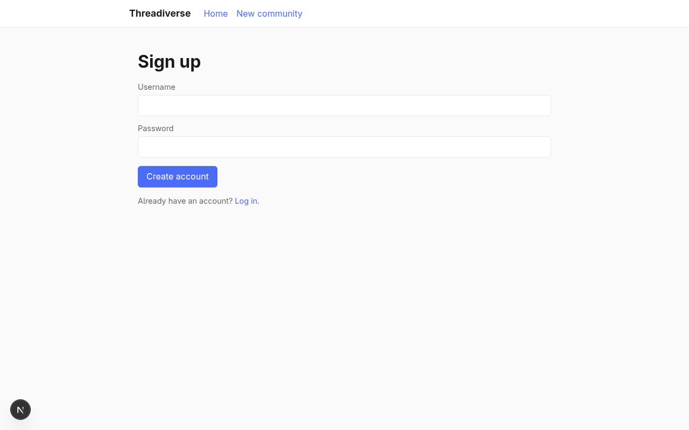
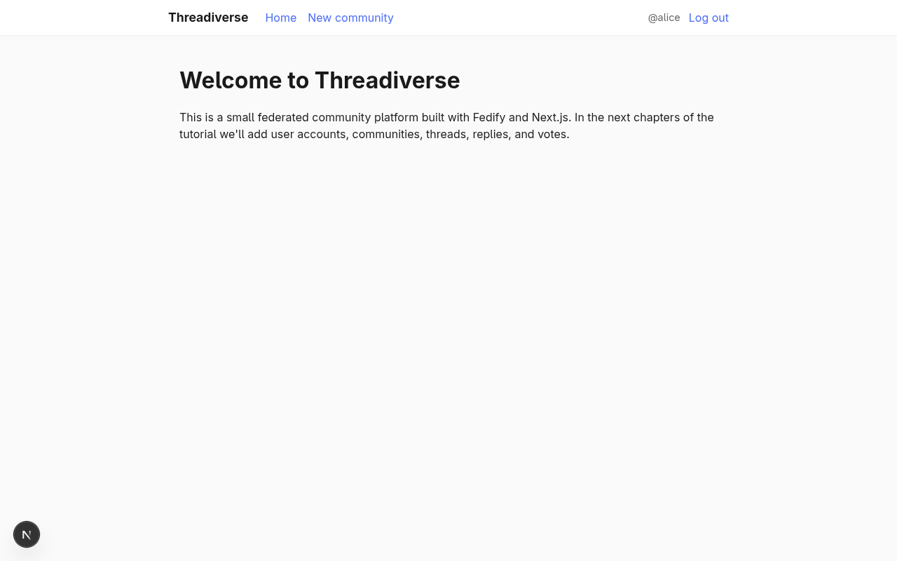
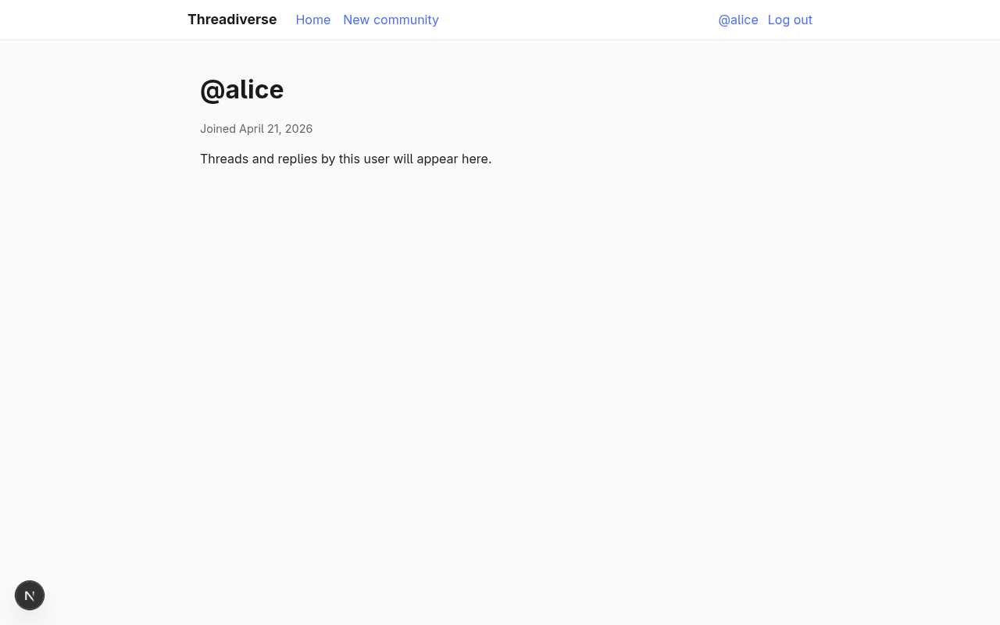
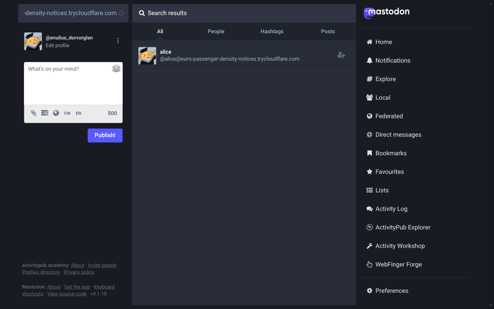
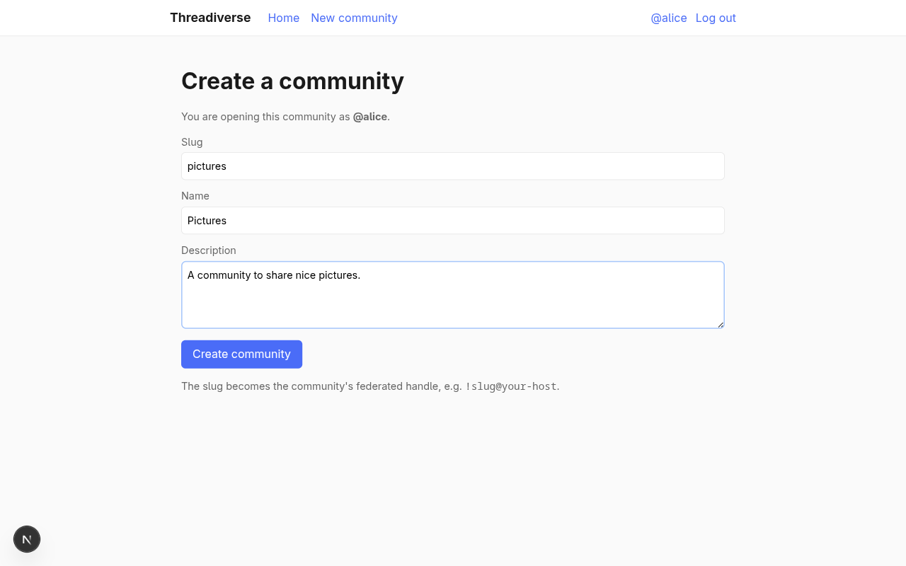
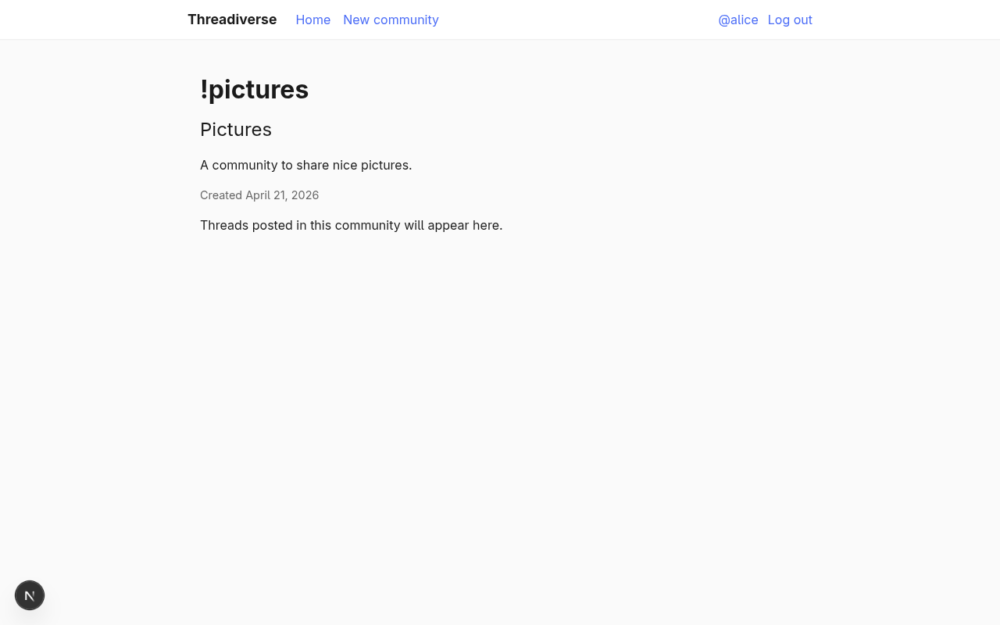
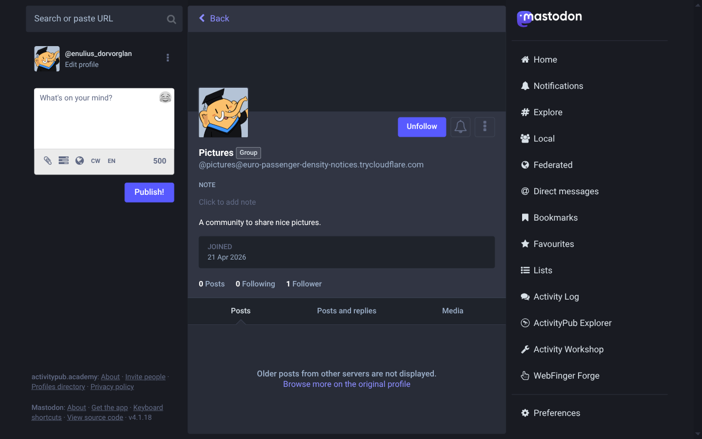
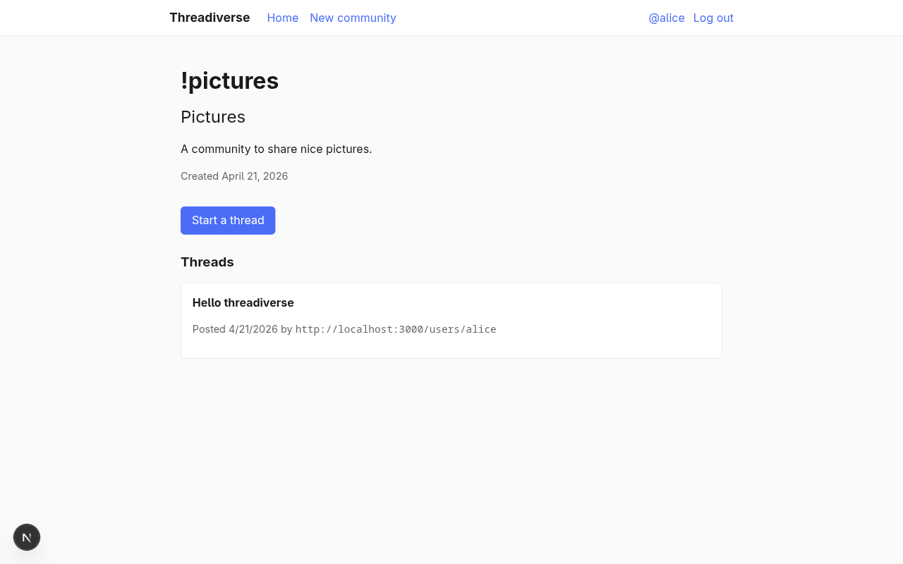

Building a threadiverse community platform
==========================================

In this tutorial, we will build a small threadiverse-style community platform
that federates with [Lemmy], [Mbin], and [NodeBB].  The server we build will
host federated *communities* that remote users can subscribe to, threads
posted inside those communities, and threaded replies to those threads.  We
will use [Fedify] as the ActivityPub framework and [Next.js] as the web
framework.

This tutorial focuses on how to use Fedify rather than on Next.js itself.  If
you have never used Next.js before, don't worry: we'll only touch the parts of
it that we need, and in a very shallow way.

If you have any questions, suggestions, or feedback, please feel free to join
our [Matrix chat space] or [GitHub Discussions].

[Lemmy]: https://join-lemmy.org/
[Mbin]: https://joinmbin.org/
[NodeBB]: https://nodebb.org/
[Fedify]: https://fedify.dev/
[Next.js]: https://nextjs.org/
[Matrix chat space]: https://matrix.to/#/#fedify:matrix.org
[GitHub Discussions]: https://github.com/fedify-dev/fedify/discussions

Target audience
---------------

This tutorial is aimed at readers who want to learn how to build a
community-centric ActivityPub application, something shaped like Lemmy rather
than like Mastodon.

We assume that you have experience creating web applications with HTML and
HTTP, that you understand command-line interfaces, JSON, and basic JavaScript.
You don't need to know TypeScript, JSX, SQL, ORMs, ActivityPub, Next.js, or
Fedify.  We'll teach you what you need to know about each of these as we go
along.

You don't need prior experience building ActivityPub software, but we do
assume that you have used at least one piece of threadiverse software such as
Lemmy, Mbin, NodeBB, or [Piefed].  That way you already have a mental picture
of the kind of product we are building.

If you are looking for a tutorial that builds a Mastodon-style microblog
(actor- and timeline-centric) instead, see
[*Creating your own federated microblog*](./microblog.md).

*[JSX]: JavaScript XML
*[ORM]: Object–Relational Mapping

[Piefed]: https://piefed.social/

Goals
-----

We will build a multi-user community platform whose local users can host
federated *communities* and subscribe to remote ones.  It will include the
following features:

 -  Users can sign up and log in with a username and password.
 -  Local users are federated as `Person` actors: other fediverse software can
    look them up by their handle.
 -  Local users can create and host federated *communities*.  A community is
    federated as a `Group` actor with its own inbox, outbox, and followers
    collection.
 -  Users can subscribe to a community on any threadiverse-compatible server
    (Lemmy, Mbin, another Fedify-based app, and so on).
 -  Users can unsubscribe from a community.
 -  Users can create a text thread inside a subscribed community.  A thread is
    federated as a `Create(Page)` activity addressed to the community.
 -  When a local community receives a thread, it redistributes that thread to
    all of its subscribers as an `Announce` activity.  This is the pattern
    threadiverse servers use to fan discussion out to every follower of a
    community.
 -  Users can reply to a thread or to another reply.  Replies are federated as
    `Create(Note)` activities.
 -  Users can up-vote (`Like`) or down-vote (`Dislike`) any thread or reply.
    The community redistributes these votes the same way it redistributes
    threads and replies.
 -  Users see a front page that lists recent threads from every community they
    subscribe to.

To keep the tutorial focused on federation mechanics, we leave out the
following features:

 -  Link threads (threads whose body is a URL instead of prose).
 -  Thread and reply editing, deletion, and `Tombstone`.
 -  Moderator roles, removals, bans, and reports.
 -  Ranking algorithms such as *Hot* or *Active*.
 -  Private communities.
 -  Media uploads.
 -  Direct messages.

After finishing the tutorial you are encouraged to add whichever of these you
want; they're all good practice.

The complete source code is available in the [GitHub repository], with
commits separated according to each implementation step for your reference.

[GitHub repository]: https://github.com/fedify-dev/threadiverse

Setting up the development environment
--------------------------------------

### Installing Node.js

Fedify supports three JavaScript runtimes: [Deno], [Bun], and [Node.js].
Next.js itself runs on Node.js, so we'll use Node.js here as well.

You need Node.js version 22.0.0 or higher.  There are
[several installation methods]; pick whichever is most convenient.  Once
Node.js is installed you should have access to the `node` and `npm` commands:

~~~~ sh
node --version
npm --version
~~~~

[Deno]: https://deno.com/
[Bun]: https://bun.sh/
[Node.js]: https://nodejs.org/
[several installation methods]: https://nodejs.org/en/download/package-manager

### Installing the `fedify` command

To scaffold a Fedify project we'll use the [`fedify`](../cli.md) command.
There are [several installation methods](../cli.md#installation); the simplest
is to install it as a global npm package:

~~~~ sh
npm install -g @fedify/cli
~~~~

Check that it works:

~~~~ sh
fedify --version
~~~~

Make sure the version number is 2.1.0 or higher.  Older versions of the CLI
don't know how to scaffold a Next.js project.

### `fedify init` to initialize the project

Pick a directory to work in.  In this tutorial we'll call it *threadiverse*.
Run the [`fedify init`](../cli.md#fedify-init-initializing-a-fedify-project)
command with a few options so it picks all of our choices non-interactively:

~~~~ sh
fedify init -w next -p npm -k in-memory -m in-process threadiverse
~~~~

The command scaffolds a Next.js App Router project that already knows how to
serve ActivityPub.  The options mean:

 -  `-w next`: integrate with [Next.js] using
    [`@fedify/next`](../manual/integration.md).
 -  `-p npm`: use `npm` as the package manager.
 -  `-k in-memory`: keep Fedify's key–value cache in memory (good enough for
    local development).  We'll swap in a persistent store in the *Next steps*
    chapter.
 -  `-m in-process`: run Fedify's background message queue in-process instead
    of on an external broker (Redis, RabbitMQ, and so on).

> [!WARNING]
> At the time of writing, `create-next-app` (which `fedify init` runs under
> the hood) defaults to Next.js 16, but `@fedify/next` 2.1.x still requires
> Next.js 15.4 or later in the 15.x line.  After `fedify init` finishes it
> will try to run `npm install` and fail with an `ERESOLVE` error.  Open
> *package.json*, change the `next`, `react`, `react-dom`, and
> `eslint-config-next` versions so they point at Next.js 15.5.x, then run
> `npm install` again:
>
> ~~~~ json
> "dependencies": {
>   "next": "^15.5.15",
>   "react": "^19.2.4",
>   "react-dom": "^19.2.4",
>   ...
> },
> "devDependencies": {
>   ...
>   "eslint-config-next": "^15.5.15",
>   ...
> }
> ~~~~
>
> This workaround will go away once Fedify ships support for Next.js 16.

After a moment your working directory will contain something like this:

 -  *app/* — Next.js App Router pages and layouts
     -  *layout.tsx* — root layout
     -  *page.tsx* — home page
     -  *globals.css* — global stylesheet
 -  *federation/* — ActivityPub server code
     -  *index.ts* — Fedify `Federation` instance
 -  *public/* — static assets served as-is
 -  *biome.json* — formatter and linter configuration
 -  *logging.ts* — logging setup
 -  *middleware.ts* — Next.js middleware that hands federation requests off
    to Fedify
 -  *next.config.ts* — Next.js configuration
 -  *package.json* — package metadata
 -  *tsconfig.json* — TypeScript configuration

As you may have guessed, we're using [TypeScript] instead of plain JavaScript,
so every source file ends in *.ts* or *.tsx* instead of *.js*.  TypeScript is
JavaScript with type annotations, and Fedify leans heavily on those types to
guide you into writing correct ActivityPub code.  If you've never used
TypeScript before, don't worry: we'll introduce each piece of syntax the
first time we use it.

*[TSX]: TypeScript XML

[TypeScript]: https://www.typescriptlang.org/

### Checking that the dev server runs

Now let's make sure the scaffold actually runs.  From inside the *threadiverse*
directory, start the Next.js development server:

~~~~ sh
npm run dev
~~~~

The dev server will keep running until you press
<kbd>Ctrl</kbd>+<kbd>C</kbd>:

~~~~ console
  ▲ Next.js 15.5.15
  - Local:        http://localhost:3000
  - Network:      http://192.168.x.x:3000

 ✓ Starting...
 ✓ Ready in 971ms
~~~~

Open a new terminal tab and use the `fedify lookup` command to confirm that
the ActivityPub side of the server is responding:

~~~~ sh
fedify lookup http://localhost:3000/users/testuser
~~~~

You should see Fedify print out a `Person` actor with `preferredUsername`
equal to `testuser`.  That placeholder actor comes from the default
`setActorDispatcher()` call that `fedify init` generated in
*federation/index.ts*.  We'll replace it with one backed by a real database
in [Federating your user](#federating-your-user-the-person-actor).

> [!TIP]
> The dev server responds to any `/users/{identifier}` URL with a generic
> actor whose only information is the identifier itself.  That's intentional:
> it lets you verify that the ActivityPub middleware is wired up correctly
> before you have any real user data.

If you ever see an `EMFILE: too many open files` error from Next.js on
Linux, you've hit the default `fs.inotify.max_user_instances` limit.
Restarting `npm run dev` with `WATCHPACK_POLLING=true` in front of it makes
Next.js fall back to polling-based file watching and sidesteps the problem.

### Swapping ESLint for Biome

The Next.js scaffold that `create-next-app` dropped into the project comes
with [ESLint] for linting, while the Fedify side of the scaffold prefers
[Biome].  `fedify init` tries to accommodate both by shipping them side by
side, but that means you have to install two tools that disagree with each
other on style.  Since Biome can do both the formatting *and* the linting we
need, let's delete ESLint and let Biome run the whole show.

Open *biome.json* and turn the linter on with the recommended rule set:

~~~~ json [biome.json]
{
  "$schema": "https://biomejs.dev/schemas/2.4.12/schema.json",
  "assist": { "actions": { "source": { "organizeImports": "on" } } },
  "formatter": {
    "enabled": true,
    "indentStyle": "space",
    "indentWidth": 2
  },
  "linter": {
    "enabled": true,
    "rules": { "recommended": true }
  },
  "files": {
    "includes": ["**", "!.next", "!node_modules", "!public"]
  }
}
~~~~

Delete the two ESLint configs:

~~~~ sh
rm eslint.config.mjs eslint.config.ts
~~~~

In *package.json*, drop the `eslint`, `eslint-config-next`, and `@fedify/lint`
packages from `devDependencies`, and rewrite the `lint` and `format` scripts
so they call Biome instead:

~~~~ json [package.json]
"scripts": {
  "dev": "next dev",
  "build": "next build",
  "start": "next start",
  "lint": "biome check",
  "format": "biome check --write"
},
~~~~

Then reinstall dependencies so the lockfile reflects the smaller dep tree:

~~~~ sh
npm install
~~~~

From now on you can format and lint the whole project with a single command:

~~~~ sh
npm run format
~~~~

Running it once right now will flag one pre-existing issue:
*federation/index.ts* imports `getLogger` from LogTape and assigns the result
to a `logger` constant, but nothing ever reads that `logger`.  Biome's
`noUnusedVariables` rule flags it.  Delete the unused import and declaration:

~~~~ typescript{2,4} [federation/index.ts]
import {
  createFederation,
  InProcessMessageQueue,
  MemoryKvStore,
} from "@fedify/fedify";
import { Person } from "@fedify/vocab";

const federation = createFederation({
  kv: new MemoryKvStore(),
  queue: new InProcessMessageQueue(),
});

federation.setActorDispatcher(
  "/users/{identifier}",
  async (ctx, identifier) => {
    return new Person({
      id: ctx.getActorUri(identifier),
      preferredUsername: identifier,
      name: identifier,
    });
  },
);

export default federation;
~~~~

We'll add logging back later when there's something worth logging.

[ESLint]: https://eslint.org/
[Biome]: https://biomejs.dev/

Layout and navigation
---------------------

Every page we build in the rest of the tutorial shares the same shell: a top
navigation bar with a brand link, a centered content area underneath it, and
a single colour palette.  We'll set that up once now so later chapters don't
have to re-specify it on every page.

Open *app/layout.tsx* and replace the `create-next-app` boilerplate with a
minimal root layout:

~~~~ tsx [app/layout.tsx]
import type { Metadata } from "next";
import Link from "next/link";
import "./globals.css";

export const metadata: Metadata = {
  title: "Threadiverse",
  description: "A small federated community platform built with Fedify.",
};

export default function RootLayout({
  children,
}: Readonly<{
  children: React.ReactNode;
}>) {
  return (
    <html lang="en">
      <body>
        <nav className="site-nav">
          

            <Link href="/" className="brand">
              Threadiverse
            </Link>
            <ul>
              <li>
                <Link href="/">Home</Link>
              </li>
              <li>
                <Link href="/communities/new">New community</Link>
              </li>
            </ul>
          

        </nav>
        <main>{children}</main>
      </body>
    </html>
  );
}
~~~~

> [!NOTE]
> A *root layout* in the [Next.js App Router] is the top-most React tree that
> wraps every page under *app/*.  Whatever it renders shows up on every
> route.  The `children` prop is the page for the current URL, rendered in
> place.  We haven't written any pages yet besides the home page, but as soon
> as we do they'll all inherit this nav bar.

Replace *app/page.tsx* with a temporary welcome blurb.  This is the page
rendered at the root URL (`/`).  We'll revisit it in a later chapter and turn
it into the *subscribed feed* once users can follow communities:

~~~~ tsx [app/page.tsx]
export default function Home() {
  return (
    <>
      <h1>Welcome to Threadiverse</h1>
      

        This is a small federated community platform built with Fedify and
        Next.js.  In the next chapters of the tutorial we'll add user
        accounts, communities, threads, replies, and votes.
      

    </>
  );
}
~~~~

Next, replace the whole contents of *app/globals.css* with the small
stylesheet below.  You can copy and paste it verbatim; we won't touch CSS
again for the rest of the tutorial:

~~~~ css [app/globals.css]
:root {
  --color-bg: #fafafa;
  --color-surface: #ffffff;
  --color-border: #e5e5e5;
  --color-text: #1a1a1a;
  --color-muted: #666;
  --color-accent: #4a6cf7;
  --color-accent-hover: #3453d8;
  --radius: 6px;
  --space: 1rem;
}

* {
  box-sizing: border-box;
}

body {
  margin: 0;
  font-family: system-ui, -apple-system, "Segoe UI", Roboto, sans-serif;
  line-height: 1.5;
  background: var(--color-bg);
  color: var(--color-text);
}

a {
  color: var(--color-accent);
  text-decoration: none;
}

a:hover {
  text-decoration: underline;
}

nav.site-nav {
  background: var(--color-surface);
  border-bottom: 1px solid var(--color-border);
  padding: 0.75rem var(--space);
}

nav.site-nav .inner {
  max-width: 800px;
  margin: 0 auto;
  display: flex;
  align-items: center;
  gap: 1.5rem;
}

nav.site-nav .brand {
  font-weight: 700;
  font-size: 1.1rem;
  color: var(--color-text);
}

nav.site-nav ul {
  list-style: none;
  margin: 0;
  padding: 0;
  display: flex;
  gap: 1rem;
  flex: 1;
}

main {
  max-width: 800px;
  margin: 0 auto;
  padding: var(--space);
}

h1,
h2,
h3 {
  margin-top: 1.5rem;
  margin-bottom: 0.5rem;
}

.card {
  background: var(--color-surface);
  border: 1px solid var(--color-border);
  border-radius: var(--radius);
  padding: var(--space);
  margin-bottom: var(--space);
}

.muted {
  color: var(--color-muted);
  font-size: 0.9rem;
}

label {
  display: block;
  margin-top: 0.75rem;
  font-size: 0.9rem;
  color: var(--color-muted);
}

input,
textarea {
  display: block;
  width: 100%;
  margin-top: 0.25rem;
  padding: 0.5rem;
  border: 1px solid var(--color-border);
  border-radius: var(--radius);
  font: inherit;
  background: var(--color-surface);
}

textarea {
  min-height: 6rem;
  resize: vertical;
}

button,
.button {
  display: inline-block;
  margin-top: 1rem;
  padding: 0.5rem 1rem;
  border: 0;
  border-radius: var(--radius);
  background: var(--color-accent);
  color: #fff;
  font: inherit;
  cursor: pointer;
}

button:hover,
.button:hover {
  background: var(--color-accent-hover);
  text-decoration: none;
  color: #fff;
}

.reply-tree {
  list-style: none;
  margin: 0;
  padding: 0;
}

.reply-tree .reply-tree {
  margin-left: 1.5rem;
  border-left: 2px solid var(--color-border);
  padding-left: 1rem;
}
~~~~

Finally, delete the four leftover files that `create-next-app` shipped but
we're no longer using:

~~~~ sh
rm app/page.module.css
rm public/file.svg public/globe.svg public/next.svg public/vercel.svg public/window.svg
~~~~

Reload `http://localhost:3000` in your browser.  You should see a nav bar
with a *Threadiverse* brand on the left, two links (*Home* and
*New community*), and the welcome blurb below it.  Clicking *New community*
will 404 for now; we'll build that page in the *Communities as Group actors*
chapter.

[Next.js App Router]: https://nextjs.org/docs/app

User accounts
-------------

Before we start federating anything we need *local* user accounts.  A local
user is just a row in our own database; we'll only turn those rows into
federated `Person` actors in the next chapter.  Getting accounts working
first gives us something concrete (a user, a username, a password) that the
federation layer can then point at.

### Drizzle ORM and SQLite

We'll keep data in [SQLite], the single-file embedded database.  SQLite is
ideal for a tutorial: the whole database lives in one *.sqlite3* file in your
project directory, there's no server to set up, and it's plenty fast for a
single-node app.  In production you would pick something like PostgreSQL, but
the code we'll write is almost identical; swapping databases is a matter of
changing the connection string.

To talk to SQLite we'll use [Drizzle ORM].  An ORM (*Object–Relational
Mapper*) lets you describe your tables as TypeScript values and then query
them with chained function calls instead of writing raw SQL strings.  The
benefit over raw SQL is that TypeScript understands your schema, so a typo
like `users.usernaem` is a compile error rather than a runtime mystery.

> [!NOTE]
> If you already know SQL, you'll find that Drizzle barely hides it: a
> Drizzle query reads almost word-for-word like the SQL it generates.  If
> you don't know SQL yet, that's fine; we'll introduce each piece of syntax
> the first time it appears.

[SQLite]: https://sqlite.org/
[Drizzle ORM]: https://orm.drizzle.team/

### Installing dependencies

Install Drizzle, the SQLite driver, and Drizzle's CLI:

~~~~ sh
npm install drizzle-orm better-sqlite3
npm install -D drizzle-kit @types/better-sqlite3
~~~~

The first line adds the runtime pieces: *drizzle-orm* is the query builder,
and [*better-sqlite3*] is a synchronous SQLite driver well-suited to
server-side rendering.  The second line adds Drizzle's CLI for managing the
schema, plus TypeScript types for *better-sqlite3*.

[*better-sqlite3*]: https://github.com/WiseLibs/better-sqlite3

### Declaring the `users` table

Create *db/schema.ts* and describe the first table:

~~~~ typescript [db/schema.ts]
import { sql } from "drizzle-orm";
import { integer, sqliteTable, text } from "drizzle-orm/sqlite-core";

export const users = sqliteTable("users", {
  id: integer("id").primaryKey({ autoIncrement: true }),
  username: text("username").notNull().unique(),
  passwordHash: text("password_hash").notNull(),
  createdAt: integer("created_at", { mode: "timestamp" })
    .notNull()
    .default(sql`(unixepoch())`),
});

export type User = typeof users.$inferSelect;
export type NewUser = typeof users.$inferInsert;
~~~~

Reading the file top to bottom:

 -  `sqliteTable("users", { ... })` defines a table named `users` with four
    columns.
 -  `id` is an auto-incrementing integer primary key.
 -  `username` is a required text column with a `UNIQUE` constraint; two
    users can't share the same username.
 -  `passwordHash` is a required text column; we'll store a *hash* of the
    password, never the password itself.
 -  `createdAt` is a Unix timestamp with a SQL default of `unixepoch()`, so
    SQLite fills in the time on insert.

The two `type` exports are a Drizzle convention.  `User` is the type of a
row as it comes out of the database (every column populated).  `NewUser` is
the shape of a row ready to *insert* (so `id` and `createdAt` are optional
because they have defaults).  Using these types means you never write out
column types by hand.

> [!TIP]
> The ``sql`(unixepoch())` `` bit is a *tagged template literal*: it embeds a
> raw SQL snippet in a Drizzle schema definition.  We use it here because
> Drizzle doesn't ship a helper for SQLite's `unixepoch()` function, and
> `unixepoch()` is the simplest way to default a column to “now” in seconds.

### Opening the database

Create *db/index.ts* next.  This is the module every server-side file will
import from when it needs to query the database:

~~~~ typescript [db/index.ts]
import Database from "better-sqlite3";
import { drizzle } from "drizzle-orm/better-sqlite3";
import * as schema from "./schema";

const sqlite = new Database("threadiverse.sqlite3");
sqlite.pragma("journal_mode = WAL");
sqlite.pragma("foreign_keys = ON");

export const db = drizzle(sqlite, { schema });
export * from "./schema";
~~~~

The file opens (or creates) *threadiverse.sqlite3* in the project root, sets
two pragmas that every SQLite app should set (`journal_mode = WAL` for
better concurrency, `foreign_keys = ON` so foreign-key constraints are
actually enforced), and wraps the connection with Drizzle.  The
`export * from "./schema"` re-exports every table and type so callers can
`import { db, users, type User } from "@/db"` from a single path.

### Wiring up Drizzle Kit

[Drizzle Kit] is Drizzle's companion CLI.  It reads your schema and either
generates migration SQL or pushes the schema directly to the database.
Create *drizzle.config.ts* at the project root:

~~~~ typescript [drizzle.config.ts]
import type { Config } from "drizzle-kit";

export default {
  schema: "./db/schema.ts",
  out: "./drizzle",
  dialect: "sqlite",
  dbCredentials: {
    url: "threadiverse.sqlite3",
  },
} satisfies Config;
~~~~

Add two npm scripts to *package.json* so the CLI is a short command:

~~~~ json [package.json]
"scripts": {
  ...
  "db:push": "drizzle-kit push",
  "db:studio": "drizzle-kit studio"
}
~~~~

`db:push` synchronizes the database schema with *db/schema.ts* in one
step.  `db:studio` opens a small web UI that lets you browse the database
contents; you don't need it now, but it's handy later when debugging
federation state.

[Drizzle Kit]: https://orm.drizzle.team/docs/kit-overview

### Creating the database

Create the database file by running:

~~~~ sh
npm run db:push
~~~~

Drizzle Kit prints a short summary and exits.  You should now have a
*threadiverse.sqlite3* file in the project root with an empty `users` table
inside.

Finally, add the SQLite database file to *.gitignore* so every developer
starts from their own empty copy:

~~~~ [.gitignore]
# sqlite database (regenerated locally)
*.sqlite3
*.sqlite3-journal
*.sqlite3-wal
*.sqlite3-shm
~~~~

> [!TIP]
> Throughout the rest of the tutorial, whenever we add or change a table,
> you'll re-run `npm run db:push` to sync the change to the database.  For
> a real app you would switch to generated migration files
> (`drizzle-kit generate` followed by `drizzle-kit migrate`) so deployments are
> reproducible; push is fine for local development and for tutorials.

### Signup form and password hashing

Now that we have a `users` table, let's give visitors a way to create a row
in it.  We'll keep authentication minimal: a username and a password.  No
email, no email verification, no social logins; you're welcome to add any
of these as a follow-up project.

Create a helper module for password hashing first.  Passwords must never be
stored as plain text; instead, we store a one-way *hash* computed with a
deliberately slow function, [scrypt], built into Node's standard library:

~~~~ typescript [lib/auth.ts]
import {
  randomBytes,
  scrypt as scryptCallback,
  timingSafeEqual,
} from "node:crypto";
import { promisify } from "node:util";

const scrypt = promisify(scryptCallback) as (
  password: string | Buffer,
  salt: string | Buffer,
  keylen: number,
) => Promise<Buffer>;

const KEY_LEN = 64;

export async function hashPassword(password: string): Promise<string> {
  const salt = randomBytes(16);
  const derived = await scrypt(password, salt, KEY_LEN);
  return `${salt.toString("hex")}:${derived.toString("hex")}`;
}

export async function verifyPassword(
  password: string,
  stored: string,
): Promise<boolean> {
  const [saltHex, hashHex] = stored.split(":");
  if (!saltHex || !hashHex) return false;
  const salt = Buffer.from(saltHex, "hex");
  const expected = Buffer.from(hashHex, "hex");
  const actual = await scrypt(password, salt, expected.length);
  return actual.length === expected.length && timingSafeEqual(actual, expected);
}
~~~~

`hashPassword` generates a fresh 16-byte salt, runs scrypt, and returns
`salt:hash` as a single hex-encoded string.  `verifyPassword` parses that
string back out, re-runs scrypt with the same salt, and uses
`timingSafeEqual` to compare the results (a constant-time comparison that
doesn't leak timing information to attackers).  We'll call these two
functions from the signup and login server actions.

Now add the signup page itself.  In Next.js App Router a page is a React
component exported from *app/some/route/page.tsx*; when you visit
`/some/route` in the browser, Next.js renders that component on the server
and sends the resulting HTML down:

~~~~ tsx [app/signup/page.tsx]
import Link from "next/link";
import { signup } from "./actions";

type SignupPageProps = {
  searchParams: Promise<{ error?: string }>;
};

export default async function SignupPage({ searchParams }: SignupPageProps) {
  const { error } = await searchParams;
  return (
    <>
      <h1>Sign up</h1>
      {error && 
{error}
}
      <form action={signup}>
        <label>
          Username
          <input
            type="text"
            name="username"
            required
            pattern="[a-zA-Z0-9_]{2,32}"
            title="2–32 letters, digits, or underscores"
          />
        </label>
        <label>
          Password
          <input type="password" name="password" required minLength={8} />
        </label>
        <button type="submit">Create account</button>
      </form>
      

        Already have an account? <Link href="/login">Log in</Link>.
      

    </>
  );
}
~~~~

> [!NOTE]
> The `searchParams` prop is how an App Router page reads the query string.
> We use it to show a flash error message when something went wrong: the
> server action redirects back to `/signup?error=...`, the page receives
> `error="..."` via `searchParams`, and the template renders it above the
> form.

The `action={signup}` attribute is what turns an ordinary HTML form into a
[*server action*].  When the user clicks *Create account*, Next.js
serializes the form fields into a `FormData` object, ships it to the
server, and invokes the `signup` function there.  No client-side fetch, no
JSON endpoint, no API route, no `onSubmit` handler needed.

Write that server action in a sibling file.  The `"use server"` directive
at the top marks every exported function as a server action that's callable
from client components and from `<form action>`:

~~~~ typescript [app/signup/actions.ts]
"use server";

import { eq } from "drizzle-orm";
import { redirect } from "next/navigation";
import { db, users } from "@/db";
import { hashPassword } from "@/lib/auth";

export async function signup(formData: FormData): Promise<void> {
  const username = String(formData.get("username") ?? "").trim();
  const password = String(formData.get("password") ?? "");

  if (!/^[a-zA-Z0-9_]{2,32}$/.test(username)) {
    redirect("/signup?error=Invalid+username");
  }
  if (password.length < 8) {
    redirect("/signup?error=Password+must+be+at+least+8+characters");
  }

  const existing = db
    .select({ id: users.id })
    .from(users)
    .where(eq(users.username, username))
    .get();
  if (existing) {
    redirect("/signup?error=Username+already+taken");
  }

  const passwordHash = await hashPassword(password);
  db.insert(users).values({ username, passwordHash }).run();

  redirect("/login?message=Account+created,+please+log+in");
}
~~~~

The action re-validates the input server-side (browsers can skip HTML
validation, so we can't trust `pattern="..."` alone), checks that the
username isn't already taken by querying the table with
`db.select(...).where(eq(users.username, username)).get()`, hashes the
password, inserts the row with `db.insert(users).values({...}).run()`, and
redirects to the login page with a success message.

> [!TIP]
> The `eq()` helper from `drizzle-orm` builds an SQL equality comparison.
> Drizzle has a whole set of comparison helpers (`and`, `or`, `inArray`,
> `gt`, `lt`, …).  They compose by nesting, so you can write something
> like `and(eq(users.id, 42), gt(users.createdAt, lastWeek))` for more
> complex `WHERE` clauses.

Open `http://localhost:3000/signup` in the browser and you should see the
form:

Fill in a username and password and click *Create account*.  The browser
will redirect to `/login?message=...`, which currently 404s because we
haven't built the login page yet.  That's fine; the signup half of the
flow worked, and the row is in the database.  We'll verify that, and build
the login half, in the next section.

[scrypt]: https://en.wikipedia.org/wiki/Scrypt
[*server action*]: https://nextjs.org/docs/app/building-your-application/data-fetching/server-actions-and-mutations

### Login and sessions

A user who signed up last section ended up at a `/login` URL that doesn't
exist yet.  Let's build login and cookie-based sessions so the account is
usable.

There are lots of ways to do session management in a web app.  We'll use the
simplest one that's safe for our purposes: a server-side `sessions` table
keyed by an opaque random token, and an HTTP-only cookie that stores just
that token.  The browser never sees the user ID or any other data; when a
request comes in, we look the token up in the database to find the user it
belongs to.  This keeps the cookie cheap to invalidate (delete the row, the
cookie becomes useless) and means we don't need to pick or rotate a cookie
signing secret.

Add the table to *db/schema.ts*:

~~~~ typescript{16-27} [db/schema.ts]
import { sql } from "drizzle-orm";
import { integer, sqliteTable, text } from "drizzle-orm/sqlite-core";

export const users = sqliteTable("users", {
  id: integer("id").primaryKey({ autoIncrement: true }),
  username: text("username").notNull().unique(),
  passwordHash: text("password_hash").notNull(),
  createdAt: integer("created_at", { mode: "timestamp" })
    .notNull()
    .default(sql`(unixepoch())`),
});

export type User = typeof users.$inferSelect;
export type NewUser = typeof users.$inferInsert;

export const sessions = sqliteTable("sessions", {
  token: text("token").primaryKey(),
  userId: integer("user_id")
    .notNull()
    .references(() => users.id, { onDelete: "cascade" }),
  expiresAt: integer("expires_at", { mode: "timestamp" }).notNull(),
  createdAt: integer("created_at", { mode: "timestamp" })
    .notNull()
    .default(sql`(unixepoch())`),
});

export type Session = typeof sessions.$inferSelect;
~~~~

`onDelete: "cascade"` on the `userId` reference means that deleting a user
automatically deletes their sessions too, so there are no dangling rows.

Re-run the schema sync:

~~~~ sh
npm run db:push
~~~~

Install the `server-only` package so that importing server-side code from a
client component fails at build time instead of leaking secrets:

~~~~ sh
npm install -D server-only
~~~~

Now write the session helpers.  Create *lib/session.ts*:

~~~~ typescript [lib/session.ts]
import "server-only";

import { randomBytes } from "node:crypto";
import { and, eq, gt } from "drizzle-orm";
import { cookies } from "next/headers";
import { db, sessions, type User, users } from "@/db";

const COOKIE_NAME = "session";
const MAX_AGE_SECONDS = 60 * 60 * 24 * 30;

export async function createSession(userId: number): Promise<void> {
  const token = randomBytes(32).toString("base64url");
  const expiresAt = new Date(Date.now() + MAX_AGE_SECONDS * 1000);
  db.insert(sessions).values({ token, userId, expiresAt }).run();
  const store = await cookies();
  store.set(COOKIE_NAME, token, {
    httpOnly: true,
    sameSite: "lax",
    secure: process.env.NODE_ENV === "production",
    path: "/",
    maxAge: MAX_AGE_SECONDS,
  });
}

export async function getCurrentUser(): Promise<User | null> {
  const store = await cookies();
  const token = store.get(COOKIE_NAME)?.value;
  if (!token) return null;
  const row = db
    .select()
    .from(sessions)
    .innerJoin(users, eq(sessions.userId, users.id))
    .where(and(eq(sessions.token, token), gt(sessions.expiresAt, new Date())))
    .get();
  return row?.users ?? null;
}

export async function destroySession(): Promise<void> {
  const store = await cookies();
  const token = store.get(COOKIE_NAME)?.value;
  if (token) {
    db.delete(sessions).where(eq(sessions.token, token)).run();
  }
  store.delete(COOKIE_NAME);
}
~~~~

A few notes:

 -  `randomBytes(32).toString("base64url")` produces a 43-character
    URL-safe random string.  That's our session token.
 -  `httpOnly: true` hides the cookie from JavaScript running in the page
    and rules out a whole class of cross-site scripting attacks.
 -  `sameSite: "lax"` means the cookie is included on top-level cross-site
    navigations but not on cross-site embeds, which keeps CSRF exposure
    small for our purposes.
 -  `secure: process.env.NODE_ENV === "production"` sets the `Secure` flag
    in production (the browser will only send the cookie over HTTPS) but
    leaves it off in development so you can log in over `http://localhost`.
 -  The join in `getCurrentUser` does `sessions ⨝ users ON user_id`, and
    the `where` filters out expired rows so we don't treat them as valid.

Now the login page.  Create *app/login/page.tsx*:

~~~~ tsx [app/login/page.tsx]
import Link from "next/link";
import { login } from "./actions";

type LoginPageProps = {
  searchParams: Promise<{ error?: string; message?: string }>;
};

export default async function LoginPage({ searchParams }: LoginPageProps) {
  const { error, message } = await searchParams;
  return (
    <>
      <h1>Log in</h1>
      {message && 
{message}
}
      {error && 
{error}
}
      <form action={login}>
        <label>
          Username
          <input type="text" name="username" required />
        </label>
        <label>
          Password
          <input type="password" name="password" required />
        </label>
        <button type="submit">Log in</button>
      </form>
      

        Need an account? <Link href="/signup">Sign up</Link>.
      

    </>
  );
}
~~~~

And the login and logout server actions in *app/login/actions.ts*:

~~~~ typescript [app/login/actions.ts]
"use server";

import { eq } from "drizzle-orm";
import { redirect } from "next/navigation";
import { db, users } from "@/db";
import { verifyPassword } from "@/lib/auth";
import { createSession, destroySession } from "@/lib/session";

export async function login(formData: FormData): Promise<void> {
  const username = String(formData.get("username") ?? "").trim();
  const password = String(formData.get("password") ?? "");

  const user = db
    .select()
    .from(users)
    .where(eq(users.username, username))
    .get();
  if (!user || !(await verifyPassword(password, user.passwordHash))) {
    redirect("/login?error=Invalid+username+or+password");
  }

  await createSession(user.id);
  redirect("/");
}

export async function logout(): Promise<void> {
  await destroySession();
  redirect("/");
}
~~~~

Finally, change the root layout into an async server component so that
every page knows whether a user is signed in.  Replace *app/layout.tsx*
with:

~~~~ tsx{3-4,15,16,35-47} [app/layout.tsx]
import type { Metadata } from "next";
import Link from "next/link";
import { logout } from "./login/actions";
import "./globals.css";
import { getCurrentUser } from "@/lib/session";

export const metadata: Metadata = {
  title: "Threadiverse",
  description: "A small federated community platform built with Fedify.",
};

export default async function RootLayout({
  children,
}: Readonly<{
  children: React.ReactNode;
}>) {
  const user = await getCurrentUser();
  return (
    <html lang="en">
      <body>
        <nav className="site-nav">
          

            <Link href="/" className="brand">
              Threadiverse
            </Link>
            <ul>
              <li>
                <Link href="/">Home</Link>
              </li>
              <li>
                <Link href="/communities/new">New community</Link>
              </li>
            </ul>
            {user ? (
              <form action={logout} className="session-controls">
                @{user.username}
                <button type="submit" className="link-button">
                  Log out
                </button>
              </form>
            ) : (
              

                <Link href="/login">Log in</Link>
                <Link href="/signup">Sign up</Link>
              

            )}
          

        </nav>
        <main>{children}</main>
      </body>
    </html>
  );
}
~~~~

Append a few more lines to *app/globals.css* for the new nav elements:

~~~~ css [app/globals.css]
nav.site-nav .session-controls {
  display: flex;
  align-items: center;
  gap: 0.75rem;
  margin: 0;
}

nav.site-nav .link-button {
  margin: 0;
  padding: 0;
  background: transparent;
  color: var(--color-accent);
  border: 0;
  cursor: pointer;
  font: inherit;
}

nav.site-nav .link-button:hover {
  background: transparent;
  color: var(--color-accent-hover);
  text-decoration: underline;
}
~~~~

Reload `/signup`, create an account, and you'll now land on a working
login page.  Sign in with the same credentials and the nav bar flips over
to show `@yourusername` and a *Log out* button:

Clicking *Log out* submits the logout action, which deletes the session
row and clears the cookie, and the nav bar flips back to *Log in / Sign
up*.

> [!TIP]
> You can inspect the cookie with your browser's developer tools (usually
> under *Application → Cookies*).  You should see a `session` cookie whose
> value is the same 43-character token as the `token` column of the
> `sessions` table.

### Profile page

Every user needs a page to call their own.  For now we'll keep it simple:
URL path, display name, join date.  Create *app/users/\[username]/page.tsx*:

~~~~ tsx [app/users/[username]/page.tsx]
import { eq } from "drizzle-orm";
import { notFound } from "next/navigation";
import { db, users } from "@/db";

type ProfilePageProps = {
  params: Promise<{ username: string }>;
};

export default async function ProfilePage({ params }: ProfilePageProps) {
  const { username } = await params;
  const user = db
    .select({
      id: users.id,
      username: users.username,
      createdAt: users.createdAt,
    })
    .from(users)
    .where(eq(users.username, username))
    .get();
  if (!user) notFound();
  return (
    <>
      <h1>@{user.username}</h1>
      

        Joined{" "}
        {user.createdAt.toLocaleDateString("en-US", {
          year: "numeric",
          month: "long",
          day: "numeric",
        })}
      

      
Threads and replies by this user will appear here.

    </>
  );
}
~~~~

A few things to notice:

 -  The square brackets in the folder name `[username]` make `username`
    a *dynamic segment*.  The Next.js router will match any path of the
    form `/users/<something>` and pass that `something` as
    `params.username`.
 -  `params` is a Promise in recent versions of Next.js, so we `await` it
    before destructuring.
 -  `notFound()` aborts rendering and shows the nearest `not-found.tsx`
    (or, if there isn't one, the default 404 page).

While we're here, turn the `@username` label in the nav bar into a link
that points to the current user's profile.  In *app/layout.tsx*, replace
the `` with a `<Link>`:

~~~~ tsx{2} [app/layout.tsx]
<form action={logout} className="session-controls">
  <Link href={`/users/${user.username}`}>@{user.username}</Link>
  <button type="submit" className="link-button">
    Log out
  </button>
</form>
~~~~

Reload and visit `/users/alice` (or whatever username you signed up with).
You should see something like this:

The same URL right now, when you open it with a browser, renders the HTML
page above.  But if a fediverse server asks for it with an
`Accept: application/activity+json` header, Fedify's middleware intercepts
the request and returns the default placeholder `Person` actor we saw
earlier.  In the next chapter we'll swap that placeholder for a proper
actor backed by our `users` table, so searching `@alice@<your-host>` in
Mastodon or Lemmy actually finds the account we just created.

Federating your user: the `Person` actor
----------------------------------------

All the pieces we've built so far have been local.  In this chapter we turn
a local user into a *federated* `Person` actor: a server-side entity that
other fediverse software can look up by handle, send follow requests to,
and verify signatures from.  This is the first chapter where ActivityPub
itself shows up.

### The `keys` table

Every federated actor needs a pair of cryptographic keys.  HTTP Signatures,
the scheme that authenticates server-to-server requests, uses an RSA key.
[Object Integrity Proofs] (sometimes called *LD Signatures* or *FEP-8b32*)
use an Ed25519 key.  We'll generate one of each per actor and store both.

Open *db/schema.ts* and add a `keys` table:

~~~~ typescript{3-8,30-48} [db/schema.ts]
import { sql } from "drizzle-orm";
import {
  integer,
  sqliteTable,
  text,
  uniqueIndex,
} from "drizzle-orm/sqlite-core";

export const users = sqliteTable("users", {
  id: integer("id").primaryKey({ autoIncrement: true }),
  username: text("username").notNull().unique(),
  passwordHash: text("password_hash").notNull(),
  createdAt: integer("created_at", { mode: "timestamp" })
    .notNull()
    .default(sql`(unixepoch())`),
});

export type User = typeof users.$inferSelect;
export type NewUser = typeof users.$inferInsert;

export const sessions = sqliteTable("sessions", {
  token: text("token").primaryKey(),
  userId: integer("user_id")
    .notNull()
    .references(() => users.id, { onDelete: "cascade" }),
  expiresAt: integer("expires_at", { mode: "timestamp" }).notNull(),
  createdAt: integer("created_at", { mode: "timestamp" })
    .notNull()
    .default(sql`(unixepoch())`),
});

export type Session = typeof sessions.$inferSelect;

export const keys = sqliteTable(
  "keys",
  {
    id: integer("id").primaryKey({ autoIncrement: true }),
    actorIdentifier: text("actor_identifier").notNull(),
    type: text("type", { enum: ["RSASSA-PKCS1-v1_5", "Ed25519"] }).notNull(),
    privateKey: text("private_key").notNull(),
    publicKey: text("public_key").notNull(),
    createdAt: integer("created_at", { mode: "timestamp" })
      .notNull()
      .default(sql`(unixepoch())`),
  },
  (table) => [
    uniqueIndex("keys_actor_type_idx").on(table.actorIdentifier, table.type),
  ],
);

export type Key = typeof keys.$inferSelect;
~~~~

A couple of things about this schema worth calling out:

 -  `actorIdentifier` is a plain string rather than a foreign key to a
    specific table.  That's deliberate: in the next chapter we'll add a
    second kind of actor (communities, i.e. `Group` actors).  Keeping
    keys keyed by identifier lets the same table serve both user and
    community keys without a schema change.
 -  The `type` column uses Drizzle's `enum` option, which in Drizzle +
    SQLite produces a `CHECK` constraint that rejects rows whose `type`
    isn't one of the two values we listed.
 -  The composite unique index `(actor_identifier, type)` makes sure
    each actor has at most one key of each algorithm.

Apply the schema change:

~~~~ sh
npm run db:push
~~~~

[Object Integrity Proofs]: https://www.w3.org/TR/vc-data-integrity/

### Actor dispatcher and key pairs dispatcher

Now rewrite *federation/index.ts* to replace the placeholder `Person` that
`fedify init` left behind with a real one backed by the database:

~~~~ typescript [federation/index.ts]
import {
  createFederation,
  exportJwk,
  generateCryptoKeyPair,
  importJwk,
  InProcessMessageQueue,
  MemoryKvStore,
} from "@fedify/fedify";
import { Endpoints, Person } from "@fedify/vocab";
import { and, eq } from "drizzle-orm";
import { db, keys, users } from "@/db";

const federation = createFederation({
  kv: new MemoryKvStore(),
  queue: new InProcessMessageQueue(),
});

federation
  .setActorDispatcher("/users/{identifier}", async (ctx, identifier) => {
    const user = db
      .select()
      .from(users)
      .where(eq(users.username, identifier))
      .get();
    if (!user) return null;

    const keyPairs = await ctx.getActorKeyPairs(identifier);
    return new Person({
      id: ctx.getActorUri(identifier),
      preferredUsername: identifier,
      name: identifier,
      inbox: ctx.getInboxUri(identifier),
      endpoints: new Endpoints({ sharedInbox: ctx.getInboxUri() }),
      url: new URL(`/users/${identifier}`, ctx.url),
      publicKey: keyPairs[0]?.cryptographicKey,
      assertionMethods: keyPairs.map((k) => k.multikey),
    });
  })
  .setKeyPairsDispatcher(async (_ctx, identifier) => {
    const user = db
      .select({ id: users.id })
      .from(users)
      .where(eq(users.username, identifier))
      .get();
    if (!user) return [];

    const pairs: CryptoKeyPair[] = [];
    for (const keyType of ["RSASSA-PKCS1-v1_5", "Ed25519"] as const) {
      const existing = db
        .select()
        .from(keys)
        .where(
          and(eq(keys.actorIdentifier, identifier), eq(keys.type, keyType)),
        )
        .get();
      if (existing) {
        pairs.push({
          privateKey: await importJwk(
            JSON.parse(existing.privateKey),
            "private",
          ),
          publicKey: await importJwk(JSON.parse(existing.publicKey), "public"),
        });
      } else {
        const pair = await generateCryptoKeyPair(keyType);
        db.insert(keys)
          .values({
            actorIdentifier: identifier,
            type: keyType,
            privateKey: JSON.stringify(await exportJwk(pair.privateKey)),
            publicKey: JSON.stringify(await exportJwk(pair.publicKey)),
          })
          .run();
        pairs.push(pair);
      }
    }
    return pairs;
  });

federation.setInboxListeners("/users/{identifier}/inbox", "/inbox");

export default federation;
~~~~

A walk-through of what changed:

 -  `setActorDispatcher` is the hook Fedify calls whenever an
    ActivityPub client wants a specific actor.  The `path` argument is
    the URL template the actor lives at (`/users/{identifier}`), and
    the callback returns an actor object or `null` for “no such actor”.
    Returning `null` makes Fedify respond with an HTTP 404.
 -  `ctx.getActorKeyPairs(identifier)` is how the dispatcher gets the
    actor's keys in the right format.  It calls our
    `setKeyPairsDispatcher` internally, wraps each pair with metadata
    that Fedify needs, and caches the result.  The returned
    `keyPairs[0]` is always the RSA pair, which is what `publicKey`
    wants; `keyPairs.map((k) => k.multikey)` produces the `Multikey`
    array that goes into `assertionMethods` for FEP-8b32 verification.
 -  `new Endpoints({ sharedInbox: ctx.getInboxUri() })` advertises a
    single *shared inbox* URL the actor is reachable through.  Large
    fediverse servers use the shared inbox to deliver one copy of an
    activity to many followers on the same host.
 -  `setKeyPairsDispatcher` is the hook that reads (or lazily creates)
    the two key pairs for an actor.  The first time you look up an
    actor, both keys are missing and we generate them; every subsequent
    lookup returns the stored pair.
 -  `setInboxListeners` registers the URL template Fedify should use
    for the per-actor inbox and the path for the shared inbox.  We
    haven't attached any `on(Activity, ...)` handlers yet, so the
    inbox accepts no activities for now; we'll add those in later
    chapters.  But registering the paths is what lets
    `ctx.getInboxUri()` resolve in the actor dispatcher above.

> [!TIP]
> Fedify's inbox and actor URLs are derived from the templates you pass
> to `setActorDispatcher` and `setInboxListeners`.  If you later want to
> change the URL scheme (for example from `/users/{identifier}` to
> `/u/{identifier}`), you only have to change the template; everything
> that calls `ctx.getActorUri(identifier)` or `ctx.getInboxUri(identifier)`
> follows along.

### Verifying locally

Start (or restart) the dev server with `npm run dev` and sign up if you
haven't already.  Then in a second terminal, ask Fedify to look up the
actor:

~~~~ sh
fedify lookup http://localhost:3000/users/alice
~~~~

You should see output that starts like this:

~~~~ console
Person {
  id: URL 'http://localhost:3000/users/alice',
  preferredUsername: 'alice',
  name: 'alice',
  inbox: URL 'http://localhost:3000/users/alice/inbox',
  ...
  publicKey: CryptographicKey { ... },
  assertionMethods: [ Multikey { ... }, Multikey { ... } ],
}
~~~~

Check the WebFinger endpoint directly too:

~~~~ sh
curl -H 'Accept: application/jrd+json' \
  "http://localhost:3000/.well-known/webfinger?resource=acct:alice@localhost:3000"
~~~~

The response is a JRD document pointing `rel="self"` at the actor URL:

~~~~ json
{
  "subject": "acct:alice@localhost:3000",
  "aliases": ["http://localhost:3000/users/alice"],
  "links": [
    { "rel": "self", "href": "http://localhost:3000/users/alice",
      "type": "application/activity+json" },
    { "rel": "http://webfinger.net/rel/profile-page",
      "href": "http://localhost:3000/users/alice" }
  ]
}
~~~~

Peek at the database too: every time the dispatcher runs for a user
with no stored keys, two rows appear in the `keys` table, one with
`type = "RSASSA-PKCS1-v1_5"` and one with `type = "Ed25519"`.

### Letting the wider fediverse see your actor

Right now the actor is reachable only at `http://localhost:3000`, and no
remote server can verify a connection to `localhost`.  To let an outside
server discover this actor we need two things: a reverse proxy, and a
bit of code that tells Fedify to trust the `Host` and `Proto` that the
proxy forwards in.

#### Running the tunnel

Fedify ships a convenience command, `fedify tunnel`, that wraps [Serveo]
to give you a free public HTTPS URL pointing at a local port.  In a new
terminal, run:

~~~~ sh
fedify tunnel 3000
~~~~

After a few seconds the command prints a line like:

~~~~ console
✔ Your local server is now publicly accessible:

  https://<random-subdomain>.serveo.net

Press ^C to stop the server.
~~~~

Leave that terminal running as long as you want the public URL to exist.

> [!WARNING]
> Tunnel services come and go, and occasionally a given provider is
> unavailable or drops your session silently after a few minutes of
> idle traffic.  If `fedify tunnel` hangs on *Creating a secure tunnel*
> or your tunnel URL stops responding, the easiest workaround is to
> restart the command (or fall back to [cloudflared] or [ngrok]).  The
> URL usually changes on restart, so expect to re-paste it anywhere
> you typed it in.

#### Honouring X-forwarded-\* headers

When a request comes in through a tunnel, Next.js sees the tunnel as a
reverse proxy.  The real public host is in the `X-Forwarded-Host` and
`X-Forwarded-Proto` headers; the `Host` header itself says `localhost:3000`.
Without any changes Fedify builds its actor URLs from `Host`, so remote
servers see `https://localhost:3000/users/alice` and can't fetch it.

Fix this by wrapping the request with [*x-forwarded-fetch*] inside the
middleware.  Install the package first:

~~~~ sh
npm install x-forwarded-fetch
~~~~

Then rewrite *middleware.ts*:

~~~~ typescript [middleware.ts]
import { integrateFederation, isFederationRequest } from "@fedify/next";
import { NextResponse } from "next/server";
import { getXForwardedRequest } from "x-forwarded-fetch";
import federation from "./federation";

const federationHandler = integrateFederation(federation);

export default async function middleware(request: Request) {
  const forwarded = await getXForwardedRequest(request);
  if (isFederationRequest(forwarded)) {
    return await federationHandler(forwarded);
  }
  return NextResponse.next();
}

export const config = {
  runtime: "nodejs",
  matcher: [
    {
      source: "/:path*",
      has: [
        {
          type: "header",
          key: "Accept",
          value: ".*application\\/((jrd|activity|ld)\\+json|xrd\\+xml).*",
        },
      ],
    },
    {
      source: "/:path*",
      has: [
        {
          type: "header",
          key: "content-type",
          value: ".*application\\/((jrd|activity|ld)\\+json|xrd\\+xml).*",
        },
      ],
    },
    { source: "/.well-known/nodeinfo" },
    { source: "/.well-known/x-nodeinfo2" },
  ],
};
~~~~

`getXForwardedRequest()` returns a new `Request` whose `url`, `protocol`,
and `host` reflect `X-Forwarded-*` headers when they're present.  We then
pass that rewritten request through to either Fedify (if it's an ActivityPub
or NodeInfo request) or the normal Next.js pipeline.

> [!WARNING]
> Only call `getXForwardedRequest()` when you know that every HTTP request
> reaches your app through a trusted proxy.  If your server also serves
> requests directly from the public internet, a malicious client can
> set its own `X-Forwarded-Host` and impersonate any domain.

#### Searching from the academy

With the tunnel running and the middleware fixed, fetch your actor
through the public URL to confirm the IDs now match the tunnel host:

~~~~ sh
curl -H 'Accept: application/activity+json' \
  https://<your-tunnel>.serveo.net/users/alice
~~~~

The JSON's `id`, `inbox`, and `endpoints.sharedInbox` should all say
`https://<your-tunnel>.serveo.net/...`, not `http://localhost:3000/...`.

Next, open [ActivityPub.Academy] — a throwaway Mastodon instance the
fediverse community runs for exactly this kind of testing — in a browser.
Sign up for a temporary account, then paste `@alice@<your-tunnel>.serveo.net`
into the search box:

Academy looks your account up via WebFinger, fetches the actor JSON, and
shows it as a result.  That's all we need from Ch. 8: the wider
fediverse can now *see* the user we created.  In the Community chapters
we'll pair this with a Follow handler so the academy (and other servers)
can actually subscribe.

[Serveo]: https://serveo.net/
[cloudflared]: https://developers.cloudflare.com/cloudflare-one/connections/connect-networks/
[ngrok]: https://ngrok.com/
[*x-forwarded-fetch*]: https://github.com/dahlia/x-forwarded-fetch
[ActivityPub.Academy]: https://activitypub.academy/

Communities as `Group` actors
-----------------------------

In the threadiverse, the unit of organisation is the *community*: a topic
bucket that local and remote users can subscribe to, post threads into, and
reply inside.  Every community is itself an actor, just like a user, but
represented as a [`Group`] in ActivityPub.  This chapter adds communities
to the local database, gives them a UI, and teaches Fedify to serve them
as `Group` actors alongside the `Person` actors we already have.

[`Group`]: ../manual/pragmatics.md#group

### The `communities` table

Add a new table to *db/schema.ts*:

~~~~ typescript [db/schema.ts]
export const communities = sqliteTable("communities", {
  id: integer("id").primaryKey({ autoIncrement: true }),
  slug: text("slug").notNull().unique(),
  name: text("name").notNull(),
  description: text("description").notNull().default(""),
  creatorId: integer("creator_id")
    .notNull()
    .references(() => users.id),
  createdAt: integer("created_at", { mode: "timestamp" })
    .notNull()
    .default(sql`(unixepoch())`),
});

export type Community = typeof communities.$inferSelect;
export type NewCommunity = typeof communities.$inferInsert;
~~~~

`slug` is the machine-readable identifier, the part that appears in URLs
and in the federated handle `!slug@host`.  `name` is the human-readable
title, displayed to users.  `creator_id` is a foreign key to the local
user who opened the community.

Apply it:

~~~~ sh
npm run db:push
~~~~

### Shared identifier namespace

Fedify's `setActorDispatcher` registers exactly one URL template per
`Federation` instance.  The scaffold uses `/users/{identifier}` for
`Person` actors, and we'll reuse the same template for `Group` actors
too, because Fedify routes every actor through the same dispatcher.

That means a username like `alice` and a community slug like `alice`
can't both exist: when someone fetches `/users/alice`, the dispatcher
has to pick *one* interpretation.  Put the uniqueness check in a
helper so signup and community creation can share it.  Create
*lib/identifiers.ts*:

~~~~ typescript [lib/identifiers.ts]
import "server-only";

import { eq } from "drizzle-orm";
import { communities, db, users } from "@/db";

export const IDENTIFIER_PATTERN = /^[a-zA-Z0-9_]{2,32}$/;

export function isValidIdentifier(identifier: string): boolean {
  return IDENTIFIER_PATTERN.test(identifier);
}

export function isIdentifierTaken(identifier: string): boolean {
  const user = db
    .select({ id: users.id })
    .from(users)
    .where(eq(users.username, identifier))
    .get();
  if (user) return true;
  const community = db
    .select({ id: communities.id })
    .from(communities)
    .where(eq(communities.slug, identifier))
    .get();
  return community != null;
}
~~~~

Then rewrite the signup action to consult it (replace the hand-rolled
regex and the direct user lookup):

~~~~ typescript{5,10,13} [app/signup/actions.ts]
"use server";

import { redirect } from "next/navigation";
import { db, users } from "@/db";
import { hashPassword } from "@/lib/auth";
import { isIdentifierTaken, isValidIdentifier } from "@/lib/identifiers";

export async function signup(formData: FormData): Promise<void> {
  const username = String(formData.get("username") ?? "").trim();
  const password = String(formData.get("password") ?? "");

  if (!isValidIdentifier(username)) {
    redirect("/signup?error=Invalid+username");
  }
  if (password.length < 8) {
    redirect("/signup?error=Password+must+be+at+least+8+characters");
  }
  if (isIdentifierTaken(username)) {
    redirect("/signup?error=Username+already+taken");
  }

  const passwordHash = await hashPassword(password);
  db.insert(users).values({ username, passwordHash }).run();

  redirect("/login?message=Account+created,+please+log+in");
}
~~~~

### Community creation form

Create *app/communities/new/page.tsx*.  It's an async server component
that redirects anonymous visitors to `/login` and otherwise renders a
slug + name + description form:

~~~~ tsx [app/communities/new/page.tsx]
import { redirect } from "next/navigation";
import { getCurrentUser } from "@/lib/session";
import { createCommunity } from "./actions";

type NewCommunityPageProps = {
  searchParams: Promise<{ error?: string }>;
};

export default async function NewCommunityPage({
  searchParams,
}: NewCommunityPageProps) {
  const user = await getCurrentUser();
  if (!user) redirect("/login?message=Log+in+to+create+a+community");
  const { error } = await searchParams;
  return (
    <>
      <h1>Create a community</h1>
      

        You are opening this community as <strong>@{user.username}</strong>.
      

      {error && 
{error}
}
      <form action={createCommunity}>
        <label>
          Slug
          <input
            type="text"
            name="slug"
            required
            pattern="[a-zA-Z0-9_]{2,32}"
            title="2–32 letters, digits, or underscores"
          />
        </label>
        <label>
          Name
          <input type="text" name="name" required maxLength={64} />
        </label>
        <label>
          Description
          <textarea name="description" maxLength={500} />
        </label>
        <button type="submit">Create community</button>
      </form>
      

        The slug becomes the community's federated handle, e.g.{" "}
        <code>!slug@your-host</code>.
      

    </>
  );
}
~~~~

And the server action in *app/communities/new/actions.ts*:

~~~~ typescript [app/communities/new/actions.ts]
"use server";

import { redirect } from "next/navigation";
import { communities, db } from "@/db";
import { isIdentifierTaken, isValidIdentifier } from "@/lib/identifiers";
import { getCurrentUser } from "@/lib/session";

export async function createCommunity(formData: FormData): Promise<void> {
  const user = await getCurrentUser();
  if (!user) redirect("/login?message=Log+in+to+create+a+community");

  const slug = String(formData.get("slug") ?? "").trim();
  const name = String(formData.get("name") ?? "").trim();
  const description = String(formData.get("description") ?? "").trim();

  if (!isValidIdentifier(slug)) {
    redirect("/communities/new?error=Invalid+slug");
  }
  if (!name) {
    redirect("/communities/new?error=Name+is+required");
  }
  if (isIdentifierTaken(slug)) {
    redirect(
      `/communities/new?error=${encodeURIComponent(
        "Slug is already taken by a user or another community",
      )}`,
    );
  }

  db.insert(communities)
    .values({ slug, name, description, creatorId: user.id })
    .run();

  redirect(`/users/${slug}`);
}
~~~~

The action re-checks the session (never trust that a client-side
redirect ran), validates the slug and name, ensures the slug doesn't
collide with a username or another community, inserts the row, and
redirects to the community's URL.

Log in, open `http://localhost:3000/communities/new`, and fill the
form:

Submitting redirects to `/users/<slug>`, which 404s for now; the
profile page only knows about users.  The next section fixes that.

### Rendering the community page

Teach the profile page to fall through to `communities` when the
identifier doesn't match a user.  Rewrite *app/users/\[username]/page.tsx*:

~~~~ tsx [app/users/[username]/page.tsx]
import { eq } from "drizzle-orm";
import { notFound } from "next/navigation";
import { communities, db, users } from "@/db";

type ProfilePageProps = {
  params: Promise<{ username: string }>;
};

export default async function ProfilePage({ params }: ProfilePageProps) {
  const { username: identifier } = await params;

  const user = db
    .select({
      id: users.id,
      username: users.username,
      createdAt: users.createdAt,
    })
    .from(users)
    .where(eq(users.username, identifier))
    .get();
  if (user) {
    return (
      <>
        <h1>@{user.username}</h1>
        

          Joined{" "}
          {user.createdAt.toLocaleDateString("en-US", {
            year: "numeric",
            month: "long",
            day: "numeric",
          })}
        

        
Threads and replies by this user will appear here.

      </>
    );
  }

  const community = db
    .select()
    .from(communities)
    .where(eq(communities.slug, identifier))
    .get();
  if (community) {
    return (
      <>
        <h1>!{community.slug}</h1>
        <h2 style={{ fontWeight: "normal", marginTop: 0 }}>{community.name}</h2>
        {community.description && 
{community.description}
}
        

          Created{" "}
          {community.createdAt.toLocaleDateString("en-US", {
            year: "numeric",
            month: "long",
            day: "numeric",
          })}
        

        
Threads posted in this community will appear here.

      </>
    );
  }

  notFound();
}
~~~~

Reload `/users/<slug>` after creating a community and the page now
renders the community's slug, name, description, and a placeholder
for future threads:

### The `Group` actor dispatcher

Now the federation side.  Teach the actor dispatcher to return a
`Group` when the identifier belongs to a community, and extend the
key pairs dispatcher so community slugs also get lazily generated
keys.  Replace the body of *federation/index.ts* with:

~~~~ typescript [federation/index.ts]
import {
  createFederation,
  exportJwk,
  generateCryptoKeyPair,
  importJwk,
  InProcessMessageQueue,
  MemoryKvStore,
} from "@fedify/fedify";
import { Endpoints, Group, Person } from "@fedify/vocab";
import { and, eq } from "drizzle-orm";
import { communities, db, keys, users } from "@/db";

const federation = createFederation({
  kv: new MemoryKvStore(),
  queue: new InProcessMessageQueue(),
});

federation
  .setActorDispatcher("/users/{identifier}", async (ctx, identifier) => {
    const user = db
      .select()
      .from(users)
      .where(eq(users.username, identifier))
      .get();
    if (user) {
      const keyPairs = await ctx.getActorKeyPairs(identifier);
      return new Person({
        id: ctx.getActorUri(identifier),
        preferredUsername: identifier,
        name: identifier,
        inbox: ctx.getInboxUri(identifier),
        endpoints: new Endpoints({ sharedInbox: ctx.getInboxUri() }),
        url: new URL(`/users/${identifier}`, ctx.url),
        publicKey: keyPairs[0]?.cryptographicKey,
        assertionMethods: keyPairs.map((k) => k.multikey),
      });
    }

    const community = db
      .select()
      .from(communities)
      .where(eq(communities.slug, identifier))
      .get();
    if (community) {
      const keyPairs = await ctx.getActorKeyPairs(identifier);
      return new Group({
        id: ctx.getActorUri(identifier),
        preferredUsername: identifier,
        name: community.name,
        summary: community.description || undefined,
        inbox: ctx.getInboxUri(identifier),
        endpoints: new Endpoints({ sharedInbox: ctx.getInboxUri() }),
        url: new URL(`/users/${identifier}`, ctx.url),
        publicKey: keyPairs[0]?.cryptographicKey,
        assertionMethods: keyPairs.map((k) => k.multikey),
      });
    }

    return null;
  })
  .setKeyPairsDispatcher(async (_ctx, identifier) => {
    const user = db
      .select({ id: users.id })
      .from(users)
      .where(eq(users.username, identifier))
      .get();
    const community = user
      ? null
      : db
          .select({ id: communities.id })
          .from(communities)
          .where(eq(communities.slug, identifier))
          .get();
    if (!user && !community) return [];

    const pairs: CryptoKeyPair[] = [];
    for (const keyType of ["RSASSA-PKCS1-v1_5", "Ed25519"] as const) {
      const existing = db
        .select()
        .from(keys)
        .where(
          and(eq(keys.actorIdentifier, identifier), eq(keys.type, keyType)),
        )
        .get();
      if (existing) {
        pairs.push({
          privateKey: await importJwk(
            JSON.parse(existing.privateKey),
            "private",
          ),
          publicKey: await importJwk(JSON.parse(existing.publicKey), "public"),
        });
      } else {
        const pair = await generateCryptoKeyPair(keyType);
        db.insert(keys)
          .values({
            actorIdentifier: identifier,
            type: keyType,
            privateKey: JSON.stringify(await exportJwk(pair.privateKey)),
            publicKey: JSON.stringify(await exportJwk(pair.publicKey)),
          })
          .run();
        pairs.push(pair);
      }
    }
    return pairs;
  });

federation.setInboxListeners("/users/{identifier}/inbox", "/inbox");

export default federation;
~~~~

Two dispatchers, one URL template, two actor types.

### Testing the `Group` federation

Bring up `fedify tunnel 3000` again if you stopped it, and with the
tunnel URL fresh, fetch the community actor:

~~~~ sh
curl -H 'Accept: application/activity+json' \
  https://<your-tunnel>/users/pictures | jq '.type, .name, .preferredUsername'
~~~~

The response says `"type": "Group"`, `"name": "Pictures"`,
`"preferredUsername": "pictures"`.

Paste `@pictures@<your-tunnel>` into ActivityPub.Academy's search box
and the community shows up, just like a user did in the last chapter:

Academy, like Mastodon, calls this a *group* in its UI.  Threadiverse
software that speaks the same protocol (Lemmy, Mbin, NodeBB) will
recognise it as a community they can subscribe to.  In the next two
sections we'll add the follow half of the story: receiving and
accepting Follow requests.

Subscribing to communities
--------------------------

Having communities is only half of the threadiverse.  The other half is
letting users (local and remote) *subscribe* to communities, and making
sure those communities see every new subscriber and acknowledge it with
an `Accept(Follow)` activity.  This chapter builds that flow in both
directions.

### The `follows` table and the followers collection

Add a `follows` table to *db/schema.ts*:

~~~~ typescript [db/schema.ts]
export const follows = sqliteTable(
  "follows",
  {
    id: integer("id").primaryKey({ autoIncrement: true }),
    followerUri: text("follower_uri").notNull(),
    followerInbox: text("follower_inbox").notNull(),
    followerSharedInbox: text("follower_shared_inbox"),
    followedUri: text("followed_uri").notNull(),
    accepted: integer("accepted", { mode: "boolean" }).notNull().default(false),
    createdAt: integer("created_at", { mode: "timestamp" })
      .notNull()
      .default(sql`(unixepoch())`),
  },
  (table) => [
    uniqueIndex("follows_pair_idx").on(table.followerUri, table.followedUri),
  ],
);

export type Follow = typeof follows.$inferSelect;
~~~~

A row holds both sides of a subscription as plain ActivityPub URIs,
plus the follower's inbox and optional shared inbox (denormalised so
fan-out doesn't have to re-fetch the actor).  `accepted` starts false
and flips to true once we've seen (or sent) the corresponding
`Accept(Follow)`.  The unique index on `(followerUri, followedUri)`
keeps the table from sprouting duplicate subscriptions.

Re-run `npm run db:push`.

Then extend *federation/index.ts* to expose the followers collection.
This is the endpoint a remote server paginates when it wants to know
who subscribes to one of our communities.  It's also what
`ctx.sendActivity(sender, "followers", activity)` resolves to when we
fan out later:

~~~~ typescript{9,13-43} [federation/index.ts]
// ...
federation
  .setActorDispatcher("/users/{identifier}", async (ctx, identifier) => {
    // ...
    if (community) {
      const keyPairs = await ctx.getActorKeyPairs(identifier);
      return new Group({
        // ...existing fields...
        followers: ctx.getFollowersUri(identifier),
      });
    }
    // ...
  });

federation.setFollowersDispatcher(
  "/users/{identifier}/followers",
  async (ctx, identifier) => {
    const community = db
      .select()
      .from(communities)
      .where(eq(communities.slug, identifier))
      .get();
    if (!community) return null;
    const rows = db
      .select()
      .from(follows)
      .where(
        and(
          eq(follows.followedUri, ctx.getActorUri(identifier).href),
          eq(follows.accepted, true),
        ),
      )
      .all();
    return {
      items: rows.map((r) => ({
        id: new URL(r.followerUri),
        inboxId: new URL(r.followerInbox),
        endpoints: r.followerSharedInbox
          ? { sharedInbox: new URL(r.followerSharedInbox) }
          : null,
      })),
    };
  },
);
~~~~

Adding `followers: ctx.getFollowersUri(identifier)` to the `Group`
actor JSON is what makes a threadiverse server (Lemmy, Mbin) willing
to call this community “real” — without it they won't trust there's
a collection to paginate.

### Handling an inbound `Follow`

Most of the Follow flow is inbox work.  The community inbox needs to:

1.  Recognise a `Follow` whose `object` is one of our communities.
2.  Resolve the follower's actor so we can read its `inbox` and
    `endpoints.sharedInbox`.
3.  Upsert the follows row (accepted = true for local communities,
    which auto-accept).
4.  Ship an `Accept(Follow)` back to the follower.

Extend *federation/index.ts*:

~~~~ typescript [federation/index.ts]
federation
  .setInboxListeners("/users/{identifier}/inbox", "/inbox")
  .on(Follow, async (ctx, follow) => {
    if (!follow.id || !follow.actorId || !follow.objectId) return;
    const parsed = ctx.parseUri(follow.objectId);
    if (parsed?.type !== "actor") return;
    const identifier = parsed.identifier;

    const community = db
      .select()
      .from(communities)
      .where(eq(communities.slug, identifier))
      .get();
    if (!community) return;

    const actor = await follow.getActor(ctx);
    if (!actor?.id || !actor.inboxId) return;

    db.insert(follows)
      .values({
        followerUri: actor.id.href,
        followerInbox: actor.inboxId.href,
        followerSharedInbox: actor.endpoints?.sharedInbox?.href ?? null,
        followedUri: follow.objectId.href,
        accepted: true,
      })
      .onConflictDoUpdate({
        target: [follows.followerUri, follows.followedUri],
        set: {
          followerInbox: actor.inboxId.href,
          followerSharedInbox: actor.endpoints?.sharedInbox?.href ?? null,
          accepted: true,
        },
      })
      .run();

    await ctx.sendActivity(
      { identifier },
      actor,
      new Accept({
        id: new URL(
          `#accepts/${encodeURIComponent(follow.id.href)}`,
          follow.objectId,
        ),
        actor: follow.objectId,
        object: follow,
      }),
    );
  });
~~~~

A few important details:

 -  `ctx.parseUri(follow.objectId)` turns the URI into a `{ type, identifier }`
    tuple we can branch on.  If the object isn't a local actor, or the
    identifier isn't a community, we bail out silently.
 -  `follow.getActor(ctx)` fetches the remote actor over HTTP
    (Fedify caches it) so we know their inbox URL.
 -  `onConflictDoUpdate` makes the upsert idempotent: if the same
    remote user sends us a Follow twice (say, after a transient
    failure), we don't crash on the unique constraint.
 -  `ctx.sendActivity(sender, recipient, activity)` enqueues the
    `Accept` on Fedify's in-process message queue.  The HTTP
    delivery happens asynchronously from the request that triggered
    it, which is important for keeping the inbox responsive.

### Handling an inbound `Accept(Follow)`

The mirror image: when a remote community accepts one of *our*
Follow requests, the Accept lands in the local user's inbox.  Add a
listener:

~~~~ typescript [federation/index.ts]
  .on(Accept, async (ctx, accept) => {
    const enclosed = await accept.getObject(ctx);
    if (!(enclosed instanceof Follow)) return;
    if (!enclosed.actorId || !enclosed.objectId) return;
    db.update(follows)
      .set({ accepted: true })
      .where(
        and(
          eq(follows.followerUri, enclosed.actorId.href),
          eq(follows.followedUri, enclosed.objectId.href),
        ),
      )
      .run();
  });
~~~~

`accept.getObject` returns the object the Accept wraps.  Only when
that object is a `Follow` do we flip the corresponding row's
`accepted` flag.

### Sending an outbound `Follow`

Give users a UI for following remote communities.  Create
*app/follow/page.tsx*:

~~~~ tsx [app/follow/page.tsx]
import { redirect } from "next/navigation";
import { getCurrentUser } from "@/lib/session";
import { followCommunity } from "./actions";

type FollowPageProps = {
  searchParams: Promise<{ error?: string; message?: string }>;
};

export default async function FollowPage({ searchParams }: FollowPageProps) {
  const user = await getCurrentUser();
  if (!user) redirect("/login?message=Log+in+to+follow+a+community");
  const { error, message } = await searchParams;
  return (
    <>
      <h1>Follow a community</h1>
      

        Paste a community handle in the form <code>@slug@host</code> (for
        example <code>@fediverse@lemmy.ml</code>) or a direct URL to a
        community on any threadiverse-compatible server.
      

      {message && 
{message}
}
      {error && 
{error}
}
      <form action={followCommunity}>
        <label>
          Handle or URL
          <input type="text" name="handle" required />
        </label>
        <button type="submit">Send follow request</button>
      </form>
    </>
  );
}
~~~~

The action needs a `Context` so it can lookup remote actors, build
URIs, and send activities.  Fedify's
`federation.createContext(url, contextData)` takes an origin URL.  When the app
is behind a reverse proxy, that origin must match whatever is in
`X-Forwarded-Host` — otherwise the URIs Fedify generates would disagree with
the URIs the actor dispatcher serves.  Put the URL-reconstruction in a helper
so every server action shares the same logic.  Create *lib/origin.ts*:

~~~~ typescript [lib/origin.ts]
import "server-only";

import { headers } from "next/headers";

export async function currentOrigin(): Promise<URL> {
  const h = await headers();
  const host = h.get("x-forwarded-host") ?? h.get("host") ?? "localhost:3000";
  const proto = h.get("x-forwarded-proto") ?? "http";
  return new URL(`${proto}://${host}`);
}
~~~~

Now write the follow action in *app/follow/actions.ts*:

~~~~ typescript [app/follow/actions.ts]
"use server";

import { Follow, Group, isActor } from "@fedify/vocab";
import { redirect } from "next/navigation";
import { db, follows } from "@/db";
import federation from "@/federation";
import { currentOrigin } from "@/lib/origin";
import { getCurrentUser } from "@/lib/session";

export async function followCommunity(formData: FormData): Promise<void> {
  const user = await getCurrentUser();
  if (!user) redirect("/login?message=Log+in+to+follow+a+community");

  const handle = String(formData.get("handle") ?? "").trim();
  if (!handle) {
    redirect("/follow?error=Handle+is+required");
  }

  const origin = await currentOrigin();
  const ctx = federation.createContext(origin, undefined);

  const actor = await ctx.lookupObject(handle);
  if (!isActor(actor) || !actor.id || !actor.inboxId) {
    redirect("/follow?error=Could+not+resolve+that+handle");
  }
  if (!(actor instanceof Group)) {
    redirect(
      `/follow?error=${encodeURIComponent(
        "That actor isn't a community; only Group actors can be followed here.",
      )}`,
    );
  }

  const followerUri = ctx.getActorUri(user.username);
  const followerInbox = ctx.getInboxUri(user.username);
  const sharedInbox = ctx.getInboxUri();

  db.insert(follows)
    .values({
      followerUri: followerUri.href,
      followerInbox: followerInbox.href,
      followerSharedInbox: sharedInbox.href,
      followedUri: actor.id.href,
      accepted: false,
    })
    .onConflictDoNothing()
    .run();

  await ctx.sendActivity(
    { identifier: user.username },
    actor,
    new Follow({
      id: new URL(`#follow/${Date.now()}`, followerUri),
      actor: followerUri,
      object: actor.id,
    }),
  );

  redirect(
    `/follow?message=${encodeURIComponent(
      `Follow request sent to ${handle}. It will show as accepted once the remote server confirms.`,
    )}`,
  );
}
~~~~

`ctx.lookupObject(handle)` does a WebFinger lookup on the handle,
then fetches the actor JSON the handle points at.  `isActor(actor)`
and `actor instanceof Group` narrow the result to the type we want
to follow.  We record the follow row as `accepted: false` up front so
the UI could, if we wanted, show a “pending” badge; when the remote
server sends back `Accept(Follow)`, the inbox listener we wrote above
flips it to true.

### Verifying with ActivityPub.Academy

With the dev server and `fedify tunnel` both running, search
`@pictures@<your-tunnel>` in ActivityPub.Academy and click the
*Follow* button on the result card.  A few seconds later, the
community profile on Academy looks like this:

The “Group” badge, the *Unfollow* button (Academy has decided our
Accept came back), and the *1 Follower* count prove that the round
trip worked: Academy sent a Follow, the community inbox accepted and
recorded it, the Accept shipped back, and Academy trusts the
relationship.  A direct peek at the local database confirms it:

~~~~ sh
echo 'SELECT follower_uri, accepted FROM follows;' \
  | sqlite3 threadiverse.sqlite3 -header -box
~~~~

Outbound follows work the same way.  Log in as a local user, open
`/follow`, paste `@fediverse@lemmy.ml` (or any community on an
instance you like), submit the form, and wait a moment — the follow
row is inserted immediately, and flips to `accepted = 1` once the
remote server's `Accept(Follow)` reaches our inbox.

Threads
-------

With users and communities wired up on both sides, we can start carrying
the actual content: discussion threads.  In threadiverse federation a
thread is a `Page` object wrapped in a `Create` activity sent from the
author to the community.  The community inbox stores the thread and
redistributes it to its subscribers as an `Announce(Create(Page))`.  The
subscribers' inboxes then unwrap the Announce and route the inner Create
to their own Create handler, which persists the thread.  One pattern,
two directions.

### The `threads` table

Add a `threads` table to *db/schema.ts*.  Like `keys` and `follows`, it
uses ActivityPub URIs instead of local foreign keys so the same row
shape works for threads posted locally and threads we receive via
federation:

~~~~ typescript [db/schema.ts]
export const threads = sqliteTable("threads", {
  id: integer("id").primaryKey({ autoIncrement: true }),
  uri: text("uri").notNull().unique(),
  communityUri: text("community_uri").notNull(),
  authorUri: text("author_uri").notNull(),
  title: text("title").notNull(),
  content: text("content").notNull().default(""),
  createdAt: integer("created_at", { mode: "timestamp" })
    .notNull()
    .default(sql`(unixepoch())`),
});

export type Thread = typeof threads.$inferSelect;
export type NewThread = typeof threads.$inferInsert;
~~~~

The `uri` column has a `UNIQUE` constraint so `onConflictDoNothing()`
can be used everywhere threads get persisted.  Re-run
`npm run db:push`.

### Creation form

Create a form at *app/users/\[username]/new-thread/page.tsx* that's
scoped to a single community:

~~~~ tsx [app/users/[username]/new-thread/page.tsx]
import { eq } from "drizzle-orm";
import { notFound, redirect } from "next/navigation";
import { communities, db } from "@/db";
import { getCurrentUser } from "@/lib/session";
import { createThread } from "./actions";

type NewThreadPageProps = {
  params: Promise<{ username: string }>;
  searchParams: Promise<{ error?: string }>;
};

export default async function NewThreadPage({
  params,
  searchParams,
}: NewThreadPageProps) {
  const { username: slug } = await params;
  const user = await getCurrentUser();
  if (!user) redirect("/login?message=Log+in+to+start+a+thread");

  const community = db
    .select()
    .from(communities)
    .where(eq(communities.slug, slug))
    .get();
  if (!community) notFound();

  const { error } = await searchParams;
  return (
    <>
      <h1>New thread in !{community.slug}</h1>
      {error && 
{error}
}
      <form action={createThread.bind(null, slug)}>
        <label>
          Title
          <input type="text" name="title" required maxLength={200} />
        </label>
        <label>
          Body
          <textarea name="content" rows={8} />
        </label>
        <button type="submit">Post thread</button>
      </form>
    </>
  );
}
~~~~

> [!NOTE]
> `createThread.bind(null, slug)` is JavaScript's standard way of
> partially applying a function.  It produces a new function whose
> first argument (the slug) is fixed; the `<form action>` handler
> supplies the remaining `formData`.  Server actions are ordinary
> functions, so `bind` works on them like any other.

And wire up the list of threads on the community page so new rows show
up after redirect.  Extend the existing *app/users/\[username]/page.tsx*
to query `threads` for the community URI and render them in a simple
card list, plus a *Start a thread* CTA visible to logged-in users:

~~~~ tsx{1,4,5,47-82} [app/users/[username]/page.tsx]
import { desc, eq } from "drizzle-orm";
import Link from "next/link";
import { notFound } from "next/navigation";
import { communities, db, threads, users } from "@/db";
import { currentOrigin } from "@/lib/origin";
import { getCurrentUser } from "@/lib/session";

type ProfilePageProps = {
  params: Promise<{ username: string }>;
};

export default async function ProfilePage({ params }: ProfilePageProps) {
  const { username: identifier } = await params;

  const user = db
    .select({
      id: users.id,
      username: users.username,
      createdAt: users.createdAt,
    })
    .from(users)
    .where(eq(users.username, identifier))
    .get();
  if (user) {
    return (
      <>
        <h1>@{user.username}</h1>
        

          Joined{" "}
          {user.createdAt.toLocaleDateString("en-US", {
            year: "numeric",
            month: "long",
            day: "numeric",
          })}
        

        
Threads and replies by this user will appear here.

      </>
    );
  }

  const community = db
    .select()
    .from(communities)
    .where(eq(communities.slug, identifier))
    .get();
  if (community) {
    const currentUser = await getCurrentUser();
    const origin = await currentOrigin();
    const communityUri = new URL(`/users/${identifier}`, origin).href;
    const threadRows = db
      .select({
        id: threads.id,
        uri: threads.uri,
        title: threads.title,
        authorUri: threads.authorUri,
        createdAt: threads.createdAt,
      })
      .from(threads)
      .where(eq(threads.communityUri, communityUri))
      .orderBy(desc(threads.createdAt))
      .all();

    return (
      <>
        <h1>!{community.slug}</h1>
        <h2 style={{ fontWeight: "normal", marginTop: 0 }}>{community.name}</h2>
        {community.description && 
{community.description}
}
        

          Created{" "}
          {community.createdAt.toLocaleDateString("en-US", {
            year: "numeric",
            month: "long",
            day: "numeric",
          })}
        

        {currentUser && (
          

            <Link
              href={`/users/${community.slug}/new-thread`}
              className="button"
            >
              Start a thread
            </Link>
          

        )}
        <h3>Threads</h3>
        {threadRows.length === 0 ? (
          
No threads yet. Be the first.

        ) : (
          <ul style={{ listStyle: "none", padding: 0 }}>
            {threadRows.map((t) => (
              <li key={t.id} className="card">
                <h4 style={{ margin: 0 }}>{t.title}</h4>
                

                  Posted {t.createdAt.toLocaleDateString("en-US")} by{" "}
                  <code>{t.authorUri}</code>
                

              </li>
            ))}
          </ul>
        )}
      </>
    );
  }

  notFound();
}
~~~~

### Publishing a `Create(Page)`

The server action does two things: insert the row locally, and federate
a `Create(Page)` to the community.  Write
*app/users/\[username]/new-thread/actions.ts*:

~~~~ typescript [app/users/[username]/new-thread/actions.ts]
"use server";

import { Create, Page, PUBLIC_COLLECTION } from "@fedify/vocab";
import { eq } from "drizzle-orm";
import { redirect } from "next/navigation";
import { communities, db, threads } from "@/db";
import federation from "@/federation";
import { currentOrigin } from "@/lib/origin";
import { getCurrentUser } from "@/lib/session";

export async function createThread(
  slug: string,
  formData: FormData,
): Promise<void> {
  const user = await getCurrentUser();
  if (!user) redirect("/login?message=Log+in+to+start+a+thread");

  const community = db
    .select()
    .from(communities)
    .where(eq(communities.slug, slug))
    .get();
  if (!community) redirect(`/users/${slug}?error=No+such+community`);

  const title = String(formData.get("title") ?? "").trim();
  const content = String(formData.get("content") ?? "").trim();
  if (!title) redirect(`/users/${slug}/new-thread?error=Title+is+required`);

  const origin = await currentOrigin();
  const ctx = federation.createContext(origin, undefined);
  const communityActorUri = ctx.getActorUri(slug);
  const communityFollowersUri = ctx.getFollowersUri(slug);
  const authorUri = ctx.getActorUri(user.username);
  const published = new Date();

  const inserted = db
    .insert(threads)
    .values({
      uri: `urn:threadiverse:pending:${Date.now()}`,
      communityUri: communityActorUri.href,
      authorUri: authorUri.href,
      title,
      content,
      createdAt: published,
    })
    .returning({ id: threads.id })
    .get();

  const threadUri = new URL(`/users/${slug}/threads/${inserted.id}`, origin);
  db.update(threads)
    .set({ uri: threadUri.href })
    .where(eq(threads.id, inserted.id))
    .run();

  const page = new Page({
    id: threadUri,
    name: title,
    content: content || undefined,
    attribution: authorUri,
    audience: communityActorUri,
    tos: [communityActorUri],
    ccs: [PUBLIC_COLLECTION, communityFollowersUri],
  });

  await ctx.sendActivity(
    { identifier: user.username },
    {
      id: communityActorUri,
      inboxId: ctx.getInboxUri(slug),
      endpoints: { sharedInbox: ctx.getInboxUri() },
    },
    new Create({
      id: new URL("#create", threadUri),
      actor: authorUri,
      object: page,
      tos: [communityActorUri],
      ccs: [PUBLIC_COLLECTION, communityFollowersUri],
    }),
  );

  redirect(`/users/${slug}`);
}
~~~~

A few things to notice:

 -  The thread is inserted with a placeholder `urn:threadiverse:pending:*`
    URI so we can get the row's `id` back from `returning`; then we build
    the canonical `threadUri` from that id and update the row.  We can't
    compute the URI before inserting because we don't know the id yet.
 -  The `Page` object declares the thread: `attribution` (author),
    `audience` (community), `to` (community), `cc` (public + community
    followers).  That's the conventional threadiverse audience pattern.
 -  We pass a plain recipient object (`{ id, inboxId, endpoints }`) to
    `sendActivity` instead of looking up the community actor again.
    For the local case we already know the URIs, and skipping the
    extra HTTP lookup avoids a pointless loopback.

### Community-side: `Create` handler and `Announce` fan-out

Now the inbox side.  When the Create lands in the community inbox, the
community persists the thread and re-announces it to all its followers.
Extend *federation/index.ts* `setInboxListeners()`:

~~~~ typescript [federation/index.ts]
  .on(Create, async (ctx, create) => {
    if (!create.actorId) return;
    const object = await create.getObject(ctx);
    if (!(object instanceof Page)) return;
    if (!object.id) return;

    const communityUri = object.audienceId ?? create.toIds[0];
    if (!communityUri) return;

    db.insert(threads)
      .values({
        uri: object.id.href,
        communityUri: communityUri.href,
        authorUri: create.actorId.href,
        title: object.name?.toString() ?? "(untitled)",
        content: object.content?.toString() ?? "",
        createdAt: object.published
          ? new Date(object.published.epochMilliseconds)
          : new Date(),
      })
      .onConflictDoNothing()
      .run();

    const parsed = ctx.parseUri(communityUri);
    if (parsed?.type !== "actor") return;
    const localCommunity = db
      .select({ slug: communities.slug })
      .from(communities)
      .where(eq(communities.slug, parsed.identifier))
      .get();
    if (!localCommunity) return;

    await ctx.sendActivity(
      { identifier: parsed.identifier },
      "followers",
      new Announce({
        id: new URL(
          `#announce/${encodeURIComponent(object.id.href)}`,
          communityUri,
        ),
        actor: communityUri,
        object: create,
        tos: [ctx.getFollowersUri(parsed.identifier)],
        ccs: [PUBLIC_COLLECTION],
      }),
      { preferSharedInbox: true },
    );
  })
~~~~

Important details:

 -  The handler works both for directly-delivered Creates (our own user
    posted) and for Creates pulled out of an Announce (a follower of a
    remote community).  In the first case the community is local, so
    we Announce.  In the second case `localCommunity` is null, the
    handler returns early, and the thread is just stored.
 -  `onConflictDoNothing()` on the insert is what keeps optimistic
    local inserts (from the Create action above) and the inbox insert
    from stepping on each other: the URI is the same, so the second
    insert is a no-op.
 -  `sendActivity(..., "followers", ...)` resolves to the
    `setFollowersDispatcher` we wrote in Ch. 14, giving Fedify the
    list of recipient inboxes.  `preferSharedInbox: true` collapses
    delivery to each host's shared inbox instead of per-actor inboxes
    when possible.

### Follower-side: `Announce` router

The mirror half: when a follower receives `Announce(Create(Page))` from
a community, we unwrap the Announce and let the same Create handler
store the thread.  `ctx.routeActivity` is the right tool: it verifies
the enclosed activity's signature (it must either be signed by its
actor or come from its actor's origin) before routing, so a malicious
Announce can't smuggle in a fake thread:

~~~~ typescript [federation/index.ts]
  .on(Announce, async (ctx, announce) => {
    const object = await announce.getObject(ctx);
    if (object instanceof Activity) {
      await ctx.routeActivity(ctx.recipient, object);
    }
  });
~~~~

That's it.  With the Announce listener in place, the same Create
handler that stored a locally-originated thread now also stores threads
that flow in via federation.

### Testing

There are three useful end-to-end tests for this chapter:

1.  **Local only.**  In one browser tab, log in as `alice`, create a
    community and post a thread in it.  Refresh the community page;
    the thread appears in the list.  The `threads` table has one row
    whose `uri` is a full absolute URL, whose `community_uri` matches
    the actor URI of the community, and whose `author_uri` matches
    the actor URI of the logged-in user.

2.  **Local community federates outbound.**  Have ActivityPub.Academy
    follow your local community (repeating the Ch. 14 test), then
    create another thread.  Mastodon-family servers (Academy
    included) don't render `Page` objects in their timelines — that's
    a Mastodon limitation, not a bug — but your community's outbound
    Announce is still enqueued and delivered.  You can see the
    outbound HTTP signatures in your dev server logs.

3.  **Remote community federates inbound.**  Find a real Lemmy
    community (for example `!fediverse@lemmy.ml`), open the `/follow`
    page, and subscribe.  Once Lemmy accepts the follow, any post
    that community makes from that point on appears in your
    `threads` table within a few seconds of the poster hitting
    publish on the Lemmy side.

> [!TIP]
> To test case 3, paste a Lemmy community handle into the `/follow`
> form, then watch the dev server logs for an inbound
> `Announce(Create(Page))`.  If nothing arrives, check that your
> tunnel is still up (Cloudflare Tunnel in particular will keep
> `cloudflared` running after the connection drops silently) and
> that the Lemmy community actually has new posts.

Replies
-------

A thread without replies is just an announcement.  In this chapter we
add nested replies, federated as `Create(Note)` activities with an
`inReplyTo` pointing at either the thread itself or another reply.
The community re-announces them exactly like it does threads, and the
same `Announce → routeActivity → Create` machinery we already have
will fan replies out to subscribers without any new plumbing.

### Thread page

Before we can reply to a thread, the thread needs a dedicated page of
its own.  Create *app/users/\[username]/threads/\[id]/page.tsx*:

~~~~ tsx [app/users/[username]/threads/[id]/page.tsx]
import { eq } from "drizzle-orm";
import { notFound } from "next/navigation";
import { communities, db, threads } from "@/db";
import { currentOrigin } from "@/lib/origin";

type ThreadPageProps = {
  params: Promise<{ username: string; id: string }>;
};

export default async function ThreadPage({ params }: ThreadPageProps) {
  const { username: slug, id: idParam } = await params;
  const community = db
    .select()
    .from(communities)
    .where(eq(communities.slug, slug))
    .get();
  if (!community) notFound();

  const origin = await currentOrigin();
  const threadUri = new URL(`/users/${slug}/threads/${idParam}`, origin).href;

  const thread = db
    .select()
    .from(threads)
    .where(eq(threads.uri, threadUri))
    .get();
  if (!thread) notFound();

  return (
    <>
      

        In <a href={`/users/${slug}`}>!{slug}</a>
      

      <h1>{thread.title}</h1>
      

        Posted {thread.createdAt.toLocaleString("en-US")} by{" "}
        <code>{thread.authorUri}</code>
      

      {thread.content && (
        

          
{thread.content}

        

      )}
      
Replies will appear here in the next commit.

    </>
  );
}
~~~~

Also turn the thread titles on the community page into `<Link>`s
pointing at the new route.

### The `replies` table

Add the table to *db/schema.ts*:

~~~~ typescript [db/schema.ts]
export const replies = sqliteTable("replies", {
  id: integer("id").primaryKey({ autoIncrement: true }),
  uri: text("uri").notNull().unique(),
  threadUri: text("thread_uri").notNull(),
  parentUri: text("parent_uri"),
  communityUri: text("community_uri").notNull(),
  authorUri: text("author_uri").notNull(),
  content: text("content").notNull(),
  createdAt: integer("created_at", { mode: "timestamp" })
    .notNull()
    .default(sql`(unixepoch())`),
});

export type Reply = typeof replies.$inferSelect;
export type NewReply = typeof replies.$inferInsert;
~~~~

`thread_uri` is always set; `parent_uri` is `null` for direct
replies to a thread or set to another reply's URI for nested
replies.  `community_uri` is denormalised into the reply so
community-side Announce delivery doesn't need to walk back through
`threads`.

`npm run db:push`.

### Reply form and tree rendering

Flesh out the thread page to render the reply tree and offer inline
reply forms.  Replace *app/users/\[username]/threads/\[id]/page.tsx*
with the full version (links, reply tree, nested reply forms).  See
the matching example commit for the complete source; the two
interesting bits are the recursive render and the `buildReplyTree`
helper that turns a flat list of rows into a nested tree using
`parent_uri`.

Recursive render:

~~~~ tsx{1,9,11-15} [app/users/[username]/threads/[id]/page.tsx]
function ReplyList({ nodes, slug, threadId, user }) {
  return (
    <ul className="reply-tree">
      {nodes.map((node) => (
        <li key={node.id}>
          

            {/* author, timestamp, content */}
            {user && (
              

                
Reply

                <form action={createReply.bind(null, slug, threadId)}>
                  <input type="hidden" name="parentUri" value={node.uri} />
                  <textarea name="content" rows={3} required />
                  <button type="submit">Post reply</button>
                </form>
              

            )}
          

          {node.children.length > 0 && (
            <ReplyList nodes={node.children} slug={slug} threadId={threadId} user={user} />
          )}
        </li>
      ))}
    </ul>
  );
}
~~~~

`buildReplyTree`:

~~~~ typescript [app/users/[username]/threads/[id]/page.tsx]
function buildReplyTree(rows: ReplyRow[], threadUri: string): ReplyNode[] {
  const byUri = new Map<string, ReplyNode>();
  const roots: ReplyNode[] = [];
  for (const row of rows) {
    byUri.set(row.uri, { ...row, children: [] });
  }
  for (const node of byUri.values()) {
    const parent = node.parentUri ? byUri.get(node.parentUri) : undefined;
    if (parent) parent.children.push(node);
    else roots.push(node);
  }
  return roots;
}
~~~~

The `reply-tree` CSS class (already in the stylesheet you copied in
the layout chapter) gives nested lists a 1.5rem indent and a left
border so the tree reads visually.

### Server action for replies

Write *app/users/\[username]/threads/\[id]/actions.ts*:

~~~~ typescript [app/users/[username]/threads/[id]/actions.ts]
"use server";

import { Create, Note, PUBLIC_COLLECTION } from "@fedify/vocab";
import { eq } from "drizzle-orm";
import { redirect } from "next/navigation";
import { communities, db, replies, threads } from "@/db";
import federation from "@/federation";
import { currentOrigin } from "@/lib/origin";
import { getCurrentUser } from "@/lib/session";

export async function createReply(
  slug: string,
  threadId: string,
  formData: FormData,
): Promise<void> {
  // 1. Authenticate and resolve the thread.
  // 2. Insert the reply optimistically with a placeholder URI,
  //    then update the row with the canonical reply URL.
  // 3. Build and send a Create(Note) addressed to the community,
  //    with `replyTarget` set to either the parent reply URI
  //    (nested reply) or the thread URI (top-level reply).
}
~~~~

(The microblog-style full listing is in the paired commit.)

The important structural detail is that **the reply URI uses
`/users/<slug>/threads/<threadId>/replies/<replyId>`** — keeping
replies namespaced under their thread is just a convention, but it
means the URI already encodes enough to find the reply's context
without a separate index.

### Community-side: `Create(Note)` handler

Teach the existing `Create` handler in *federation/index.ts* to also
accept `Note` objects.  The inline diff against the previous version:

~~~~ typescript [federation/index.ts]
.on(Create, async (ctx, create) => {
  if (!create.actorId) return;
  const object = await create.getObject(ctx);
  if (!object?.id) return;

  let communityUri: URL | null = null;

  if (object instanceof Page) {
    // (existing thread branch)
  } else if (object instanceof Note) {
    communityUri = object.audienceId ?? create.toIds[0] ?? null;
    const inReplyTo = object.replyTargetId;
    if (!communityUri || !inReplyTo) return;
    // Look the parent up in `threads` first, then in `replies`,
    // to derive the top-level `thread_uri` for the row.
    const parentThread = db
      .select({ uri: threads.uri })
      .from(threads)
      .where(eq(threads.uri, inReplyTo.href))
      .get();
    const parentReply = parentThread
      ? null
      : db
          .select({ uri: replies.uri, threadUri: replies.threadUri })
          .from(replies)
          .where(eq(replies.uri, inReplyTo.href))
          .get();
    const threadUri = parentThread?.uri ?? parentReply?.threadUri;
    if (!threadUri) return;
    db.insert(replies)
      .values({
        uri: object.id.href,
        threadUri,
        parentUri: parentReply ? inReplyTo.href : null,
        communityUri: communityUri.href,
        authorUri: create.actorId.href,
        content: object.content?.toString() ?? "",
        createdAt: object.published
          ? new Date(object.published.epochMilliseconds)
          : new Date(),
      })
      .onConflictDoNothing()
      .run();
  } else {
    return;
  }

  // ...then the same "is this community local?" + Announce branch
  // as the thread handler, unchanged.
});
~~~~

The rest of the handler — the local-community check and the
`sendActivity(..., "followers", Announce(Create))` fan-out — is
shared between threads and replies, so the community Announces
threads and replies exactly the same way.

### Testing

Log in as two different local users in different browser sessions
(or use private-window isolation).  One user posts a thread, the
other replies to it.  Both reply forms (top-level and nested) should
insert a row in `replies` and leave the dev server's Fedify
pipeline carrying a `Create(Note)` → `Announce(Create(Note))` pair
to every subscriber of the community.

Votes (`Like` and `Dislike`)
----------------------------

Threadiverse platforms let users up-vote and down-vote threads and
replies to sort them.  ActivityPub already has two activity types that
match exactly: [`Like`] and [`Dislike`].  We federate them the same way
we federate threads and replies: voter → community → `Announce` to
followers.

[`Like`]: https://www.w3.org/ns/activitystreams#Like
[`Dislike`]: https://www.w3.org/ns/activitystreams#Dislike

### The `votes` table

~~~~ typescript [db/schema.ts]
export const votes = sqliteTable(
  "votes",
  {
    id: integer("id").primaryKey({ autoIncrement: true }),
    uri: text("uri").notNull().unique(),
    voterUri: text("voter_uri").notNull(),
    targetUri: text("target_uri").notNull(),
    kind: text("kind", { enum: ["Like", "Dislike"] }).notNull(),
    communityUri: text("community_uri").notNull(),
    createdAt: integer("created_at", { mode: "timestamp" })
      .notNull()
      .default(sql`(unixepoch())`),
  },
  (table) => [
    uniqueIndex("votes_voter_target_idx").on(table.voterUri, table.targetUri),
  ],
);

export type Vote = typeof votes.$inferSelect;
~~~~

The `(voter_uri, target_uri)` unique index gives each voter exactly one
current vote per target.  Switching from Like to Dislike is an upsert
that updates `kind` in place, so a voter's two activity URIs don't
leave two vote rows behind.

Run `npm run db:push` to create the table.

### Vote buttons on the thread page

Add ▲ and ▼ buttons to the thread page next to each thread and each
reply.  Before rendering, query every vote for every target on the
page in a single `inArray` query and fold the rows into a
`Map<targetUri, { likes, dislikes, myVote }>`:

~~~~ typescript [app/users/[username]/threads/[id]/page.tsx]
const voteTargets = [threadUri, ...replyRows.map((r) => r.uri)];
const voteRows = db
  .select()
  .from(votes)
  .where(inArray(votes.targetUri, voteTargets))
  .all();
const myVoterUri = user
  ? new URL(`/users/${user.username}`, origin).href
  : null;
const tallies = new Map<string, VoteTally>();
for (const v of voteRows) {
  const t = tallies.get(v.targetUri) ?? {
    likes: 0, dislikes: 0, myVote: null,
  };
  if (v.kind === "Like") t.likes++;
  else t.dislikes++;
  if (v.voterUri === myVoterUri) t.myVote = v.kind;
  tallies.set(v.targetUri, t);
}
~~~~

Then a small `<VoteButtons>` component renders two forms, each a
one-shot that POSTs to the server action we'll write next:

~~~~ tsx [app/users/[username]/threads/[id]/page.tsx]

  <form action={castVote.bind(null, slug, threadId)}>
    <input type="hidden" name="targetUri" value={targetUri} />
    <input type="hidden" name="kind" value="Like" />
    <button
      type="submit"
      className={mine === "Like" ? "" : "link-button"}
    >
      ▲ {likes}
    </button>
  </form>
  <form action={castVote.bind(null, slug, threadId)}>
    <input type="hidden" name="targetUri" value={targetUri} />
    <input type="hidden" name="kind" value="Dislike" />
    <button
      type="submit"
      className={mine === "Dislike" ? "" : "link-button"}
    >
      ▼ {dislikes}
    </button>
  </form>

~~~~

The solid accent colour (`button` default) marks the user's active
vote; the un-voted side renders with the `link-button` class so it
looks like a muted link until the user commits to it.

### Outbound: `castVote` action

~~~~ typescript [app/users/[username]/threads/[id]/vote-actions.ts]
"use server";

import { Dislike, Like, PUBLIC_COLLECTION } from "@fedify/vocab";
import { eq } from "drizzle-orm";
import { redirect } from "next/navigation";
import { communities, db, votes } from "@/db";
import federation from "@/federation";
import { currentOrigin } from "@/lib/origin";
import { getCurrentUser } from "@/lib/session";

export async function castVote(
  slug: string,
  threadId: string,
  formData: FormData,
): Promise<void> {
  const user = await getCurrentUser();
  if (!user) redirect("/login?message=Log+in+to+vote");

  const targetUri = String(formData.get("targetUri") ?? "").trim();
  const kind = String(formData.get("kind") ?? "") as "Like" | "Dislike";
  // (...validate)

  const origin = await currentOrigin();
  const ctx = federation.createContext(origin, undefined);
  const voterUri = ctx.getActorUri(user.username);
  const communityActorUri = ctx.getActorUri(slug);
  const voteActivityUri = new URL(
    `/users/${user.username}/votes/${Date.now()}`,
    origin,
  );

  db.insert(votes)
    .values({
      uri: voteActivityUri.href,
      voterUri: voterUri.href,
      targetUri,
      kind,
      communityUri: communityActorUri.href,
    })
    .onConflictDoUpdate({
      target: [votes.voterUri, votes.targetUri],
      set: { kind, uri: voteActivityUri.href },
    })
    .run();

  const VoteClass = kind === "Like" ? Like : Dislike;
  await ctx.sendActivity(
    { identifier: user.username },
    { id: communityActorUri, inboxId: ctx.getInboxUri(slug),
      endpoints: { sharedInbox: ctx.getInboxUri() } },
    new VoteClass({
      id: voteActivityUri,
      actor: voterUri,
      object: new URL(targetUri),
      audience: communityActorUri,
      tos: [communityActorUri],
      ccs: [PUBLIC_COLLECTION, ctx.getFollowersUri(slug)],
    }),
  );

  redirect(`/users/${slug}/threads/${threadId}`);
}
~~~~

Two important bits:

 -  `const VoteClass = kind === "Like" ? Like : Dislike;` +
    `new VoteClass(...)` — both activity classes have the same field
    shape, so constructing them generically is just a conditional.
 -  `ccs: [PUBLIC_COLLECTION, ctx.getFollowersUri(slug)]` — even
    though a vote is sent to a specific community, adding the
    followers collection as a `cc` keeps the activity's audience
    consistent with how we addressed threads and replies.

### Inbox: `Like` / `Dislike` handlers with re-`Announce`

The community side does the same pattern as threads and replies: upsert
the vote, then re-Announce if the community is local.  Both Like and
Dislike go through one shared function:

~~~~ typescript [federation/index.ts]
federation
  .setInboxListeners("/users/{identifier}/inbox", "/inbox")
  // ...Follow, Accept, Create, Announce listeners from before...
  .on(Like, async (ctx, like) => {
    await handleVote(ctx, like, "Like");
  })
  .on(Dislike, async (ctx, dislike) => {
    await handleVote(ctx, dislike, "Dislike");
  });

async function handleVote(
  ctx: InboxContext<unknown>,
  activity: Like | Dislike,
  kind: "Like" | "Dislike",
): Promise<void> {
  if (!activity.id || !activity.actorId || !activity.objectId) return;
  const targetUri = activity.objectId.href;
  const communityUri = activity.audienceId ?? activity.toIds[0] ?? null;
  if (!communityUri) return;

  // Only accept votes on known threads or replies.
  const targetThread = db
    .select({ uri: threads.uri })
    .from(threads)
    .where(eq(threads.uri, targetUri))
    .get();
  const targetReply = targetThread
    ? null
    : db
        .select({ uri: replies.uri })
        .from(replies)
        .where(eq(replies.uri, targetUri))
        .get();
  if (!targetThread && !targetReply) return;

  db.insert(votes)
    .values({
      uri: activity.id.href,
      voterUri: activity.actorId.href,
      targetUri,
      kind,
      communityUri: communityUri.href,
    })
    .onConflictDoUpdate({
      target: [votes.voterUri, votes.targetUri],
      set: { kind, uri: activity.id.href },
    })
    .run();

  const parsed = ctx.parseUri(communityUri);
  if (parsed?.type !== "actor") return;
  const localCommunity = db
    .select({ slug: communities.slug })
    .from(communities)
    .where(eq(communities.slug, parsed.identifier))
    .get();
  if (!localCommunity) return;

  await ctx.sendActivity(
    { identifier: parsed.identifier },
    "followers",
    new Announce({
      id: new URL(
        `#announce/${encodeURIComponent(activity.id.href)}`,
        communityUri,
      ),
      actor: communityUri,
      object: activity,
      tos: [ctx.getFollowersUri(parsed.identifier)],
      ccs: [PUBLIC_COLLECTION],
    }),
    { preferSharedInbox: true },
  );
}
~~~~

There's no new inbox plumbing for subscribers: the `Announce` listener
we already have `routeActivity`s the inner `Like` / `Dislike` right
back through this same handler, and `handleVote` short-circuits the
re-Announce branch when the community is remote.  One function, two
directions.

> [!TIP]
> Threadiverse servers score threads with signed integer sums like
> `likes - dislikes`.  A ranking query is just
> `SELECT target_uri, SUM(CASE kind WHEN 'Like' THEN 1 ELSE -1 END) AS score FROM votes GROUP BY target_uri`.
> We keep the vote rows rather than a pre-aggregated counter so ranking
> algorithms can be added later without a schema migration.

Putting it together: the subscribed feed
----------------------------------------

Every feature so far — Person/Group actors, Follow/Accept/Undo,
Create(Page), Create(Note), Like, Dislike — has moved a row into or
out of one of our tables.  The home page is where those rows become
something the reader actually sees: a chronological feed of every
thread from every community they subscribe to.

Rewrite *app/page.tsx* to branch on the viewer:

~~~~ tsx [app/page.tsx]
import { desc, eq, inArray } from "drizzle-orm";
import Link from "next/link";
import { db, follows, threads } from "@/db";
import { currentOrigin } from "@/lib/origin";
import { getCurrentUser } from "@/lib/session";
import { unfollowCommunity } from "./unfollow/actions";

export default async function Home() {
  const user = await getCurrentUser();
  if (!user) {
    return (
      <>
        <h1>Welcome to Threadiverse</h1>
        
A small federated community platform built with Fedify and Next.js.

        

          <Link href="/signup" className="button">Sign up</Link>{" "}
          <Link href="/login">or log in</Link>.
        

      </>
    );
  }

  const origin = await currentOrigin();
  const viewerUri = new URL(`/users/${user.username}`, origin).href;

  const subscribed = db
    .select({ followedUri: follows.followedUri, accepted: follows.accepted })
    .from(follows)
    .where(eq(follows.followerUri, viewerUri))
    .all();
  const subscribedUris = subscribed
    .filter((r) => r.accepted)
    .map((r) => r.followedUri);

  const feed = subscribedUris.length === 0 ? [] : db
    .select()
    .from(threads)
    .where(inArray(threads.communityUri, subscribedUris))
    .orderBy(desc(threads.createdAt))
    .limit(30)
    .all();

  return (
    <>
      <h1>Your feed</h1>
      {/* subscriptions list + feed rendering: see the paired commit */}
    </>
  );
}
~~~~

The `inArray(threads.communityUri, subscribedUris)` query is the
important bit: it turns the list of accepted follow rows into a single
SQL `IN (…)` predicate, so fetching the feed is one roundtrip
regardless of how many communities the user subscribes to.

Unsubscribing with `Undo(Follow)`
---------------------------------

The subscriptions list on the home page includes an *Unfollow* button
per community.  Unsubscribing is essentially Ch. 14's follow flow
played backwards.

### Outbound: `unfollowCommunity`

~~~~ typescript [app/unfollow/actions.ts]
"use server";

import { Follow, Undo } from "@fedify/vocab";
import { and, eq } from "drizzle-orm";
import { redirect } from "next/navigation";
import { db, follows } from "@/db";
import federation from "@/federation";
import { currentOrigin } from "@/lib/origin";
import { getCurrentUser } from "@/lib/session";

export async function unfollowCommunity(formData: FormData): Promise<void> {
  const user = await getCurrentUser();
  if (!user) redirect("/login");

  const followedUri = String(formData.get("followedUri") ?? "").trim();
  if (!followedUri) redirect("/");

  const origin = await currentOrigin();
  const ctx = federation.createContext(origin, undefined);
  const followerUri = ctx.getActorUri(user.username);

  const row = db
    .select()
    .from(follows)
    .where(and(
      eq(follows.followerUri, followerUri.href),
      eq(follows.followedUri, followedUri),
    ))
    .get();
  if (!row) redirect("/");

  const undoActivityUri = new URL(
    `/users/${user.username}/undoes/${Date.now()}`, origin,
  );

  await ctx.sendActivity(
    { identifier: user.username },
    { id: new URL(followedUri), inboxId: new URL(row.followerInbox) },
    new Undo({
      id: undoActivityUri,
      actor: followerUri,
      object: new Follow({
        id: new URL(`#follow-undo/${row.id}`, followerUri),
        actor: followerUri,
        object: new URL(followedUri),
      }),
    }),
  );

  db.delete(follows).where(and(
    eq(follows.followerUri, followerUri.href),
    eq(follows.followedUri, followedUri),
  )).run();

  redirect("/");
}
~~~~

A few subtle bits:

 -  The enclosed `Follow` inside the `Undo` doesn't have to be the
    exact original Follow (we don't necessarily remember its URI);
    it only needs to have the same `actor` + `object` so the
    receiving server can match it against its own record.
 -  The recipient is built by hand with the followee's URI as `id`
    and the follower's inbox URL (which we stored when the follow
    was first inserted).  That's sufficient for `sendActivity`
    without another network lookup.
 -  We ship the Undo *before* deleting the local row.  If delivery
    fails, the follow stays in the table and the user can try again.

### Inbound: `Undo` handler

When a remote actor Undoes a Follow directed at one of our communities,
we need to remove the row:

~~~~ typescript [federation/index.ts]
  .on(Undo, async (ctx, undo) => {
    const enclosed = await undo.getObject(ctx);
    if (!(enclosed instanceof Follow)) return;
    if (!enclosed.actorId || !enclosed.objectId) return;
    if (undo.actorId?.href !== enclosed.actorId.href) return;
    db.delete(follows)
      .where(
        and(
          eq(follows.followerUri, enclosed.actorId.href),
          eq(follows.followedUri, enclosed.objectId.href),
        ),
      )
      .run();
  })
~~~~

The `undo.actorId?.href !== enclosed.actorId.href` check is the
authorization: you can only Undo your own Follow, not someone else's.
Fedify already verifies the Undo's HTTP signature, so `undo.actorId`
is trustworthy; we rely on that plus an explicit actor-equality check
to defend the row.

### Testing

Follow your local community from ActivityPub.Academy (same as Ch. 14),
open the Academy community profile, and hit *Unfollow*.  A few seconds
later your `follows` table has zero rows for the
`@enulius_dorvorglan@activitypub.academy` actor.  Inversely, log in as
a local user, expand the *Subscriptions* section on the home page,
and click *Unfollow* next to a remote community; the row disappears
from your table and, once the remote server processes the Undo, from
their member count too.

Areas to improve
----------------

The tutorial stops here, but there's a long list of features you can
add next.  Each of these is a small extension of the primitives already
in place:

 -  **Link threads.**  The feature checklist at the top of this
    tutorial mentioned link posts as out of scope.  The shape is
    small: give `threads` a nullable `link_url` column, render it in
    the thread card, and set `Page.url` when federating.  No new
    activity types are required.
 -  **Editing and deletion.**  `Update(Page)` / `Update(Note)` and
    `Delete(Page)` / `Delete(Note)` with `Tombstone` substitutes.
    The handlers look just like the Create handler, differing only
    in what DB row they mutate.
 -  **Local community index.**  A `/communities` page that lists
    every `communities` row.  A single select + paginate; no
    federation touched.
 -  **Ranking.**  Surface the
    `SUM(CASE kind WHEN 'Like' THEN 1 ELSE -1 END)` tally from
    [Votes (`Like` and `Dislike`)](#votes-like-and-dislike) as
    `score`, and sort feeds by `score * decay(created_at)` for the
    Lemmy *Active* / *Hot* formulas.
 -  **Persistent federation state.**  `fedify init` set us up with
    `MemoryKvStore` + `InProcessMessageQueue`.  In production you'll
    want persistent versions so activity retries survive restarts;
    swap both in *federation/index.ts* for `PostgresKvStore` /
    `PostgresMessageQueue` from [`@fedify/postgres`], or
    `SqliteKvStore` / `SqliteMessageQueue` from [`@fedify/sqlite`].
 -  **PostgreSQL for application data.**  Drizzle's SQLite and
    Postgres drivers share most of the schema vocabulary, so moving
    from `drizzle-orm/better-sqlite3` to `drizzle-orm/node-postgres`
    is largely a connection-string change plus a small column-type
    pass.
 -  **Lemmy-specific actor fields.**  If you want Lemmy (specifically)
    to subscribe to your community without quirks, Lemmy's
    `Group` actors carry `attributedTo` (creator), `moderators`
    (collection of mod URIs), `featured` (pinned-post collection),
    and `postingRestrictedToMods`.  Fedify exposes
    `setFeaturedDispatcher` and lets you set `attributedTo` and
    `moderators` on the Group you return from the actor dispatcher.
    See [Lemmy's federation notes] for the full list.

[`@fedify/postgres`]: https://jsr.io/@fedify/postgres
[`@fedify/sqlite`]: https://jsr.io/@fedify/sqlite
[Lemmy's federation notes]: https://join-lemmy.org/docs/contributors/05-federation.html

Next steps
----------

If you're getting ready to put this (or a derived app) into production:

 -  Read the [*Deployment*](../manual/deploy.md) chapter of the
    Fedify manual end to end.  Run through its sections on
    [canonical origin](../manual/deploy.md#canonical-origin),
    [behind a reverse proxy](../manual/deploy.md#behind-a-reverse-proxy),
    [persistent KV store and message queue](../manual/deploy.md#persistent-kv-store-and-message-queue),
    [actor key lifecycle](../manual/deploy.md#actor-key-lifecycle), and
    [running the process](../manual/deploy.md#running-the-process) first.  The
    *running the process* section has a Node.js recipe that matches the runtime
    of what we built here.
 -  The [`@fedify/next` README][@fedify/next] covers the Next.js
    middleware's runtime constraints and the Vercel
    deployment caveats (Node.js runtime required; the middleware
    does not run on the Edge).
 -  Join the [Matrix chat] or [GitHub Discussions] if you get stuck.

Congratulations — you've built a federated community platform from
scratch using Fedify.  Go spin up a tunnel, share your community
handle on the fediverse, and watch threads flow in.

[@fedify/next]: https://www.npmjs.com/package/@fedify/next
[Matrix chat]: https://matrix.to/#/#fedify:matrix.org
